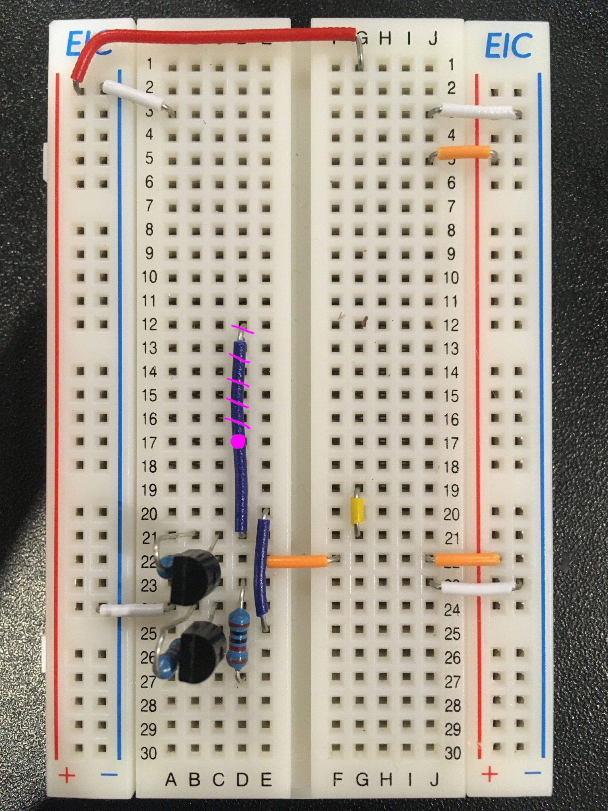
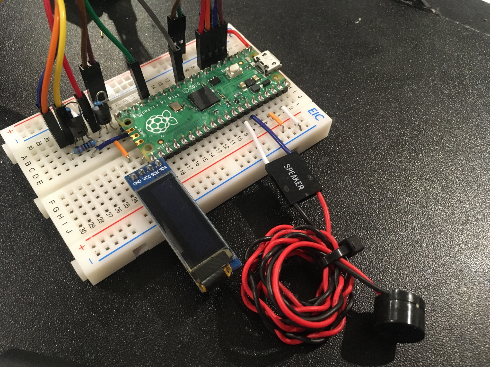

usb3sun
=======

usb3sun is a firmware for the RP2040 (Raspberry Pi Pico) that allows you to connect USB keyboards and mice to the Sun 8-pin mini-DIN interface.

project writeup: <https://cohost.org/delan/post/787278-usb3sun-a-usb-input>

see also:

* [USB2Sun](https://github.com/jgilje/USB2Sun) by @jgilje
* [sun2usb](https://github.com/jareklupinski/sun2usb) by @jareklupinski

instructions
------------

1. fix the -DCFG_TUSB_CONFIG_FILE in platformio.ini for your absolute path
2. apply [tinyusb1.patch](tinyusb1.patch) to <.pio/libdeps/pico/Adafruit TinyUSB Library/src/host/usbh.c> (version 1.16.0)
    * upstream patch: hathach/tinyusb#1786
3. apply [tinyusb2.patch](tinyusb2.patch) to <.pio/libdeps/pico/Adafruit TinyUSB Library/src/host/usbh.c> (version 1.16.0)

features
--------

* keyboard support
* mouse support
* soft power key support
* LED indicators via SSD1306 (128x32)
* click and bell via passive piezo buzzer

bindings
--------

for more details, see [src/bindings.h](src/bindings.h), but here are the important ones:

| USB               | Sun                     |
|-------------------|-------------------------|
| context menu      | Compose                 |
| Left Alt          | Alt                     |
| Right Alt         | Graph/Alt               |
| Left GUI*         | left Meta (diamond)     |
| Right GUI*        | right Meta (diamond)    |
| Left Ctrl         | Control                 |
| Right Ctrl+Space  | (usb3sun settings menu) |
| Right Ctrl+Esc    | Front                   |
| Right Ctrl+Return | Line Feed               |
| Right Ctrl+F1     | Help                    |
| Right Ctrl+F4     | Props                   |
| Right Ctrl+=      | keypad =                |
| Right Ctrl+C      | Copy                    |
| Right Ctrl+F      | Find                    |
| Right Ctrl+O      | Front                   |
| Right Ctrl+P      | Power                   |
| Right Ctrl+V      | Paste                   |
| Right Ctrl+X      | Cut                     |
| Right Ctrl+Y      | Again                   |
| Right Ctrl+Z      | Undo                    |

\* aka Super, Mod4, Windows, etc

compatibility
-------------

- 04A5:8001 BenQ Zowie EC2 **mouse** — perfect
- 3367:1903 Endgame Gear XM1r **mouse** — buttons only (16-bit dx/dy, no boot protocol)
- 0461:4E24 HP KB71211 **keyboard** — almost perfect (lacks scroll lock or right meta)
- 0461:4E23 HP MOGIUO **mouse** — perfect
- 045E:0040 Microsoft Wheel **Mouse** Optical 1.1A — perfect
- 045E:0752 Microsoft Wired **Keyboard** 400 — perfect
- 045E:0750 Microsoft Wired **Keyboard** 600 — perfect

prototype assembly
------------------

### bill of materials

* 1x [raspberry pi pico, with headers](https://www.altronics.com.au/p/z6421a-raspberry-pi-pico-rp2040-development-board-with-headers/)
    * or 1x [raspberry pi pico](https://www.altronics.com.au/p/z6421-raspberry-pi-pico-microcontroller-board/) + 1x [0.1″ header pin block, 40x1](https://www.altronics.com.au/p/p5430-oupiin-40-way-header-pin/)
* 1x [ssd1306 i2c oled display, 128x32, with headers](https://www.aliexpress.com/item/1005004375650245.html)
* 2x [2n7000, n-channel mosfet, to-92 (s, g, d)](https://www.altronics.com.au/p/z1555-2n7000-to-92-n-channel-tmosfet/) ([datasheet](https://www.onsemi.com/pdf/datasheet/nds7002a-d.pdf))
* 3x 20K resistor, through hole
    * or 1x [20K resistor, through hole, 1% 0W25, bulk 10 units](https://www.altronics.com.au/p/r7589-20k-0.25w-metal-film-resistor-pk-10/)
    * or 1x [tinker component kit](https://www.altronics.com.au/p/k9640-tinker-parts-starter-kit/)
* 1x [solderless breadboard, 400 tie points (300+50+50)](https://www.altronics.com.au/p/p1002-400-way-breadboard/)
* 1x [solid wire kit, for solderless breadboards](https://www.altronics.com.au/p/p1018a-prototyping-breadboard-wire-packs-350pcs/)
    * or any sufficient amount of suitable solid wire
* 1x [mini-din plug, 8 pins, reversible](https://www.altronics.com.au/p/p1098-8-pin-line-mini-din-plug/)
* 16x jumper wire, dupont 0.1″, pin to socket
    * or 1x [jumper wire, dupont 0.1″, pin to socket, row of 30](https://www.altronics.com.au/p/p1021-pin-to-socket-30-way-prototyping-ribbon-strips/)
* ⎰ 3x crimp housing, dupont 0.1″, 4x1
* ⎱ 4x crimp housing, dupont 0.1″, 2x1
    * or 1x [crimp kit, dupont 0.1″](https://www.altronics.com.au/p/k9642-2.54mm-header-kit-310pc/)
* ⎰ 1x usb breakout board, usb a, 2 ports
* ⎱ 1x piezo buzzer, passive
    * you can often find these in old computer cases

### reference designators

* Q1 = 2n7000 for keyboard rx level shifter
* Q2 = 2n7000 for keyboard tx level shifter (optional)
* Q3 = 2n7000 for mouse tx level shifter (optional)
* Q4 = 2n7000 for soft power key
* U1 = pico
* U2 = display

### assembly instructions

1. connect a3 (U1 GND) to the left (Vusb) negative rail
2. connect g1 (U1 VBUS) to the left (Vusb) positive rail
3. connect j3 (U1 GND) to the right (3V3) negative rail
4. connect j5 (U1 3V3(OUT)) to the right (3V3) positive rail
5. connect j23 (U2 GND) to the right (3V3) negative rail
6. connect j22 (U2 VCC) to the right (3V3) positive rail
7. connect e22 (Q1 pin 2) to f22 (3V3 supply)
8. connect a24 (Q4 pin 1) to the left (Vusb) negative rail
9. connect g21 (U2 SCK) to g19 (U1 GP17)
10. connect d21 (Q1 pin 1) to d17 (U1 GP13)
    * picture below erroneously shows d21 to d12 (U1 GP9)
11. connect e25 (Q4 pin 2) to e20 (U1 GP15)
12. place Q1 pins (1,2,3) in (c21,c22,c23)
13. place Q4 pins (1,2,3) in (c24,c25,c26)
14. place resistor between b21 (Q1 pin 1) and b22 (3V3 supply)
15. place resistor between b23 (Q1 pin 3) and b27 (Vsun)
16. place resistor between b25 (Q4 pin 2) and b24 (ground)



17. extract 1x1 crimp housings from both ends of 8 jumper wires
18. attach 4x1 crimp housing to socket ends of (VCC1,D-1,D+1,GND1)
19. attach 4x1 crimp housing to socket ends of (VCC2,D-2,D+2,GND2)
20. attach 2x1 crimp housing to pin ends of (VCC1,VCC2)
21. attach 2x1 crimp housing to pin ends of (GND1,GND2)
22. attach 4x1 crimp housing to pin ends of (D+1,D-1,D+2,D-2)
23. connect socket ends of (VCC1,D-1,D+1,GND1) and (VCC2,D-2,D+2,GND2)
24. connect pin ends of (GND1,GND2) to left (Vusb) negative rail
25. connect pin ends of (VCC1,VCC2) to left (Vusb) positive rail
26. connect pin ends of (D+1,D-1,D+2,D-2) to (a4,a5,a6,a7) (U1 (GP2,GP3,GP4,GP5))


27. strip and tin the socket ends of 8 jumper wires
28. solder those wires to the mini-din plug

**DO NOT** solder to the side where the middle pin is closer to the left, when orienting the connector body such that the pins are in rows of (3,3,2) from top to bottom. this is the side that faces the sun.

**DO** solder to the side where the middle pin is closer to the right.

```
 side facing sun           solder side
                         (same as socket
                             on sun)

        ^                       ^
    6   7   8               8   7   6
  3   4       5           5       4   3
      1   2                   2   1
```

29. extract 1x1 crimp housings from wires for mini-din pins (1,2) (ground)
30. attach 2x1 crimp housing to wires for mini-din pins (1,2) (ground)
31. extract 1x1 crimp housings from wires for mini-din pins (3,8) (Vsun)
32. attach 2x1 crimp housing to wires for mini-din pins (3,8) (Vsun)
33. connect wires for mini-din pins (1,2) (ground) to left (Vusb) negative rail
34. connect wire for mini-din pins (3,8) (Vsun) to (a27,b27) (resistor on Q1 pin 3)
35. connect wire for mini-din pin 4 (mouse tx) to b11 (U1 GP8)
36. connect wire for mini-din pin 6 (keyboard tx) to b16 (U1 GP12)
37. connect wire for mini-din pin 5 (keyboard rx) to b23 (Q1 pin 3)
38. connect wire for mini-din pin 7 (power key) to b26 (Q4 pin 3)


39. place U1 pins (GP0…GP15,GP16…VBUS) in (c1…c20,h20…h1)
40. place U2 pins (SDA,SCK,VCC,GND) in (i20,i21,i22,i23)
41. connect buzzer negative to i8 (U1 GND)
42. connect buzzer positive to i7 (U1 GP28)



troubleshooting
---------------

### monitor gets sync but no video

*observed on SPARCstation 5*

some machines will refuse to send any video unless a working keyboard is connected.

1. check that your adapter is assembled correctly
2. check that your mini-din housing isn’t interfering with the connection
    * you may need to retract the housing from time to time (see below)


