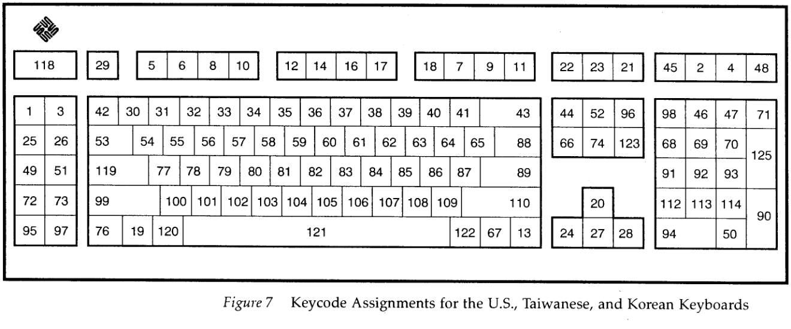
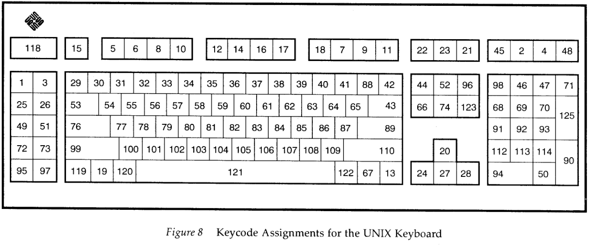
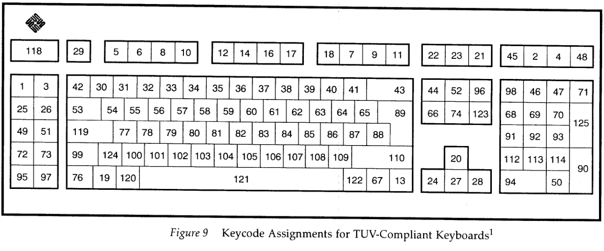
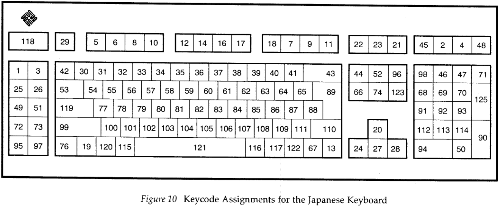

# sun keyboard layout support

supporting the various type 4 and type 5 keyboard layouts has a few challenges:
- identifying the physical keyboard layouts
- knowing what keycodes they send
- building tables of what the keycodes mean in each layout
- deciding how to map usb keycodes to them

also…
- layout codes ([0Fh Layout Command](https://temlib.org/pub/SparcStation/Standards/KBD.pdf) and [FEh Layout Request Response](https://temlib.org/pub/SparcStation/Standards/KBD.pdf)) are used to select the keymap in solaris/sunos and the firmware (openboot/sunmon), but seem to be ignored by linux distros (tested with debian 7.11.0)
- [sparc keyboard spec version1](https://temlib.org/pub/SparcStation/Standards/KBD.pdf) has incomplete and incorrect information about non-US keyboard layouts, notably table 2 (“International Scan Set”) is identical to table 1 (“US Scan Set”), both only documenting the 107-key layout

## physical keyboard layouts

- there are ?two physical type 4 layouts
  - 107-key layout with 47 main character keys ([pic en-US](https://www.flickr.com/photos/jgrove/3051883468/)), used by the US keyboard (320-1005)
  - 109-key layout with 49 main character keys ([pic de-DE](https://github.com/delan/usb3sun/assets/465303/2aa3ea0e-02fa-488c-a6cb-80acda7aae20), [pic BE fr-FR](https://tinkerdifferent.com/threads/sun-type-4-keyboard.1444/#post-9703)), used by ?all other keyboards ([part numbers](https://dogemicrosystems.ca/pub/Sun/System_Handbook/Sun_syshbk_V3.4/Systems/Sun4/INPUT_Type4_Keyboard.html))
  - see also [§ appendix: type 4 keyboard variants](#appendix-type-4-keyboard-variants)
- there are four physical type 5 layouts [[1]](https://www.vaxbarn.com/downloads/pub/pdf/sun/workstation/Sun%20Type%205c%20Keyboard%20and%20Type%205%20Mouse%20Product%20Notes%20-%201994-07.pdf)[[2]](https://vtda.org/docs/computing/Sun/hardware/800-6802-12_Type5KeyboardandMouseProductNotes_RevA_Oct93.pdf)[[3]](https://ia802806.us.archive.org/29/items/Sun_Type_5_Keyboard_Product_Notes/Sun_Type_5_Keyboard_Product_Notes.pdf)
  - 118-key layout with 47 main character keys ([pic en-US](https://www.flickr.com/photos/jgrove/3051046581/)), for US/TW/KR keyboards <!-- 10+1+1+4+4+4+3+4+6+4+4+3+4+3+3+14+14+13+12+7; 10+9+7+10+3+3+2+3 -->
  - 119-key layout with 47 main character keys ([pic en-US](https://deskthority.net/wiki/File:Suntype5.jpg)), for the “UNIX” keyboard <!-- 10+1+1+4+4+4+3+4+6+4+4+3+4+3+3+15+14+13+12+7; 10+9+7+10+4+2+2+3 -->
  - 119-key layout with 48 main character keys ([pic de-DE](https://github.com/delan/usb3sun/assets/465303/ecaf231e-8db7-405c-a329-d7a3bd58c9db), [pic en-UK](https://deskthority.net/wiki/File:Sun_Type_5_UK.jpg), [pic sv-SE](https://deskthority.net/wiki/File:SunType5c.jpg)), for “TUV-Compliant” keyboards (all other keyboards) <!-- 10+1+1+4+4+4+3+4+6+4+4+3+4+3+3+14+13+14+13+7; 10+9+7+10+3+2+3+4 -->
  - 122-key layout with 48 main character keys, for the JP keyboard <!-- 10+1+1+4+4+4+3+4+6+4+4+3+4+3+3+14+13+14+13+10; 10+9+7+10+3+2+3+4 --> ([pic jp-JP](images/type5-jp.jpg))
  - see also [§ appendix: type 5 keyboard variants](#appendix-type-4-keyboard-variants)
- physical usb layouts
  - 101/104-key layout with 47 main character keys, ansi/incits 154 <!-- 10+9+7+10+3+3+2+3 -->
  - 102/105-key layout with 48 main character keys, [iso 9995](https://en.wikipedia.org/w/index.php?title=ISO/IEC_9995&oldid=1242965538#ISO/IEC_9995-2) with B00 and C12 <!-- 10+9+7+10+3+2+3+4 -->
  - 106/109-key layout with 48 main character keys, jis x 6002 <!-- 10+9+7+10+3+2+3+4 -->
  - see also [List of QWERTY keyboard language variants](https://en.wikipedia.org/w/index.php?title=List_of_QWERTY_keyboard_language_variants&oldid=1253689618) and [Keyboard layout#Physical layouts](https://en.wikipedia.org/w/index.php?title=Keyboard_layout&oldid=1259709337#Physical_layouts) on wikipedia

## keycodes for each physical layout

### type 4, 107-key en-US (320-1005)

- gathered by building the firmware with `-DSUNK_SNIFFER_ENABLE` ([25d9defbb9ef7](https://github.com/delan/usb3sun/commit/25d9defbb9ef707f8eb204be7a572ce0c875a7cc)), then connecting my real sun keyboard to both workstation and usb3sun
- as expected, keycodes did not change when changing layout code from 00h ([United States](https://dogemicrosystems.ca/pub/Sun/System_Handbook/Sun_syshbk_V3.4/Systems/Sun4/INPUT_Type4_Keyboard.html)) to 02h ([Belgium/French](https://dogemicrosystems.ca/pub/Sun/System_Handbook/Sun_syshbk_V3.4/Systems/Sun4/INPUT_Type4_Keyboard.html)) or 05h ([German](https://dogemicrosystems.ca/pub/Sun/System_Handbook/Sun_syshbk_V3.4/Systems/Sun4/INPUT_Type4_Keyboard.html))

```
01h 03h  05h 06h 08h 0Ah 0Ch 0Eh 10h 11h 12h 07h 09h 0Bh 58h ====42h  15h 16h 17h 62h
19h 1Ah  1Dh 1Eh 1Fh 20h 21h 22h 23h 24h 25h 26h 27h 28h 29h ====2Bh  2Dh 2Eh 2Fh 47h
31h 33h  35h== 36h 37h 38h 39h 3Ah 3Bh 3Ch 3Dh 3Eh 3Fh 40h 41h |___|  44h 45h 46h |_|
48h 49h  4Ch=== 4Dh 4Eh 4Fh 50h 51h 52h 53h 54h 55h 56h 57h 2Ah |59h  5Bh 5Ch 5Dh 7Dh
5Fh 61h  63h===== 64h 65h 66h 67h 68h 69h 6Ah 6Bh 6Ch 6Dh ===6Eh 6Fh  70h 71h 72h |_|
76h====  77h 13h 78h 79h================================ 7Ah 43h 0Dh  5Eh==== 32h 5Ah
```

### type 4, 109-key layouts

- gathered by collating illumos keymaps (see [§ what the keycodes mean in each layout](#what-the-keycodes-mean-in-each-layout)) with some photos found online ([pic de-DE](https://github.com/delan/usb3sun/assets/465303/2aa3ea0e-02fa-488c-a6cb-80acda7aae20), [pic BE fr-FR](https://tinkerdifferent.com/threads/sun-type-4-keyboard.1444/#post-9703))

```
01h 03h  05h 06h 08h 0Ah 0Ch 0Eh 10h 11h 12h 07h 09h 0Bh 58h 0Fh 42h  15h 16h 17h 62h
19h 1Ah  1Dh 1Eh 1Fh 20h 21h 22h 23h 24h 25h 26h 27h 28h 29h ====2Bh  2Dh 2Eh 2Fh 47h
31h 33h  35h== 36h 37h 38h 39h 3Ah 3Bh 3Ch 3Dh 3Eh 3Fh 40h 41h |___|  44h 45h 46h |_|
48h 49h  4Ch=== 4Dh 4Eh 4Fh 50h 51h 52h 53h 54h 55h 56h 57h 2Ah |59h  5Bh 5Ch 5Dh 7Dh
5Fh 61h  63h= 7Ch 64h 65h 66h 67h 68h 69h 6Ah 6Bh 6Ch 6Dh ===6Eh 6Fh  70h 71h 72h |_|
76h====  77h 13h 78h 79h================================ 7Ah 43h 0Dh  5Eh==== 32h 5Ah
```

### type 5, 118-key US/TW/KR

- gathered from *Sun Type 5 Keyboard and Mouse Product Notes* (October 1993, [800-6802-12](https://vtda.org/docs/computing/Sun/hardware/800-6802-12_Type5KeyboardandMouseProductNotes_RevA_Oct93.pdf)), figure 7



### type 5, 119-key “UNIX”

- gathered from *Sun Type 5 Keyboard and Mouse Product Notes* (October 1993, [800-6802-12](https://vtda.org/docs/computing/Sun/hardware/800-6802-12_Type5KeyboardandMouseProductNotes_RevA_Oct93.pdf)), figure 8



### type 5, 119-key “TUV-Compliant”

- gathered from *Sun Type 5 Keyboard and Mouse Product Notes* (October 1993, [800-6802-12](https://vtda.org/docs/computing/Sun/hardware/800-6802-12_Type5KeyboardandMouseProductNotes_RevA_Oct93.pdf)), figure 9



### type 5, 122-key JP

- gathered from *Sun Type 5 Keyboard and Mouse Product Notes* (October 1993, [800-6802-12](https://vtda.org/docs/computing/Sun/hardware/800-6802-12_Type5KeyboardandMouseProductNotes_RevA_Oct93.pdf)), figure 10



## what the keycodes mean in each layout

- gathered from the [type 4 (and 5) keymaps](https://github.com/illumos/illumos-gate/tree/616c76953410e11aab663c510c9ba143e545bd4b/usr/src/cmd/loadkeys/type_4) in illumos-gate with [`doc/attic/query-illumos-keymaps.sh`](https://github.com/delan/usb3sun/blob/ce851c6adff445e0aab2189fc1ff3773a01b7e50/doc/attic/query-illumos-keymaps.sh) ([ce851c6adff44](https://github.com/delan/usb3sun/commit/ce851c6adff445e0aab2189fc1ff3773a01b7e50))
  - the layout code associated with each keymap is defined in [the Makefile](https://github.com/illumos/illumos-gate/blob/616c76953410e11aab663c510c9ba143e545bd4b/usr/src/cmd/loadkeys/type_4/Makefile)
- how to understand the output
  - [`src/bindings.h`](https://github.com/delan/usb3sun/blob/ce851c6adff445e0aab2189fc1ff3773a01b7e50/src/bindings.h) as of [ce851c6adff44](https://github.com/delan/usb3sun/commit/ce851c6adff445e0aab2189fc1ff3773a01b7e50) is included for reference
  - `reset` is next, because every keycode inherits its meaning from it if unspecified
  - finally the meanings of the keycode as overriden by other keymaps
  - for more details about the keymap syntax, see [solaris keytables(4)](https://docs.oracle.com/cd/E86824_01/html/E54775/keytables-4.html)

<details><summary>type 4 layouts</summary>

```
0 (00h)
reset:key 0	 all hole

1 (01h)
bindings.h:  {120, 0x01, 0x81}, // Keyboard Stop → 15. Stop
bindings.h:  {1u << 4, 55, 0x01, 0x81}, // CtrlR+. → 15. Stop
reset:key 1	 all buckybits+systembit up buckybits+systembit

2 (02h)
reset:key 2	 all hole

3 (03h)
bindings.h:  {121, 0x03, 0x83}, // Keyboard Again → 16. Again
bindings.h:  {1u << 4, 28, 0x03, 0x83}, // CtrlR+Y → 16. Again
reset:key 3	 all lf(2)

4 (04h)
reset:key 4	 all hole

5 (05h)
bindings.h:  {58, 0x05, 0x85}, // 1. F1
reset:key 5	 all tf(1)

6 (06h)
bindings.h:  {59, 0x06, 0x86}, // 2. F2
reset:key 6	 all tf(2)

7 (07h)
bindings.h:  {67, 0x07, 0x87}, // 10. F10
reset:key 7	 all tf(10)

8 (08h)
bindings.h:  {60, 0x08, 0x88}, // 3. F3
reset:key 8	 all tf(3)

9 (09h)
bindings.h:  {68, 0x09, 0x89}, // 11. F11
reset:key 9	 all tf(11)

10 (0Ah)
bindings.h:  {61, 0x0A, 0x8A}, // 4. F4
reset:key 10	 all tf(4)

11 (0Bh)
bindings.h:  {69, 0x0B, 0x8B}, // 12. F12
reset:key 11	 all tf(12)

12 (0Ch)
bindings.h:  {62, 0x0C, 0x8C}, // 5. F5
reset:key 12	 all tf(5)

13 (0Dh)
bindings.h:  {1u << 6, 0x0D, 0x8D}, // 105. Graph	Alt
reset:key 13	 all shiftkeys+altgraph up shiftkeys+altgraph
us:key 13	 all shiftkeys+altgraph up shiftkeys+altgraph
germany:key 13	 all shiftkeys+alt up shiftkeys+alt
swiss_german:key 13	 all compose
belgium_france:key 13	 all shiftkeys+capslock
uk:key 13	 all shiftkeys+altgraph up shiftkeys+altgraph
swiss_french:key 13	 all compose
netherlands:key 13	 all shiftkeys+capslock
sweden_finland:key 13	 all compose
denmark:key 13	 all compose
norway:key 13	 all shiftkeys+altgraph up shiftkeys+altgraph
italy:key 13	 all shiftkeys+altgraph up shiftkeys+altgraph
spain_latin_america:key 13	 all shiftkeys+altgraph up shiftkeys+altgraph
portugal:key 13	 all shiftkeys+altgraph up shiftkeys+altgraph
canada:key 13	 all shiftkeys+capslock

14 (0Eh)
bindings.h:  {63, 0x0E, 0x8E}, // 6. F6
reset:key 14	 all tf(6)

15 (0Fh)
reset:key 15	 all hole
us:key 15	 all hole
germany:key 15	 base ] shift } caps ] ctrl ^] altg »
swiss_german:key 15	 base > shift } caps > ctrl > altg nop
belgium_france:key 15	 base ] shift } caps ] ctrl ^] altg »
uk:key 15	 all hole
swiss_french:key 15	 base > shift } caps > ctrl > altg nop
netherlands:key 15	 base '\\' shift | caps '\\' ctrl ^\ altg nop
sweden_finland:key 15	 base ~ shift ^ caps ~ ctrl ^^ altg nop
denmark:key 15	 base ~ shift ^ caps ~ ctrl ^^ altg nop
norway:key 15	 base ~ shift ^ caps ~ ctrl ^^ altg nop
italy:key 15	 base ] shift } caps ] ctrl ^] altg »
spain_latin_america:key 15	 base ] shift } caps ] ctrl ^] altg »
portugal:key 15	 base ] shift } caps ] ctrl ^] altg »

16 (10h)
bindings.h:  {64, 0x10, 0x90}, // 7. F7
reset:key 16	 all tf(7)

17 (11h)
bindings.h:  {65, 0x11, 0x91}, // 8. F8
reset:key 17	 all tf(8)

18 (12h)
bindings.h:  {66, 0x12, 0x92}, // 9. F9
reset:key 18	 all tf(9)

19 (13h)
bindings.h:  {1u << 2, 0x13, 0x93}, // 100. Alt
reset:key 19	 all shiftkeys+alt up shiftkeys+alt
us:key 19	 all shiftkeys+alt up shiftkeys+alt
germany:key 19	 all shiftkeys+altgraph up shiftkeys+altgraph
swiss_german:key 19	 all shiftkeys+alt up shiftkeys+alt
belgium_france:key 19	 all shiftkeys+alt up shiftkeys+alt
uk:key 19	 all shiftkeys+alt up shiftkeys+alt
swiss_french:key 19	 all shiftkeys+alt up shiftkeys+alt
netherlands:key 19	 all shiftkeys+alt up shiftkeys+alt
sweden_finland:key 19	 all shiftkeys+alt up shiftkeys+alt
denmark:key 19	 all shiftkeys+alt up shiftkeys+alt
norway:key 19	 all shiftkeys+alt up shiftkeys+alt
italy:key 19	 all shiftkeys+alt up shiftkeys+alt
spain_latin_america:key 19	 all shiftkeys+alt up shiftkeys+alt
portugal:key 19	 all shiftkeys+alt up shiftkeys+alt
canada:key 19	 all shiftkeys+alt up shiftkeys+alt

20 (14h)
reset:key 20	 all hole

21 (15h)
bindings.h:  {72, 0x15, 0x95}, // Pause/Break(!) aka “Keyboard Pause” → 17. Pause
reset:key 21	 all rf(1)

22 (16h)
bindings.h:  {70, 0x16, 0x96}, // PrintScreen/SysRq aka “Keyboard PrintScreen” → 70. Pr Sc
reset:key 22	 all rf(2)

23 (17h)
bindings.h:  {71, 0x17, 0x97}, // Keyboard Scroll Lock → 71. Break(!)	Scroll Lock
reset:key 23	 all rf(3)

24 (18h)
reset:key 24	 all hole

25 (19h)
bindings.h:  {163, 0x19, 0x99}, // Keyboard CrSel/Props → 21. Props
bindings.h:  {1u << 4, 61, 0x19, 0x99}, // CtrlR+F4 → 21. Props
reset:key 25	 all lf(3)

26 (1Ah)
bindings.h:  {122, 0x1A, 0x9A}, // Keyboard Undo → 22. Undo
bindings.h:  {1u << 4, 29, 0x1A, 0x9A}, // CtrlR+Z → 22. Undo
reset:key 26	 all lf(4)

27 (1Bh)
reset:key 27	 all hole

28 (1Ch)
reset:key 28	 all hole

29 (1Dh)
bindings.h:  {41, 0x1D, 0x9D}, // 23. Esc
reset:key 29	 all ^[

30 (1Eh)
bindings.h:  {30, 0x1E, 0x9E}, // 24. 1	!
reset:key 30	 base 1 shift ! caps 1 ctrl 1 altg nop
us:key 30	 base 1 shift ! caps 1 ctrl 1 altg nop
germany:key 30	 base 1 shift ! caps 1 ctrl 1 altg nop
swiss_german:key 30	 base 1 shift + caps 1 ctrl 1 altg !
belgium_france:key 30	 base & shift 1 caps & ctrl & altg nop
uk:key 30	 base 1 shift ! caps 1 ctrl 1 altg |
swiss_french:key 30	 base 1 shift + caps 1 ctrl 1 altg !
netherlands:key 30	 base 1 shift ! caps 1 ctrl 1 altg ¹
sweden_finland:key 30	 base 1 shift ! caps 1 ctrl 1 altg nop
denmark:key 30	 base 1 shift ! caps 1 ctrl 1 altg nop
norway:key 30	 base 1 shift ! caps 1 ctrl 1 altg nop
italy:key 30	 base 1 shift ! caps 1 ctrl 1 altg nop
spain_latin_america:key 30	 base 1 shift ! caps 1 ctrl 1 altg nop
portugal:key 30	 base 1 shift ! caps 1 ctrl 1 altg nop
canada:key 30	 base 1 shift ! caps 1 ctrl 1 altg ±

31 (1Fh)
bindings.h:  {31, 0x1F, 0x9F}, // 25. 2	@
reset:key 31	 base 2 shift @ caps 2 ctrl ^@ altg nop
us:key 31	 base 2 shift @ caps 2 ctrl ^@ altg nop
germany:key 31	 base 2 shift '"' caps 2 ctrl 2 altg ²
swiss_german:key 31	 base 2 shift '"' caps 2 ctrl ^@ altg @
belgium_france:key 31	 base é shift 2 caps E ctrl É altg ²
uk:key 31	 base 2 shift @ caps 2 ctrl ^@ altg nop
swiss_french:key 31	 base 2 shift '"' caps 2 ctrl ^@ altg @
netherlands:key 31	 base 2 shift '"' caps 2 ctrl 2 altg ²
sweden_finland:key 31	 base 2 shift '"' caps 2 ctrl ^@ altg @
denmark:key 31	 base 2 shift '"' caps 2 ctrl ^@ altg @
norway:key 31	 base 2 shift '"' caps 2 ctrl ^@ altg @
italy:key 31	 base 2 shift '"' caps 2 ctrl 2 altg ²
spain_latin_america:key 31	 base 2 shift '"' caps 2 ctrl ^@ altg @
portugal:key 31	 base 2 shift '"' caps 2 ctrl ^@ altg @
canada:key 31	 base 2 shift '"' caps 2 ctrl ^@ altg @

32 (20h)
bindings.h:  {32, 0x20, 0xA0}, // 26. 3	#
reset:key 32	 base 3 shift # caps 3 ctrl 3 altg nop
us:key 32	 base 3 shift # caps 3 ctrl 3 altg nop
germany:key 32	 base 3 shift § caps 3 ctrl 3 altg ³
swiss_german:key 32	 base 3 shift * caps 3 ctrl 3 altg #
belgium_france:key 32	 base '"' shift 3 caps '"' ctrl '"' altg ³
uk:key 32	 base 3 shift £ caps 3 ctrl 3 altg #
swiss_french:key 32	 base 3 shift * caps 3 ctrl 3 altg #
netherlands:key 32	 base 3 shift # caps 3 ctrl 3 altg ³
sweden_finland:key 32	 base 3 shift # caps 3 ctrl 3 altg £
denmark:key 32	 base 3 shift # caps 3 ctrl 3 altg £
norway:key 32	 base 3 shift # caps 3 ctrl 3 altg £
italy:key 32	 base 3 shift £ caps 3 ctrl 3 altg ³
spain_latin_america:key 32	 base 3 shift · caps 3 ctrl 3 altg #
portugal:key 32	 base 3 shift # caps 3 ctrl 3 altg £
canada:key 32	 base 3 shift / caps 3 ctrl 3 altg £

33 (21h)
bindings.h:  {33, 0x21, 0xA1}, // 27. 4	$
reset:key 33	 base 4 shift $ caps 4 ctrl 4 altg nop
us:key 33	 base 4 shift $ caps 4 ctrl 4 altg nop
germany:key 33	 base 4 shift $ caps 4 ctrl 4 altg nop
swiss_german:key 33	 base 4 shift ç caps 4 ctrl 4 altg ¢
belgium_france:key 33	 base '\'' shift 4 caps '\'' ctrl '\'' altg nop
uk:key 33	 base 4 shift $ caps 4 ctrl 4 altg nop
swiss_french:key 33	 base 4 shift ç caps 4 ctrl 4 altg ¢
netherlands:key 33	 base 4 shift $ caps 4 ctrl 4 altg ¼
sweden_finland:key 33	 base 4 shift ¤ caps 4 ctrl 4 altg $
denmark:key 33	 base 4 shift ¤ caps 4 ctrl 4 altg $
norway:key 33	 base 4 shift ¤ caps 4 ctrl 4 altg $
italy:key 33	 base 4 shift $ caps 4 ctrl 4 altg nop
spain_latin_america:key 33	 base 4 shift $ caps 4 ctrl 4 altg nop
portugal:key 33	 base 4 shift $ caps 4 ctrl 4 altg §
canada:key 33	 base 4 shift $ caps 4 ctrl 4 altg ¢

34 (22h)
bindings.h:  {34, 0x22, 0xA2}, // 28. 5	%
reset:key 34	 base 5 shift % caps 5 ctrl 5 altg nop
us:key 34	 base 5 shift % caps 5 ctrl 5 altg nop
germany:key 34	 base 5 shift % caps 5 ctrl 5 altg nop
swiss_german:key 34	 base 5 shift % caps 5 ctrl 5 altg ~
belgium_france:key 34	 base ( shift 5 caps ( ctrl ( altg nop
uk:key 34	 base 5 shift % caps 5 ctrl 5 altg nop
swiss_french:key 34	 base 5 shift % caps 5 ctrl 5 altg ~
netherlands:key 34	 base 5 shift % caps 5 ctrl 5 altg ½
sweden_finland:key 34	 base 5 shift % caps 5 ctrl 5 altg nop
denmark:key 34	 base 5 shift % caps 5 ctrl 5 altg nop
norway:key 34	 base 5 shift % caps 5 ctrl 5 altg nop
italy:key 34	 base 5 shift % caps 5 ctrl 5 altg nop
spain_latin_america:key 34	 base 5 shift % caps 5 ctrl 5 altg °
portugal:key 34	 base 5 shift % caps 5 ctrl 5 altg nop
canada:key 34	 base 5 shift % caps 5 ctrl 5 altg ¤

35 (23h)
bindings.h:  {35, 0x23, 0xA3}, // 29. 6	^
reset:key 35	 base 6 shift ^ caps 6 ctrl ^^ altg nop
us:key 35	 base 6 shift ^ caps 6 ctrl ^^ altg nop
germany:key 35	 base 6 shift & caps 6 ctrl 6 altg nop
swiss_german:key 35	 base 6 shift & caps 6 ctrl 6 altg §
belgium_france:key 35	 base § shift 6 caps § ctrl ^^ altg ^
uk:key 35	 base 6 shift ^ caps 6 ctrl ^^ altg nop
swiss_french:key 35	 base 6 shift & caps 6 ctrl 6 altg §
netherlands:key 35	 base 6 shift & caps 6 ctrl 6 altg ¾
sweden_finland:key 35	 base 6 shift & caps 6 ctrl 6 altg nop
denmark:key 35	 base 6 shift & caps 6 ctrl 6 altg nop
norway:key 35	 base 6 shift & caps 6 ctrl 6 altg nop
italy:key 35	 base 6 shift & caps 6 ctrl 6 altg ¬
spain_latin_america:key 35	 base 6 shift & caps 6 ctrl 6 altg ¬
portugal:key 35	 base 6 shift & caps 6 ctrl 6 altg ¬
canada:key 35	 base 6 shift ? caps 6 ctrl 6 altg ¬

36 (24h)
bindings.h:  {36, 0x24, 0xA4}, // 30. 7	&
reset:key 36	 base 7 shift & caps 7 ctrl 7 altg nop
us:key 36	 base 7 shift & caps 7 ctrl 7 altg nop
germany:key 36	 base 7 shift / caps 7 ctrl 7 altg °
swiss_german:key 36	 base 7 shift / caps 7 ctrl 7 altg |
belgium_france:key 36	 base è shift 7 caps E ctrl è altg nop
uk:key 36	 base 7 shift & caps 7 ctrl 7 altg nop
swiss_french:key 36	 base 7 shift / caps 7 ctrl 7 altg |
netherlands:key 36	 base 7 shift _ caps 7 ctrl ^_ altg £
sweden_finland:key 36	 base 7 shift / caps 7 ctrl 7 altg {
denmark:key 36	 base 7 shift / caps 7 ctrl 7 altg {
norway:key 36	 base 7 shift / caps 7 ctrl 7 altg {
italy:key 36	 base 7 shift / caps 7 ctrl 7 altg nop
spain_latin_america:key 36	 base 7 shift / caps 7 ctrl 7 altg nop
portugal:key 36	 base 7 shift / caps 7 ctrl 7 altg nop
canada:key 36	 base 7 shift & caps 7 ctrl 7 altg |

37 (25h)
bindings.h:  {37, 0x25, 0xA5}, // 31. 8	*
reset:key 37	 base 8 shift * caps 8 ctrl 8 altg nop
us:key 37	 base 8 shift * caps 8 ctrl 8 altg nop
germany:key 37	 base 8 shift ( caps 8 ctrl 8 altg `
swiss_german:key 37	 base 8 shift ( caps 8 ctrl 8 altg °
belgium_france:key 37	 base ! shift 8 caps ! ctrl ! altg £
uk:key 37	 base 8 shift * caps 8 ctrl 8 altg nop
swiss_french:key 37	 base 8 shift ( caps 8 ctrl 8 altg °
netherlands:key 37	 base 8 shift ( caps 8 ctrl 8 altg {
sweden_finland:key 37	 base 8 shift ( caps 8 ctrl ^[ altg [
denmark:key 37	 base 8 shift ( caps 8 ctrl ^[ altg [
norway:key 37	 base 8 shift ( caps 8 ctrl ^[ altg [
italy:key 37	 base 8 shift ( caps 8 ctrl 8 altg nop
spain_latin_america:key 37	 base 8 shift ( caps 8 ctrl 8 altg nop
portugal:key 37	 base 8 shift ( caps 8 ctrl 8 altg nop
canada:key 37	 base 8 shift * caps 8 ctrl 8 altg ²

38 (26h)
bindings.h:  {38, 0x26, 0xA6}, // 32. 9	(
reset:key 38	 base 9 shift ( caps 9 ctrl 9 altg nop
us:key 38	 base 9 shift ( caps 9 ctrl 9 altg nop
germany:key 38	 base 9 shift ) caps 9 ctrl 9 altg '
swiss_german:key 38	 base 9 shift ) caps 9 ctrl ^\ altg '\\'
belgium_france:key 38	 base ç shift 9 caps C ctrl ^\ altg '\\'
uk:key 38	 base 9 shift ( caps 9 ctrl 9 altg nop
swiss_french:key 38	 base 9 shift ) caps 9 ctrl ^\ altg '\\'
netherlands:key 38	 base 9 shift ) caps 9 ctrl ^\ altg }
sweden_finland:key 38	 base 9 shift ) caps 9 ctrl ^] altg ]
denmark:key 38	 base 9 shift ) caps 9 ctrl ^] altg ]
norway:key 38	 base 9 shift ) caps 9 ctrl ^] altg ]
italy:key 38	 base 9 shift ) caps 9 ctrl ^\ altg '\\'
spain_latin_america:key 38	 base 9 shift ) caps 9 ctrl ^\ altg '\\'
portugal:key 38	 base 9 shift ) caps 9 ctrl ^\ altg '\\'
canada:key 38	 base 9 shift ( caps 9 ctrl 9 altg ³

39 (27h)
bindings.h:  {39, 0x27, 0xA7}, // 33. 0	)
reset:key 39	 base 0 shift ) caps 0 ctrl 0 altg nop
us:key 39	 base 0 shift ) caps 0 ctrl 0 altg nop
germany:key 39	 base 0 shift = caps 0 ctrl 0 altg |
swiss_german:key 39	 base 0 shift = caps 0 ctrl ^^ altg ^
belgium_france:key 39	 base à shift 0 caps A ctrl à altg nop
uk:key 39	 base 0 shift ) caps 0 ctrl 0 altg nop
swiss_french:key 39	 base 0 shift = caps 0 ctrl ^^ altg ^
netherlands:key 39	 base 0 shift '\'' caps 0 ctrl 0 altg `
sweden_finland:key 39	 base 0 shift = caps 0 ctrl 0 altg }
denmark:key 39	 base 0 shift = caps 0 ctrl 0 altg }
norway:key 39	 base 0 shift = caps 0 ctrl 0 altg }
italy:key 39	 base 0 shift = caps 0 ctrl 0 altg |
spain_latin_america:key 39	 base 0 shift = caps 0 ctrl 0 altg |
portugal:key 39	 base 0 shift = caps 0 ctrl 0 altg |
canada:key 39	 base 0 shift ) caps 0 ctrl 0 altg ¼

40 (28h)
bindings.h:  {45, 0x28, 0xA8}, // 34. -	_
reset:key 40	 base - shift _ caps - ctrl ^_ altg nop
us:key 40	 base - shift _ caps - ctrl ^_ altg nop
germany:key 40	 base ß shift ? caps ß ctrl ^\ altg '\\' 
swiss_german:key 40	 base '\'' shift ? caps '\'' ctrl '\'' altg `
belgium_france:key 40	 base ) shift ° caps ) ctrl ) altg ~
uk:key 40	 base - shift _ caps - ctrl ^_ altg ¬
swiss_french:key 40	 base '\'' shift ? caps '\'' ctrl '\'' altg `
netherlands:key 40	 base / shift ? caps / ctrl / altg nop
sweden_finland:key 40	 base + shift ? caps + ctrl ^\ altg '\\'
denmark:key 40	 base + shift ? caps + ctrl ^_ altg nop
norway:key 40	 base + shift ? caps + ctrl + altg nop
italy:key 40	 base '\'' shift ? caps '\'' ctrl '\'' altg `
spain_latin_america:key 40	 base '\'' shift ? caps '\'' ctrl ^\ altg `
portugal:key 40	 base '\'' shift ? caps '\'' ctrl '\'' altg `
canada:key 40	 base - shift _ caps - ctrl ^_ altg ½

41 (29h)
bindings.h:  {46, 0x29, 0xA9}, // 35. =	+
reset:key 41	 base = shift + caps = ctrl = altg nop
us:key 41	 base = shift + caps = ctrl = altg nop
germany:key 41	 base fa_acute shift fa_grave caps fa_acute ctrl fa_acute altg nop
swiss_german:key 41	 base fa_cflex shift fa_grave caps fa_cflex ctrl fa_cflex altg nop
belgium_france:key 41	 base - shift _ caps - ctrl ^_ altg #
uk:key 41	 base = shift + caps = ctrl = altg nop
swiss_french:key 41	 base fa_cflex shift fa_grave caps fa_cflex ctrl fa_cflex altg nop
netherlands:key 41	 base ° shift fa_tilde caps ° ctrl ° altg fa_cedilla
sweden_finland:key 41	 base fa_acute shift fa_grave caps fa_acute ctrl fa_acute altg nop
denmark:key 41	 base fa_acute shift fa_grave caps fa_acute ctrl fa_acute altg |
norway:key 41	 base '\\' shift fa_grave caps '\\' ctrl ^\ altg fa_acute
italy:key 41	 base ì shift ^ caps Ì ctrl ^^ altg nop
spain_latin_america:key 41	 base ¡ shift ¿ caps ¡ ctrl ¡ altg nop
portugal:key 41	 base ¡ shift ¿ caps ¡ ctrl ¡ altg nop
canada:key 41	 base = shift + caps = ctrl = altg ¾

42 (2Ah)
bindings.h:  {53, 0x2A, 0xAA}, // 75. `	~
reset:key 42	 base ` shift ~ caps ` ctrl ^^ altg nop
us:key 42	 base ` shift ~ caps ` ctrl ^^ altg nop
germany:key 42	 base # shift ^ caps # ctrl ^^ altg @
swiss_german:key 42	 base $ shift fa_tilde caps $ ctrl $ altg £
belgium_france:key 42	 base * shift | caps * ctrl ^\ altg ¤
uk:key 42	 base ` shift ~ caps ` ctrl ^^ altg nop
swiss_french:key 42	 base $ shift fa_tilde caps $ ctrl $ altg £
netherlands:key 42	 base < shift > caps < ctrl ^] altg nop
sweden_finland:key 42	 base '\'' shift * caps '\'' ctrl ^^ altg `
denmark:key 42	 base '\'' shift * caps '\'' ctrl ^^ altg `
norway:key 42	 base '\'' shift * caps '\'' ctrl '\'' altg `
italy:key 42	 base ù shift § caps U ctrl ù altg nop
spain_latin_america:key 42	 base ç shift Ç caps Ç ctrl ç altg nop
portugal:key 42	 base fa_tilde shift fa_cflex caps fa_tilde ctrl ^^ altg ^
canada:key 42	 base < shift > caps < ctrl ^[ altg }

43 (2Bh)
bindings.h:  {42, 0x2B, 0xAB}, // 36. Backspace
reset:key 43	 all '\b'

44 (2Ch)
reset:key 44	 all hole

45 (2Dh)
bindings.h:  {103, 0x2D, 0xAD}, // Keypad Equal Sign → 37. =
bindings.h:  {1u << 4, 46, 0x2D, 0xAD}, // “Keypad = and +” → 37. =
reset:key 45	 all rf(4) numl padequal

46 (2Eh)
bindings.h:  {84, 0x2E, 0xAE}, // 38. /
reset:key 46	 all rf(5) numl padslash

47 (2Fh)
bindings.h:  {85, 0x2F, 0xAF}, // 39. *
reset:key 47	 all rf(6) numl padstar

48 (30h)
bindings.h:  {102, 0x30, 0xB0}, // keyboard Power → bf(13) Power
bindings.h:  {1u << 4, 19, 0x30, 0xB0}, // CtrlR+P → bf(13) Power
reset:key 48	 all bf(13)

49 (31h)
bindings.h:  {1u << 4, 41, 0x31, 0xB1}, // CtrlR+Esc → 41. Front
reset:key 49	 all lf(5)

50 (32h)
bindings.h:  {99, 0x32, 0xB2}, // 107. Del	.
reset:key 50	 all bf(10) numl paddot

51 (33h)
bindings.h:  {124, 0x33, 0xB3}, // Keyboard Copy → 42. Copy
bindings.h:  {1u << 4, 6, 0x33, 0xB3}, // CtrlR+C → 42. Copy
reset:key 51	 all lf(6)

52 (34h)
reset:key 52	 all hole

53 (35h)
bindings.h:  {43, 0x35, 0xB5}, // 43. Tab
reset:key 53	 all '\t'

54 (36h)
bindings.h:  {20, 0x36, 0xB6}, // 44. Q
reset:key 54	 base q shift Q caps Q ctrl ^Q altg nop
us:key 54	 base q shift Q caps Q ctrl ^Q altg nop
germany:key 54	 base q shift Q caps Q ctrl ^Q altg nop
swiss_german:key 54	 base q shift Q caps Q ctrl ^Q altg nop
belgium_france:key 54	 base a shift A caps A ctrl ^A altg nop
uk:key 54	 base q shift Q caps Q ctrl ^Q altg nop
swiss_french:key 54	 base q shift Q caps Q ctrl ^Q altg nop
netherlands:key 54	 base q shift Q caps Q ctrl ^Q altg nop
sweden_finland:key 54	 base q shift Q caps Q ctrl ^Q altg nop
denmark:key 54	 base q shift Q caps Q ctrl ^Q altg nop
norway:key 54	 base q shift Q caps Q ctrl ^Q altg nop
italy:key 54	 base q shift Q caps Q ctrl ^Q altg nop
spain_latin_america:key 54	 base q shift Q caps Q ctrl ^Q altg nop
portugal:key 54	 base q shift Q caps Q ctrl ^Q altg nop
canada:key 54	 base q shift Q caps Q ctrl ^Q altg nop

55 (37h)
bindings.h:  {26, 0x37, 0xB7}, // 45. W
reset:key 55	 base w shift W caps W ctrl ^W altg nop
us:key 55	 base w shift W caps W ctrl ^W altg nop
germany:key 55	 base w shift W caps W ctrl ^W altg nop
swiss_german:key 55	 base w shift W caps W ctrl ^W altg nop
belgium_france:key 55	 base z shift Z caps Z ctrl ^Z altg nop
uk:key 55	 base w shift W caps W ctrl ^W altg nop
swiss_french:key 55	 base w shift W caps W ctrl ^W altg nop
netherlands:key 55	 base w shift W caps W ctrl ^W altg nop
sweden_finland:key 55	 base w shift W caps W ctrl ^W altg nop
denmark:key 55	 base w shift W caps W ctrl ^W altg nop
norway:key 55	 base w shift W caps W ctrl ^W altg nop
italy:key 55	 base w shift W caps W ctrl ^W altg nop
spain_latin_america:key 55	 base w shift W caps W ctrl ^W altg nop
portugal:key 55	 base w shift W caps W ctrl ^W altg nop
canada:key 55	 base w shift W caps W ctrl ^W altg nop

56 (38h)
bindings.h:  {8, 0x38, 0xB8}, // 46. E
reset:key 56	 base e shift E caps E ctrl ^E altg nop

57 (39h)
bindings.h:  {21, 0x39, 0xB9}, // 47. R
reset:key 57	 base r shift R caps R ctrl ^R altg nop

58 (3Ah)
bindings.h:  {23, 0x3A, 0xBA}, // 48. T
reset:key 58	 base t shift T caps T ctrl ^T altg nop

59 (3Bh)
bindings.h:  {28, 0x3B, 0xBB}, // 49. Y
reset:key 59	 base y shift Y caps Y ctrl ^Y altg nop
us:key 59	 base y shift Y caps Y ctrl ^Y altg nop
germany:key 59	 base z shift Z caps Z ctrl ^Z altg nop
swiss_german:key 59	 base z shift Z caps Z ctrl ^Z altg nop
belgium_france:key 59	 base y shift Y caps Y ctrl ^Y altg nop
uk:key 59	 base y shift Y caps Y ctrl ^Y altg nop
swiss_french:key 59	 base z shift Z caps Z ctrl ^Z altg nop
netherlands:key 59	 base y shift Y caps Y ctrl ^Y altg nop
sweden_finland:key 59	 base y shift Y caps Y ctrl ^Y altg nop
denmark:key 59	 base y shift Y caps Y ctrl ^Y altg nop
norway:key 59	 base y shift Y caps Y ctrl ^Y altg nop
italy:key 59	 base y shift Y caps Y ctrl ^Y altg nop
spain_latin_america:key 59	 base y shift Y caps Y ctrl ^Y altg nop
portugal:key 59	 base y shift Y caps Y ctrl ^Y altg nop
canada:key 59	 base y shift Y caps Y ctrl ^Y altg nop

60 (3Ch)
bindings.h:  {24, 0x3C, 0xBC}, // 50. U
reset:key 60	 base u shift U caps U ctrl ^U altg nop

61 (3Dh)
bindings.h:  {12, 0x3D, 0xBD}, // 51. I
reset:key 61	 base i shift I caps I ctrl '\t' altg nop

62 (3Eh)
bindings.h:  {18, 0x3E, 0xBE}, // 52. O
reset:key 62	 base o shift O caps O ctrl ^O altg nop
us:key 62	 base o shift O caps O ctrl ^O altg nop
germany:key 62	 base o shift O caps O ctrl ^O altg nop
swiss_german:key 62	 base o shift O caps O ctrl ^O altg nop
belgium_france:key 62	 base o shift O caps O ctrl ^O altg nop
uk:key 62	 base o shift O caps O ctrl ^O altg nop
swiss_french:key 62	 base o shift O caps O ctrl ^O altg nop
netherlands:key 62	 base o shift O caps O ctrl ^O altg nop
sweden_finland:key 62	 base o shift O caps O ctrl ^O altg nop
denmark:key 62	 base o shift O caps O ctrl ^O altg nop
norway:key 62	 base o shift O caps O ctrl ^O altg nop
italy:key 62	 base o shift O caps O ctrl ^O altg nop
spain_latin_america:key 62	 base o shift O caps O ctrl ^O altg º
portugal:key 62	 base o shift O caps O ctrl ^O altg nop
canada:key 62	 base o shift O caps O ctrl ^O altg §

63 (3Fh)
bindings.h:  {19, 0x3F, 0xEF}, // 53. P
reset:key 63	 base p shift P caps P ctrl ^P altg nop
us:key 63	 base p shift P caps P ctrl ^P altg nop
germany:key 63	 base p shift P caps P ctrl ^P altg nop
swiss_german:key 63	 base p shift P caps P ctrl ^P altg nop
belgium_france:key 63	 base p shift P caps P ctrl ^P altg nop
uk:key 63	 base p shift P caps P ctrl ^P altg nop
swiss_french:key 63	 base p shift P caps P ctrl ^P altg nop
netherlands:key 63	 base p shift P caps P ctrl ^P altg nop
sweden_finland:key 63	 base p shift P caps P ctrl ^P altg nop
denmark:key 63	 base p shift P caps P ctrl ^P altg nop
norway:key 63	 base p shift P caps P ctrl ^P altg nop
italy:key 63	 base p shift P caps P ctrl ^P altg nop
spain_latin_america:key 63	 base p shift P caps P ctrl ^P altg nop
portugal:key 63	 base p shift P caps P ctrl ^P altg nop
canada:key 63	 base p shift P caps P ctrl ^P altg ¶

64 (40h)
bindings.h:  {47, 0x40, 0xC0}, // 54. [	{
reset:key 64	 base [ shift { caps [ ctrl ^[ altg nop
us:key 64	 base [ shift { caps [ ctrl ^[ altg nop
germany:key 64	 base ü shift Ü caps Ü ctrl ü altg nop
swiss_german:key 64	 base ü shift è caps ü ctrl ü altg nop
belgium_france:key 64	 base fa_cflex shift fa_umlaut caps fa_cflex ctrl fa_cflex altg nop
uk:key 64	 base [ shift { caps [ ctrl ^[ altg nop
swiss_french:key 64	 base è shift ü caps E ctrl è altg nop
netherlands:key 64	 base fa_umlaut shift ^ caps fa_umlaut ctrl ^^ altg fa_cflex
sweden_finland:key 64	 base å shift Å caps Å ctrl å altg nop
denmark:key 64	 base å shift Å caps Å ctrl å altg nop
norway:key 64	 base å shift Å caps Å ctrl å altg nop
italy:key 64	 base è shift é caps E ctrl è altg nop
spain_latin_america:key 64	 base fa_grave shift fa_cflex caps fa_grave ctrl ^^ altg ^
portugal:key 64	 base fa_umlaut shift * caps fa_umlaut ctrl fa_umlaut altg +
canada:key 64   base fa_cflex shift ^ caps fa_cflex ctrl ^^ altg [

65 (41h)
bindings.h:  {48, 0x41, 0xC1}, // 55. ]	}
reset:key 65	 base ] shift } caps ] ctrl ^] altg nop
us:key 65	 base ] shift } caps ] ctrl ^] altg nop
germany:key 65	 base + shift * caps + ctrl + altg ~
swiss_german:key 65	 base fa_umlaut shift fa_acute caps fa_umlaut ctrl fa_umlaut altg nop
belgium_france:key 65	 base ` shift $ caps ` ctrl ^@ altg @
uk:key 65	 base ] shift } caps ] ctrl ^] altg nop
swiss_french:key 65	 base fa_umlaut shift fa_acute caps fa_umlaut ctrl fa_umlaut altg nop
netherlands:key 65	 base * shift ¦ caps * ctrl * altg ~
sweden_finland:key 65	 base fa_umlaut shift fa_cflex caps fa_umlaut ctrl fa_umlaut altg fa_tilde
denmark:key 65	 base fa_umlaut shift fa_cflex caps fa_umlaut ctrl fa_umlaut altg fa_tilde
norway:key 65	 base fa_umlaut shift fa_cflex caps fa_umlaut ctrl fa_umlaut altg fa_tilde
italy:key 65	 base + shift * caps + ctrl + altg ~
spain_latin_america:key 65	 base + shift * caps + ctrl + altg ~
portugal:key 65	 base fa_acute shift fa_grave caps fa_acute ctrl fa_acute altg ~
canada:key 65   base fa_cedilla shift fa_umlaut caps fa_cedilla ctrl ^] altg ]

66 (42h)
bindings.h:  {76, 0x42, 0xC2}, // 14. Delete
reset:key 66	 all '\177'

67 (43h)
bindings.h:  {101, 0x43, 0xC3}, // context menu aka “Keyboard Application” → 101. Compose
reset:key 67	 all compose
us:key 67	 all compose
germany:key 67	 all compose
swiss_german:key 67	 all shiftkeys+altgraph up shiftkeys+altgraph
belgium_france:key 67	 all compose
uk:key 67	 all compose
swiss_french:key 67	 all shiftkeys+altgraph up shiftkeys+altgraph
netherlands:key 67	 all compose
sweden_finland:key 67	 all shiftkeys+altgraph up shiftkeys+altgraph
denmark:key 67	 all shiftkeys+altgraph up shiftkeys+altgraph
norway:key 67	 all compose
italy:key 67	 all compose
spain_latin_america:key 67	 all compose
portugal:key 67	 all compose
canada:key 67	 all compose

68 (44h)
bindings.h:  {95, 0x44, 0xC4}, // 57. Home	7
reset:key 68	 all rf(7) numl pad7

69 (45h)
bindings.h:  {96, 0x45, 0xC5}, // 58. (up cur)	8
reset:key 69	 all string+uparrow numl pad8

70 (46h)
bindings.h:  {97, 0x46, 0xC6}, // 59. PgUp	9
reset:key 70	 all rf(9) numl pad9

71 (47h)
bindings.h:  {86, 0x47, 0xC7}, // 40. -
reset:key 71	 all bf(15) numl padminus

72 (48h)
bindings.h:  {1u << 4, 18, 0x48, 0xC8}, // CtrlR+O → 61. Open
reset:key 72	 all lf(7)

73 (49h)
bindings.h:  {125, 0x49, 0xC9}, // Keyboard Paste → 62. Paste
bindings.h:  {1u << 4, 25, 0x49, 0xC9}, // CtrlR+V → 62. Paste
reset:key 73	 all lf(8)

74 (4Ah)
reset:key 74	 all hole

75 (4Bh)
reset:key 75	 all hole

76 (4Ch)
bindings.h:  {1u << 0, 0x4C, 0xCC}, // CtrlL → 63. Control
reset:key 76	 all shiftkeys+leftctrl up shiftkeys+leftctrl
us:key 76	 all shiftkeys+leftctrl up shiftkeys+leftctrl
germany:key 76	 all shiftkeys+capslock
swiss_german:key 76	 all shiftkeys+capslock
belgium_france:key 76	 all shiftkeys+leftctrl up shiftkeys+leftctrl
uk:key 76	 all shiftkeys+leftctrl up shiftkeys+leftctrl
swiss_french:key 76	 all shiftkeys+capslock
netherlands:key 76	 all shiftkeys+leftctrl up shiftkeys+leftctrl
sweden_finland:key 76	 all shiftkeys+capslock
denmark:key 76	 all shiftkeys+capslock
norway:key 76 	 all shiftkeys+capslock
italy:key 76	 all shiftkeys+capslock
spain_latin_america:key 76	 all shiftkeys+capslock
portugal:key 76	 all shiftkeys+capslock
canada:key 76	 all shiftkeys+leftctrl up shiftkeys+leftctrl

77 (4Dh)
bindings.h:  {4, 0x4D, 0xCD}, // 64. A
reset:key 77	 base a shift A caps A ctrl ^A altg nop
us:key 77	 base a shift A caps A ctrl ^A altg nop
germany:key 77	 base a shift A caps A ctrl ^A altg nop
swiss_german:key 77	 base a shift A caps A ctrl ^A altg nop
belgium_france:key 77	 base q shift Q caps Q ctrl ^Q altg nop
uk:key 77	 base a shift A caps A ctrl ^A altg nop
swiss_french:key 77	 base a shift A caps A ctrl ^A altg nop
netherlands:key 77	 base a shift A caps A ctrl ^A altg nop
sweden_finland:key 77	 base a shift A caps A ctrl ^A altg nop
denmark:key 77	 base a shift A caps A ctrl ^A altg nop
norway:key 77	 base a shift A caps A ctrl ^A altg nop
italy:key 77	 base a shift A caps A ctrl ^A altg nop
spain_latin_america:key 77	 base a shift A caps A ctrl ^A altg ª
portugal:key 77	 base a shift A caps A ctrl ^A altg nop
canada:key 77	 base a shift A caps A ctrl ^A altg nop

78 (4Eh)
bindings.h:  {22, 0x4E, 0xCE}, // 65. S
reset:key 78	 base s shift S caps S ctrl ^S altg nop
us:key 78	 base s shift S caps S ctrl ^S altg nop
germany:key 78	 base s shift S caps S ctrl ^S altg nop
swiss_german:key 78	 base s shift S caps S ctrl ^S altg nop
belgium_france:key 78	 base s shift S caps S ctrl ^S altg nop
uk:key 78	 base s shift S caps S ctrl ^S altg nop
swiss_french:key 78	 base s shift S caps S ctrl ^S altg nop
netherlands:key 78	 base s shift S caps S ctrl ^S altg ß
sweden_finland:key 78	 base s shift S caps S ctrl ^S altg nop
denmark:key 78	 base s shift S caps S ctrl ^S altg nop
norway:key 78	 base s shift S caps S ctrl ^S altg nop
italy:key 78	 base s shift S caps S ctrl ^S altg nop
spain_latin_america:key 78	 base s shift S caps S ctrl ^S altg nop
portugal:key 78	 base s shift S caps S ctrl ^S altg nop
canada:key 78	 base s shift S caps S ctrl ^S altg nop

79 (4Fh)
bindings.h:  {7, 0x4F, 0xCF}, // 66. D
reset:key 79	 base d shift D caps D ctrl ^D altg nop

80 (50h)
bindings.h:  {9, 0x50, 0xD0}, // 67. F
reset:key 80	 base f shift F caps F ctrl ^F altg nop

81 (51h)
bindings.h:  {10, 0x51, 0xD1}, // 68. G
reset:key 81	 base g shift G caps G ctrl ^G altg nop

82 (52h)
bindings.h:  {11, 0x52, 0xD2}, // 69. H
reset:key 82	 base h shift H caps H ctrl '\b' altg nop

83 (53h)
bindings.h:  {13, 0x53, 0xD3}, // 70. J
reset:key 83	 base j shift J caps J ctrl '\n' altg nop

84 (54h)
bindings.h:  {14, 0x54, 0xD4}, // 71. K
reset:key 84	 base k shift K caps K ctrl '\v' altg nop

85 (55h)
bindings.h:  {15, 0x55, 0xD5}, // 72. L
reset:key 85	 base l shift L caps L ctrl ^L altg nop

86 (56h)
bindings.h:  {51, 0x56, 0xD6}, // 73. ;	:
reset:key 86	 base ; shift : caps ; ctrl ; altg nop
us:key 86	 base ; shift : caps ; ctrl ; altg nop
germany:key 86	 base ö shift Ö caps Ö ctrl ö altg nop
swiss_german:key 86	 base ö shift é caps ö ctrl ö altg nop
belgium_france:key 86	 base m shift M caps M ctrl '\r' altg µ
uk:key 86	 base ; shift : caps ; ctrl ; altg nop
swiss_french:key 86	 base é shift ö caps E ctrl é altg nop
netherlands:key 86	 base + shift ± caps + ctrl + altg nop
sweden_finland:key 86	 base ö shift Ö caps Ö ctrl ö altg nop
denmark:key 86	 base æ shift Æ caps Æ ctrl æ altg nop
norway:key 86	 base ø shift Ø caps Ø ctrl ø altg nop
italy:key 86	 base ò shift ç caps O ctrl ^@ altg @
spain_latin_america:key 86	 base ñ shift Ñ caps Ñ ctrl ñ altg nop
portugal:key 86	 base ç shift Ç caps Ç ctrl ç altg nop
canada:key 86	 base ; shift : caps ; ctrl ; altg ~

87 (57h)
bindings.h:  {52, 0x57, 0xD7}, // 74. '	"
reset:key 87	 base '\'' shift '"' caps '\'' ctrl '\'' altg nop
us:key 87	 base '\'' shift '"' caps '\'' ctrl '\'' altg nop
germany:key 87	 base ä shift Ä caps Ä ctrl ä altg nop
swiss_german:key 87	 base ä shift à caps ä ctrl ä altg nop
belgium_france:key 87	 base ù shift % caps U ctrl ù altg nop
uk:key 87	 base '\'' shift '"' caps '\'' ctrl '\'' altg nop
swiss_french:key 87	 base à shift ä caps A ctrl à altg nop
netherlands:key 87	 base fa_acute shift fa_grave caps fa_acute ctrl fa_acute altg nop
sweden_finland:key 87	 base ä shift Ä caps Ä ctrl ä altg nop
denmark:key 87	 base ø shift Ø caps Ø ctrl ø altg nop
norway:key 87	 base æ shift Æ caps Æ ctrl æ altg nop
italy:key 87	 base à shift ° caps A ctrl à altg #
spain_latin_america:key 87	 base fa_acute shift fa_umlaut caps fa_acute ctrl fa_acute altg nop
portugal:key 87	 base º shift ª caps º ctrl º altg nop
canada:key 87	 base fa_grave shift ` caps fa_grave ctrl ` altg {

88 (58h)
bindings.h:  {49, 0x58, 0xD8}, // Keyboard \ and | = 13. \	|
bindings.h:  {100, 0x58, 0xD8}, // Keyboard Non-US \ and | = 13. \	|
reset:key 88	 base '\\' shift | caps '\\' ctrl ^\ altg nop
us:key 88	 base '\\' shift | caps '\\' ctrl ^\ altg nop
germany:key 88	 base [ shift { caps [ ctrl ^[ altg «
swiss_german:key 88	 base < shift { caps < ctrl < altg nop
belgium_france:key 88	 base [ shift { caps [ ctrl ^[ altg «
uk:key 88	 base '\\' shift | caps '\\' ctrl ^\ altg nop
swiss_french:key 88	 base < shift { caps < ctrl < altg nop
netherlands:key 88	 base @ shift § caps @ ctrl ^@ altg '¬'
sweden_finland:key 88	 base § shift ½ caps § ctrl § altg nop
denmark:key 88	 base ½ shift § caps ½ ctrl ½ altg nop
norway:key 88	 base | shift § caps | ctrl | altg nop
italy:key 88	 base [ shift { caps [ ctrl ^[ altg «
spain_latin_america:key 88	 base [ shift { caps [ ctrl ^[ altg «
portugal:key 88	 base [ shift { caps [ ctrl ^[ altg «
canada:key 88	 base # shift | caps # ctrl ^\ altg '\\'

89 (59h)
bindings.h:  {40, 0x59, 0xD9}, // Keyboard Return (ENTER) (*not* “Keyboard Return”) → 56. Return
bindings.h:  {158, 0x59, 0xD9}, // Keyboard Return (*not* “Keyboard Return (ENTER)”) → 56. Return
reset:key 89	 all '\r'

90 (5Ah)
bindings.h:  {88, 0x5A, 0xDA}, // Keypad ENTER → 97. Enter
reset:key 90	 all bf(11) numl padenter

91 (5Bh)
bindings.h:  {92, 0x5B, 0xDB}, // 76. (Left Cur)	4
reset:key 91	 all string+leftarrow numl pad4

92 (5Ch)
bindings.h:  {93, 0x5C, 0xDC}, // 77. 5
reset:key 92	 all rf(11) numl pad5

93 (5Dh)
bindings.h:  {94, 0x5D, 0xDD}, // 78. (Right Cur)	6
reset:key 93	 all string+rightarrow numl pad6

94 (5Eh)
bindings.h:  {98, 0x5E, 0xDE}, // 106. Ins	0
reset:key 94	 all bf(8) numl pad0

95 (5Fh)
bindings.h:  {126, 0x5F, 0xDF}, // Keyboard Find → 79. Find
bindings.h:  {1u << 4, 9, 0x5F, 0xDF}, // CtrlR+F → 79. Find
reset:key 95	 all lf(9)

96 (60h)
reset:key 96	 all hole

97 (61h)
bindings.h:  {123, 0x61, 0xE1}, // Keyboard Cut → 80. Cut
bindings.h:  {1u << 4, 27, 0x61, 0xE1}, // CtrlR+X → 80. Cut
reset:key 97	 all lf(10)

98 (62h)
bindings.h:  {83, 0x62, 0xE2}, // 20. Num Lock
reset:key 98	 all shiftkeys+numlock

99 (63h)
bindings.h:  {1u << 1, 0x63, 0xE3}, // 81. left “Shift”
reset:key 99	 all shiftkeys+leftshift up shiftkeys+leftshift

100 (64h)
bindings.h:  {29, 0x64, 0xE4}, // 82. Z
reset:key 100	 base z shift Z caps Z ctrl ^Z altg nop
us:key 100	 base z shift Z caps Z ctrl ^Z altg nop
germany:key 100	 base y shift Y caps Y ctrl ^Y altg nop
swiss_german:key 100	 base y shift Y caps Y ctrl ^Y altg nop
belgium_france:key 100	 base w shift W caps W ctrl ^W altg nop
uk:key 100	 base z shift Z caps Z ctrl ^Z altg nop
swiss_french:key 100	 base y shift Y caps Y ctrl ^Y altg nop
netherlands:key 100	 base z shift Z caps Z ctrl ^Z altg «
sweden_finland:key 100	 base z shift Z caps Z ctrl ^Z altg nop
denmark:key 100	 base z shift Z caps Z ctrl ^Z altg nop
denmark:key 100	 base z shift Z caps Z ctrl ^Z altg nop
norway:key 100	 base z shift Z caps Z ctrl ^Z altg nop
italy:key 100	 base z shift Z caps Z ctrl ^Z altg nop
spain_latin_america:key 100	 base z shift Z caps Z ctrl ^Z altg nop
portugal:key 100	 base z shift Z caps Z ctrl ^Z altg nop
canada:key 100	 base z shift Z caps Z ctrl ^Z altg nop

101 (65h)
bindings.h:  {27, 0x65, 0xE5}, // 83. X
reset:key 101	 base x shift X caps X ctrl ^X altg nop
us:key 101  base x shift X caps X ctrl ^X altg nop
germany:key 101  base x shift X caps X ctrl ^X altg nop
swiss_german:key 101  base x shift X caps X ctrl ^X altg nop
belgium_france:key 101  base x shift X caps X ctrl ^X altg nop
uk:key 101  base x shift X caps X ctrl ^X altg nop
swiss_french:key 101  base x shift X caps X ctrl ^X altg nop
netherlands:key 101  base x shift X caps X ctrl ^X altg »
sweden_finland:key 101  base x shift X caps X ctrl ^X altg nop
denmark:key 101  base x shift X caps X ctrl ^X altg nop
italy:key 101  base x shift X caps X ctrl ^X altg nop
spain_latin_america:key 101  base x shift X caps X ctrl ^X altg nop
portugal:key 101  base x shift X caps X ctrl ^X altg nop
canada:key 101  base x shift X caps X ctrl ^X altg nop

102 (66h)
bindings.h:  {6, 0x66, 0xE6}, // 84. C
reset:key 102	 base c shift C caps C ctrl ^C altg nop
us:key 102	 base c shift C caps C ctrl ^C altg nop
germany:key 102	 base c shift C caps C ctrl ^C altg nop
swiss_german:key 102	 base c shift C caps C ctrl ^C altg nop
belgium_france:key 102	 base c shift C caps C ctrl ^C altg nop
uk:key 102	 base c shift C caps C ctrl ^C altg nop
swiss_french:key 102	 base c shift C caps C ctrl ^C altg nop
netherlands:key 102	 base c shift C caps C ctrl ^C altg ¢
sweden_finland:key 102	 base c shift C caps C ctrl ^C altg nop
denmark:key 102	 base c shift C caps C ctrl ^C altg nop
norway:key 102	 base c shift C caps C ctrl ^C altg nop
italy:key 102	 base c shift C caps C ctrl ^C altg nop
spain_latin_america:key 102	 base c shift C caps C ctrl ^C altg nop
portugal:key 102	 base c shift C caps C ctrl ^C altg nop
canada:key 102	 base c shift C caps C ctrl ^C altg nop

103 (67h)
bindings.h:  {25, 0x67, 0xE7}, // 85. V
reset:key 103	 base v shift V caps V ctrl ^V altg nop
us:key 103  base v shift V caps V ctrl ^V altg nop
germany:key 103  base v shift V caps V ctrl ^V altg nop
swiss_german:key 103  base v shift V caps V ctrl ^V altg nop
belgium_france:key 103  base v shift V caps V ctrl ^V altg nop
uk:key 103  base v shift V caps V ctrl ^V altg nop
swiss_french:key 103  base v shift V caps V ctrl ^V altg nop
netherlands:key 103  base v shift V caps V ctrl ^V altg nop
sweden_finland:key 103  base v shift V caps V ctrl ^V altg nop
denmark:key 103  base v shift V caps V ctrl ^V altg nop
italy:key 103  base v shift V caps V ctrl ^V altg nop
spain_latin_america:key 103  base v shift V caps V ctrl ^V altg nop
portugal:key 103  base v shift V caps V ctrl ^V altg nop
canada:key 103  base v shift V caps V ctrl ^V altg «

104 (68h)
bindings.h:  {5, 0x68, 0xE8}, // 86. B
reset:key 104	 base b shift B caps B ctrl ^B altg nop
us:key 104  base b shift B caps B ctrl ^B altg nop
germany:key 104  base b shift B caps B ctrl ^B altg nop
swiss_german:key 104  base b shift B caps B ctrl ^B altg nop
belgium_france:key 104  base b shift B caps B ctrl ^B altg nop
uk:key 104  base b shift B caps B ctrl ^B altg nop
swiss_french:key 104  base b shift B caps B ctrl ^B altg nop
netherlands:key 104  base b shift B caps B ctrl ^B altg nop
sweden_finland:key 104  base b shift B caps B ctrl ^B altg nop
denmark:key 104  base b shift B caps B ctrl ^B altg nop
italy:key 104  base b shift B caps B ctrl ^B altg nop
spain_latin_america:key 104  base b shift B caps B ctrl ^B altg nop
portugal:key 104  base b shift B caps B ctrl ^B altg nop
canada:key 104  base b shift B caps B ctrl ^B altg »

105 (69h)
bindings.h:  {17, 0x69, 0xE9}, // 87. N
reset:key 105	 base n shift N caps N ctrl ^N altg nop
us:key 105	 base n shift N caps N ctrl ^N altg nop
germany:key 105	 base n shift N caps N ctrl ^N altg nop
swiss_german:key 105	 base n shift N caps N ctrl ^N altg nop
belgium_france:key 105	 base n shift N caps N ctrl ^N altg nop
uk:key 105	 base n shift N caps N ctrl ^N altg nop
swiss_french:key 105	 base n shift N caps N ctrl ^N altg nop
netherlands:key 105	 base n shift N caps N ctrl ^N altg nop
sweden_finland:key 105	 base n shift N caps N ctrl ^N altg nop
denmark:key 105	 base n shift N caps N ctrl ^N altg nop
norway:key 105	 base n shift N caps N ctrl ^N altg nop
italy:key 105	 base n shift N caps N ctrl ^N altg nop
spain_latin_america:key 105	 base n shift N caps N ctrl ^N altg nop
portugal:key 105	 base n shift N caps N ctrl ^N altg nop
canada:key 105	 base n shift N caps N ctrl ^N altg °

106 (6Ah)
bindings.h:  {16, 0x6A, 0xEA}, // 88. M
reset:key 106	 base m shift M caps M ctrl '\r' altg nop
us:key 106	 base m shift M caps M ctrl '\r' altg nop
germany:key 106	 base m shift M caps M ctrl '\r' altg µ
swiss_german:key 106	 base m shift M caps M ctrl '\r' altg µ
belgium_france:key 106	 base , shift ? caps , ctrl , altg nop
uk:key 106	 base m shift M caps M ctrl '\r' altg nop
swiss_french:key 106	 base m shift M caps M ctrl '\r' altg µ
netherlands:key 106	 base m shift M caps M ctrl '\r' altg µ
sweden_finland:key 106	 base m shift M caps M ctrl '\r' altg nop
denmark:key 106	 base m shift M caps M ctrl '\r' altg nop
norway:key 106	 base m shift M caps M ctrl '\r' altg nop
italy:key 106	 base m shift M caps M ctrl '\r' altg nop
spain_latin_america:key 106	 base m shift M caps M ctrl '\r' altg nop
portugal:key 106	 base m shift M caps M ctrl '\r' altg nop
canada:key 106	 base m shift M caps M ctrl '\r' altg µ

107 (6Bh)
bindings.h:  {54, 0x6B, 0xEB}, // 89. ,	<
reset:key 107	 base , shift < caps , ctrl , altg nop
us:key 107	 base , shift < caps , ctrl , altg nop
germany:key 107	 base , shift ; caps , ctrl , altg nop
swiss_german:key 107	 base , shift ; caps , ctrl , altg nop
belgium_france:key 107	 base ; shift . caps ; ctrl ; altg nop
uk:key 107	 base , shift < caps , ctrl , altg nop
swiss_french:key 107	 base , shift ; caps , ctrl , altg nop
netherlands:key 107	 base , shift ; caps , ctrl , altg nop
sweden_finland:key 107	 base , shift ; caps , ctrl , altg nop
denmark:key 107	 base , shift ; caps , ctrl , altg nop
norway:key 107	 base , shift ; caps , ctrl , altg nop
italy:key 107	 base , shift ; caps , ctrl , altg nop
spain_latin_america:key 107	 base , shift ; caps , ctrl , altg nop
portugal:key 107	 base , shift ; caps , ctrl , altg nop
canada:key 107	 base , shift '\'' caps , ctrl , altg ¯

108 (6Ch)
bindings.h:  {55, 0x6C, 0xEC}, // 90. .	>
reset:key 108	 base . shift > caps . ctrl . altg nop
us:key 108	 base . shift > caps . ctrl . altg nop
germany:key 108	 base . shift : caps . ctrl . altg nop
swiss_german:key 108	 base . shift : caps . ctrl . altg nop
belgium_france:key 108	 base : shift / caps : ctrl : altg nop
uk:key 108	 base . shift > caps . ctrl . altg nop
swiss_french:key 108	 base . shift : caps . ctrl . altg nop
netherlands:key 108	 base . shift : caps . ctrl . altg nop
sweden_finland:key 108	 base . shift : caps . ctrl . altg nop
denmark:key 108	 base . shift : caps . ctrl . altg nop
norway:key 108	 base . shift : caps . ctrl . altg nop
italy:key 108	 base . shift : caps . ctrl . altg nop
spain_latin_america:key 108	 base . shift : caps . ctrl . altg nop
portugal:key 108	 base . shift : caps . ctrl . altg nop
canada:key 108	 base . shift . caps . ctrl . altg nop

109 (6Dh)
bindings.h:  {56, 0x6D, 0xED}, // 91. /	?
reset:key 109	 base / shift ? caps / ctrl ^_ altg nop
us:key 109	 base / shift ? caps / ctrl ^_ altg nop
germany:key 109	 base - shift _ caps - ctrl ^_ altg nop
swiss_german:key 109	 base - shift _ caps - ctrl ^_ altg nop
belgium_france:key 109	 base = shift + caps = ctrl = altg nop
uk:key 109	 base / shift ? caps / ctrl ^_ altg nop
swiss_french:key 109	 base - shift _ caps - ctrl ^_ altg nop
netherlands:key 109	 base - shift = caps - ctrl ^_ altg nop
sweden_finland:key 109	 base - shift _ caps - ctrl ^_ altg nop
denmark:key 109	 base - shift _ caps - ctrl ^_ altg nop
norway:key 109	 base - shift _ caps - ctrl ^_ altg nop
italy:key 109	 base - shift _ caps - ctrl ^_ altg nop
spain_latin_america:key 109	 base - shift _ caps - ctrl ^_ altg nop
portugal:key 109	 base - shift _ caps - ctrl ^_ altg nop
canada:key 109	 base é shift É caps É ctrl é altg fa_acute

110 (6Eh)
bindings.h:  {1u << 5, 0x6E, 0xEE}, // 92. right “Shift”
reset:key 110	 all shiftkeys+rightshift up shiftkeys+rightshift

111 (6Fh)
bindings.h:  {1u << 4, 40, 0x6F, 0xEF}, // CtrlR + Keyboard Return (ENTER) → 93. Line Feed
reset:key 111	 all '\n'

112 (70h)
bindings.h:  {89, 0x70, 0xF0}, // 94. End	1
reset:key 112	 all rf(13) numl pad1

113 (71h)
bindings.h:  {90, 0x71, 0xF1}, // 95. (Dn Cur)	2
reset:key 113	 all string+downarrow numl pad2

114 (72h)
bindings.h:  {91, 0x72, 0xF2}, // 96. PgDn	3
reset:key 114	 all rf(15) numl pad3

115 (73h)
reset:key 115	 all hole

116 (74h)
reset:key 116	 all hole

117 (75h)
reset:key 117	 all hole

118 (76h)
bindings.h:  {117, 0x76, 0xF6}, // Keyboard Help → 98. Help
bindings.h:  {1u << 4, 58, 0x76, 0xF6}, // CtrlR+F1 → 98. Help
reset:key 118	 all lf(16)

119 (77h)
bindings.h:  {57, 0x77, 0xF7}, // 99. Caps Lock
reset:key 119	 all shiftkeys+capslock
us:key 119	 all shiftkeys+capslock
germany:key 119	 all shiftkeys+leftctrl up shiftkeys+leftctrl
swiss_german:key 119	 all shiftkeys+leftctrl up shiftkeys+leftctrl
belgium_france:key 119	 all shiftkeys+altgraph up shiftkeys+altgraph
uk:key 119	 all shiftkeys+capslock
swiss_french:key 119	 all shiftkeys+leftctrl up shiftkeys+leftctrl
netherlands:key 119	 all shiftkeys+altgraph up shiftkeys+altgraph
sweden_finland:key 119	 all shiftkeys+leftctrl up shiftkeys+leftctrl
denmark:key 119	 all shiftkeys+leftctrl up shiftkeys+leftctrl
norway:key 119	 all shiftkeys+leftctrl up shiftkeys+leftctrl
italy:key 119	 all shiftkeys+leftctrl up shiftkeys+leftctrl
spain_latin_america:key 119	 all shiftkeys+leftctrl up shiftkeys+leftctrl
portugal:key 119	 all shiftkeys+leftctrl up shiftkeys+leftctrl
canada:key 119	 all shiftkeys+altgraph up shiftkeys+altgraph

120 (78h)
bindings.h:  {1u << 3, 0x78, 0xF8}, // 101. left meta aka “(L Triangle)”
reset:key 120	 all buckybits+metabit up buckybits+metabit

121 (79h)
bindings.h:  {44, 0x79, 0xF9}, // 102. (Space Bar)
reset:key 121	 base ' ' shift ' ' caps ' ' ctrl ^@ altg ' '

122 (7Ah)
bindings.h:  {1u << 7, 0x7A, 0xFA}, // 102. right meta aka “(R triangle)”
reset:key 122	 all buckybits+metabit up buckybits+metabit

123 (7Bh)
reset:key 123	 all hole

124 (7Ch)
reset:key 124	 all hole
us:key 124	 all hole
germany:key 124	 base < shift > caps < ctrl < altg nop numl nonl
swiss_german:key 124	 base ] shift [ caps ] ctrl ^] altg '\\' numl nonl
belgium_france:key 124	 base < shift > caps < ctrl < altg nop numl nonl
uk:key 124	 all hole
swiss_french:key 124	 base ] shift [ caps ] ctrl ^] altg '\\' numl nonl
netherlands:key 124	 base ] shift [ caps ] ctrl ^[ altg nop numl nonl
sweden_finland:key 124	 base < shift > caps < ctrl ^\ altg | numl nonl
denmark:key 124	 base < shift > caps < ctrl ^\ altg '\\' numl nonl
norway:key 124	 base < shift > caps < ctrl < altg nop numl nonl
italy:key 124	 base < shift > caps < ctrl < altg nop numl nonl
spain_latin_america:key 124	 base < shift > caps < ctrl < altg nop numl nonl
portugal:key 124	 base < shift > caps < ctrl < altg nop numl nonl
canada:key 124	 base « shift » caps « ctrl « altg ° numl nonl

125 (7Dh)
bindings.h:  {87, 0x7D, 0xFD}, // 60. +
reset:key 125	 all bf(14) numl padplus

126 (7Eh)
reset:key 126	 all error numl error up hole

127 (7Fh)
reset:key 127	 all idle numl idle up reset
```
</details>

<details><summary>type 5 layouts</summary>

```
0 (00h)
reset:key 0	 all hole

1 (01h)
bindings.h:  {120, 0x01, 0x81}, // Keyboard Stop → 15. Stop
bindings.h:  {1u << 4, 55, 0x01, 0x81}, // CtrlR+. → 15. Stop
reset:key 1	 all buckybits+systembit up buckybits+systembit

2 (02h)
reset:key 2	 all hole

3 (03h)
bindings.h:  {121, 0x03, 0x83}, // Keyboard Again → 16. Again
bindings.h:  {1u << 4, 28, 0x03, 0x83}, // CtrlR+Y → 16. Again
reset:key 3	 all lf(2)

4 (04h)
reset:key 4	 all hole

5 (05h)
bindings.h:  {58, 0x05, 0x85}, // 1. F1
reset:key 5	 all tf(1)

6 (06h)
bindings.h:  {59, 0x06, 0x86}, // 2. F2
reset:key 6	 all tf(2)

7 (07h)
bindings.h:  {67, 0x07, 0x87}, // 10. F10
reset:key 7	 all tf(10)

8 (08h)
bindings.h:  {60, 0x08, 0x88}, // 3. F3
reset:key 8	 all tf(3)

9 (09h)
bindings.h:  {68, 0x09, 0x89}, // 11. F11
reset:key 9	 all tf(11)

10 (0Ah)
bindings.h:  {61, 0x0A, 0x8A}, // 4. F4
reset:key 10	 all tf(4)

11 (0Bh)
bindings.h:  {69, 0x0B, 0x8B}, // 12. F12
reset:key 11	 all tf(12)

12 (0Ch)
bindings.h:  {62, 0x0C, 0x8C}, // 5. F5
reset:key 12	 all tf(5)

13 (0Dh)
bindings.h:  {1u << 6, 0x0D, 0x8D}, // 105. Graph	Alt
reset:key 13	 all shiftkeys+altgraph up shiftkeys+altgraph
japan_5:key 13         all bf(4)
korea_5:key 13  all bf(3)
traditional_chinese_5:key 13	all bf(3)
us_5:key 13	 all shiftkeys+altgraph up shiftkeys+altgraph

14 (0Eh)
bindings.h:  {63, 0x0E, 0x8E}, // 6. F6
reset:key 14	 all tf(6)

15 (0Fh)
reset:key 15	 all hole
sweden_5:key 15	 base ~ shift ^ caps ~ ctrl ^^ altg nop
us_5:key 15	 all hole

16 (10h)
bindings.h:  {64, 0x10, 0x90}, // 7. F7
reset:key 16	 all tf(7)

17 (11h)
bindings.h:  {65, 0x11, 0x91}, // 8. F8
reset:key 17	 all tf(8)

18 (12h)
bindings.h:  {66, 0x12, 0x92}, // 9. F9
reset:key 18	 all tf(9)

19 (13h)
bindings.h:  {1u << 2, 0x13, 0x93}, // 100. Alt
reset:key 19	 all shiftkeys+alt up shiftkeys+alt
us_5:key 19	 all shiftkeys+alt up shiftkeys+alt

20 (14h)
reset:key 20	 all hole
canadian_french_5:key 20   all string+uparrow
czech_5:key 20   all string+uparrow
denmark_5:key 20   all string+uparrow
france_5:key 20   all string+uparrow
germany_5:key 20   all string+uparrow
hungary_5:key 20   all string+uparrow
italy_5:key 20   all string+uparrow
japan_5:key 20   all string+uparrow
korea_5:key 20   all string+uparrow
netherlands_5:key 20   all string+uparrow
norway_5:key 20   all string+uparrow
poland_5:key 20   all string+uparrow
portugal_5:key 20   all string+uparrow
russia_5:key 20   all string+uparrow
spain_5:key 20   all string+uparrow
sweden_5:key 20   all string+uparrow
swiss_french_5:key 20   all string+uparrow
swiss_german_5:key 20   all string+uparrow
traditional_chinese_5:key 20   all string+uparrow
uk_5:key 20   all string+uparrow
us_5:key 20   all string+uparrow

21 (15h)
bindings.h:  {72, 0x15, 0x95}, // Pause/Break(!) aka “Keyboard Pause” → 17. Pause
reset:key 21	 all rf(1)

22 (16h)
bindings.h:  {70, 0x16, 0x96}, // PrintScreen/SysRq aka “Keyboard PrintScreen” → 70. Pr Sc
reset:key 22	 all rf(2)

23 (17h)
bindings.h:  {71, 0x17, 0x97}, // Keyboard Scroll Lock → 71. Break(!)	Scroll Lock
reset:key 23	 all rf(3)

24 (18h)
reset:key 24	 all hole
canadian_french_5:key 24   all string+leftarrow
czech_5:key 24   all string+leftarrow
denmark_5:key 24   all string+leftarrow
france_5:key 24   all string+leftarrow
germany_5:key 24   all string+leftarrow
hungary_5:key 24   all string+leftarrow
italy_5:key 24   all string+leftarrow
japan_5:key 24   all string+leftarrow
korea_5:key 24   all string+leftarrow
netherlands_5:key 24   all string+leftarrow
norway_5:key 24   all string+leftarrow
poland_5:key 24   all string+leftarrow
portugal_5:key 24   all string+leftarrow
russia_5:key 24   all string+leftarrow
spain_5:key 24   all string+leftarrow
sweden_5:key 24   all string+leftarrow
swiss_french_5:key 24   all string+leftarrow
swiss_german_5:key 24   all string+leftarrow
traditional_chinese_5:key 24   all string+leftarrow
uk_5:key 24   all string+leftarrow
us_5:key 24   all string+leftarrow

25 (19h)
bindings.h:  {163, 0x19, 0x99}, // Keyboard CrSel/Props → 21. Props
bindings.h:  {1u << 4, 61, 0x19, 0x99}, // CtrlR+F4 → 21. Props
reset:key 25	 all lf(3)

26 (1Ah)
bindings.h:  {122, 0x1A, 0x9A}, // Keyboard Undo → 22. Undo
bindings.h:  {1u << 4, 29, 0x1A, 0x9A}, // CtrlR+Z → 22. Undo
reset:key 26	 all lf(4)

27 (1Bh)
reset:key 27	 all hole
canadian_french_5:key 27   all string+downarrow
czech_5:key 27   all string+downarrow
denmark_5:key 27   all string+downarrow
france_5:key 27   all string+downarrow
germany_5:key 27   all string+downarrow
hungary_5:key 27   all string+downarrow
italy_5:key 27   all string+downarrow
japan_5:key 27   all string+downarrow
korea_5:key 27   all string+downarrow
netherlands_5:key 27   all string+downarrow
norway_5:key 27   all string+downarrow
poland_5:key 27   all string+downarrow
portugal_5:key 27   all string+downarrow
russia_5:key 27   all string+downarrow
spain_5:key 27   all string+downarrow
sweden_5:key 27   all string+downarrow
swiss_french_5:key 27   all string+downarrow
swiss_german_5:key 27   all string+downarrow
traditional_chinese_5:key 27   all string+downarrow
uk_5:key 27   all string+downarrow
us_5:key 27   all string+downarrow

28 (1Ch)
reset:key 28	 all hole
canadian_french_5:key 28   all string+rightarrow
czech_5:key 28   all string+rightarrow
denmark_5:key 28   all string+rightarrow
france_5:key 28   all string+rightarrow
germany_5:key 28   all string+rightarrow
hungary_5:key 28   all string+rightarrow
italy_5:key 28   all string+rightarrow
japan_5:key 28   all string+rightarrow
korea_5:key 28   all string+rightarrow
netherlands_5:key 28   all string+rightarrow
norway_5:key 28   all string+rightarrow
poland_5:key 28   all string+rightarrow
portugal_5:key 28   all string+rightarrow
russia_5:key 28   all string+rightarrow
spain_5:key 28   all string+rightarrow
sweden_5:key 28   all string+rightarrow
swiss_french_5:key 28   all string+rightarrow
swiss_german_5:key 28   all string+rightarrow
traditional_chinese_5:key 28   all string+rightarrow
uk_5:key 28   all string+rightarrow
us_5:key 28   all string+rightarrow

29 (1Dh)
bindings.h:  {41, 0x1D, 0x9D}, // 23. Esc
reset:key 29	 all ^[

30 (1Eh)
bindings.h:  {30, 0x1E, 0x9E}, // 24. 1	!
reset:key 30	 base 1 shift ! caps 1 ctrl 1 altg nop
canadian_french_5:key 30	 base 1 shift ! caps 1 ctrl 1 altg ±
czech_5:key 30	 base + shift 1 caps + ctrl nop altg +
france_5:key 30	 base & shift 1 caps & ctrl & altg nop
germany_5:key 30   base 1 shift ! caps 1 ctrl 1 altg nop
hungary_5:key 30   base 1 shift '\'' caps 1 ctrl 1 altg nop
netherlands_5:key 30	 base 1 shift ! caps 1 ctrl 1 altg ¹
poland_5:key 30	 base 1 shift ! caps 1 ctrl nop altg nop
spain_5:key 30	 base 1 shift ! caps 1 ctrl 1 altg |
swiss_french_5:key 30	 base 1 shift + caps 1 ctrl 1 altg |
swiss_german_5:key 30	 base 1 shift + caps 1 ctrl 1 altg |
us_5:key 30	 base 1 shift ! caps 1 ctrl 1 altg nop

31 (1Fh)
bindings.h:  {31, 0x1F, 0x9F}, // 25. 2	@
reset:key 31	 base 2 shift @ caps 2 ctrl ^@ altg nop
canadian_french_5:key 31	 base 2 shift @ caps 2 ctrl ^@ altg nop
czech_5:key 31	 base @ shift 2 caps @ ctrl nop altg @
denmark_5:key 31	 base 2 shift '"' caps 2 ctrl ^@ altg @
france_5:key 31	 base é shift 2 caps é ctrl é altg ~
germany_5:key 31	 base 2 shift '"' caps 2 ctrl ^@ altg ²
hungary_5:key 31	 base 2 shift '"' caps 2 ctrl 2 altg nop
italy_5:key 31	 base 2 shift '"' caps 2 ctrl 2 altg nop
japan_5:key 31         base 2 shift '"' caps 2 ctrl 2 altg nop
netherlands_5:key 31	 base 2 shift '"' caps 2 ctrl 2 altg ²
norway_5:key 31	 base 2 shift '"' caps 2 ctrl ^@ altg @
poland_5:key 31	 base 2 shift '"' caps 2 ctrl 2 altg @
portugal_5:key 31	 base 2 shift '"' caps 2 ctrl ^@ altg @
russia_5:key 31	 base 2 shift @ caps 2 ctrl 2 altg nop
spain_5:key 31	 base 2 shift '"' caps 2 ctrl ^@ altg @
sweden_5:key 31	 base 2 shift '"' caps 2 ctrl ^@ altg @
swiss_french_5:key 31	 base 2 shift '"' caps 2 ctrl ^@ altg @
swiss_german_5:key 31	 base 2 shift '"' caps 2 ctrl ^@ altg @
uk_5:key 31	 base 2 shift '"' caps 2 ctrl 2 altg nop
us_5:key 31	 base 2 shift @ caps 2 ctrl ^@ altg nop

32 (20h)
bindings.h:  {32, 0x20, 0xA0}, // 26. 3	#
reset:key 32	 base 3 shift # caps 3 ctrl 3 altg nop
canadian_french_5:key 32	 base 3 shift # caps 3 ctrl 3 altg £
czech_5:key 32	 base # shift 3 caps # ctrl nop altg #
denmark_5:key 32	 base 3 shift # caps 3 ctrl 3 altg £
france_5:key 32	 base '"' shift 3 caps '"' ctrl '"' altg #
germany_5:key 32	 base 3 shift § caps 3 ctrl 3 altg ³
hungary_5:key 32	 base 3 shift + caps 3 ctrl 3 altg #
italy_5:key 32	 base 3 shift £ caps 3 ctrl 3 altg nop
netherlands_5:key 32	 base 3 shift # caps 3 ctrl 3 altg ³
norway_5:key 32	 base 3 shift # caps 3 ctrl 3 altg £
poland_5:key 32	 base 3 shift : caps 3 ctrl 3 altg #
portugal_5:key 32	 base 3 shift # caps 3 ctrl 3 altg £
russia_5:key 32	 base 3 shift # caps 3 ctrl 3 altg nop
spain_5:key 32	 base 3 shift · caps 3 ctrl 3 altg #
sweden_5:key 32	 base 3 shift # caps 3 ctrl 3 altg £
swiss_french_5:key 32	 base 3 shift * caps 3 ctrl 3 altg #
swiss_german_5:key 32	 base 3 shift * caps 3 ctrl 3 altg #
uk_5:key 32	 base 3 shift £ caps 3 ctrl 3 altg nop
us_5:key 32	 base 3 shift # caps 3 ctrl 3 altg nop

33 (21h)
bindings.h:  {33, 0x21, 0xA1}, // 27. 4	$
reset:key 33	 base 4 shift $ caps 4 ctrl 4 altg nop
canadian_french_5:key 33	 base 4 shift $ caps 4 ctrl 4 altg ¢
czech_5:key 33	 base $ shift 4 caps $ ctrl nop altg $
denmark_5:key 33	 base 4 shift ¤ caps 4 ctrl 4 altg $
france_5:key 33	 base '\'' shift 4 caps '\'' ctrl '\'' altg {
germany_5:key 33   base 4 shift $ caps 4 ctrl 4 altg nop
hungary_5:key 33   base 4 shift ! caps 4 ctrl 4 altg $
netherlands_5:key 33	 base 4 shift $ caps 4 ctrl 4 altg ¼
norway_5:key 33	 base 4 shift ¤ caps 4 ctrl 4 altg $
poland_5:key 33	 base 4 shift ? caps 4 ctrl 4 altg $
portugal_5:key 33	 base 4 shift $ caps 4 ctrl 4 altg §
spain_5:key 33   base 4 shift $ caps 4 ctrl ^^ altg ^
sweden_5:key 33	 base 4 shift ¤ caps 4 ctrl 4 altg $
swiss_french_5:key 33	 base 4 shift ç caps 4 ctrl ^^ altg ^
swiss_german_5:key 33	 base 4 shift ç caps 4 ctrl ^^ altg ^
us_5:key 33	 base 4 shift $ caps 4 ctrl 4 altg nop

34 (22h)
bindings.h:  {34, 0x22, 0xA2}, // 28. 5	%
reset:key 34	 base 5 shift % caps 5 ctrl 5 altg nop
canadian_french_5:key 34   base 5 shift % caps 5 ctrl 5 altg ¤
czech_5:key 34	 base % shift 5 caps % ctrl nop altg %
denmark_5:key 34   base 5 shift % caps 5 ctrl 5 altg ~
france_5:key 34	 base ( shift 5 caps ( ctrl ^[ altg [
germany_5:key 34   base 5 shift % caps 5 ctrl 5 altg nop
hungary_5:key 34   base 5 shift % caps 5 ctrl 5 altg nop
netherlands_5:key 34	 base 5 shift % caps 5 ctrl 5 altg ½
norway_5:key 34   base 5 shift % caps 5 ctrl 5 altg ~
poland_5:key 34	 base 5 shift % caps 5 ctrl nop altg nop
portugal_5:key 34   base 5 shift % caps 5 ctrl 5 altg ~
spain_5:key 34   base 5 shift % caps 5 ctrl 5 altg ~
swiss_french_5:key 34   base 5 shift % caps 5 ctrl 5 altg ~
swiss_german_5:key 34   base 5 shift % caps 5 ctrl 5 altg ~
us_5:key 34	 base 5 shift % caps 5 ctrl 5 altg nop

35 (23h)
bindings.h:  {35, 0x23, 0xA3}, // 29. 6	^
reset:key 35	 base 6 shift ^ caps 6 ctrl ^^ altg nop
canadian_french_5:key 35	 base 6 shift ? caps 6 ctrl 6 altg nop
czech_5:key 35	 base ^ shift 6 caps ^ ctrl nop altg ^
denmark_5:key 35	 base 6 shift & caps 6 ctrl ^^ altg ^
france_5:key 35	 base - shift 6 caps - ctrl ^_ altg |
germany_5:key 35	 base 6 shift & caps 6 ctrl 6 altg nop
hungary_5:key 35   base 6 shift / caps 6 ctrl 6 altg ^
italy_5:key 35	 base 6 shift & caps 6 ctrl 6 altg nop
japan_5:key 35         base 6 shift & caps 6 ctrl 6 altg nop
netherlands_5:key 35	 base 6 shift & caps 6 ctrl 6 altg ¾
norway_5:key 35	 base 6 shift & caps 6 ctrl ^^ altg ^
poland_5:key 35	 base 6 shift + caps 6 ctrl nop altg ^
portugal_5:key 35	 base 6 shift & caps 6 ctrl ^^ altg ^
spain_5:key 35	 base 6 shift & caps 6 ctrl 6 altg ¬
sweden_5:key 35	 base 6 shift & caps 6 ctrl 6 altg nop
swiss_french_5:key 35	 base 6 shift & caps 6 ctrl 6 altg nop
swiss_german_5:key 35	 base 6 shift & caps 6 ctrl 6 altg nop
us_5:key 35	 base 6 shift ^ caps 6 ctrl ^^ altg nop

36 (24h)
bindings.h:  {36, 0x24, 0xA4}, // 30. 7	&
reset:key 36	 base 7 shift & caps 7 ctrl 7 altg nop
canadian_french_5:key 36	 base 7 shift & caps 7 ctrl 7 altg nop
czech_5:key 36	 base & shift 7 caps & ctrl nop altg &
denmark_5:key 36	 base 7 shift / caps 7 ctrl 7 altg {
france_5:key 36	 base è shift 7 caps è ctrl è altg `
germany_5:key 36	 base 7 shift / caps 7 ctrl 7 altg {
hungary_5:key 36   base 7 shift = caps 7 ctrl 7 altg {
italy_5:key 36	 base 7 shift / caps 7 ctrl 7 altg nop
japan_5:key 36         base 7 shift '\'' caps 7 ctrl 7 altg nop
netherlands_5:key 36	 base 7 shift _ caps 7 ctrl ^_ altg £
norway_5:key 36	 base 7 shift / caps 7 ctrl 7 altg {
poland_5:key 36	 base 7 shift _ caps 7 ctrl 7 altg &
portugal_5:key 36	 base 7 shift / caps 7 ctrl 7 altg {
spain_5:key 36	 base 7 shift / caps 7 ctrl 7 altg nop
sweden_5:key 36	 base 7 shift / caps 7 ctrl 7 altg {
swiss_french_5:key 36	 base 7 shift / caps 7 ctrl 7 altg nop
swiss_german_5:key 36	 base 7 shift / caps 7 ctrl 7 altg nop
us_5:key 36	 base 7 shift & caps 7 ctrl 7 altg nop

37 (25h)
bindings.h:  {37, 0x25, 0xA5}, // 31. 8	*
reset:key 37	 base 8 shift * caps 8 ctrl 8 altg nop
canadian_french_5:key 37	 base 8 shift * caps 8 ctrl 8 altg nop
czech_5:key 37	 base * shift 8 caps * ctrl nop altg *
denmark_5:key 37	 base 8 shift ( caps 8 ctrl ^[ altg [
france_5:key 37	 base _ shift 8 caps _ ctrl ^\ altg \
germany_5:key 37	 base 8 shift ( caps 8 ctrl ^[ altg [
hungary_5:key 37   base 8 shift ( caps 8 ctrl 8 altg [
italy_5:key 37	 base 8 shift ( caps 8 ctrl 8 altg {
japan_5:key 37         base 8 shift ( caps 8 ctrl 8 altg nop
netherlands_5:key 37	 base 8 shift ( caps 8 ctrl 8 altg {
norway_5:key 37	 base 8 shift ( caps 8 ctrl ^[ altg [
poland_5:key 37	 base 8 shift ( caps 8 ctrl 8 altg *
portugal_5:key 37	 base 8 shift ( caps 8 ctrl ^[ altg [
spain_5:key 37	 base 8 shift ( caps 8 ctrl 8 altg nop
sweden_5:key 37	 base 8 shift ( caps 8 ctrl ^[ altg [
swiss_french_5:key 37	 base 8 shift ( caps 8 ctrl 8 altg nop
swiss_german_5:key 37	 base 8 shift ( caps 8 ctrl 8 altg nop
us_5:key 37	 base 8 shift * caps 8 ctrl 8 altg nop

38 (26h)
bindings.h:  {38, 0x26, 0xA6}, // 32. 9	(
reset:key 38	 base 9 shift ( caps 9 ctrl 9 altg nop
canadian_french_5:key 38	 base 9 shift ( caps 9 ctrl 9 altg [
czech_5:key 38	 base { shift 9 caps { ctrl nop altg {
denmark_5:key 38	 base 9 shift ) caps 9 ctrl ^] altg ]
france_5:key 38	 base ç shift 9 caps ç ctrl ^^ altg ^
germany_5:key 38	 base 9 shift ) caps 9 ctrl ^] altg ]
hungary_5:key 38   base 9 shift ) caps 9 ctrl 9 altg ]
italy_5:key 38	 base 9 shift ) caps 9 ctrl 9 altg }
japan_5:key 38         base 9 shift ) caps 9 ctrl 9 altg nop
netherlands_5:key 38	 base 9 shift ) caps 9 ctrl ^] altg }
norway_5:key 38	 base 9 shift ) caps 9 ctrl ^] altg ]
poland_5:key 38	 base 9 shift ) caps 9 ctrl 9 altg nop
portugal_5:key 38	 base 9 shift ) caps 9 ctrl ^] altg ]
spain_5:key 38	 base 9 shift ) caps 9 ctrl 9 altg nop
sweden_5:key 38	 base 9 shift ) caps 9 ctrl ^] altg ]
swiss_french_5:key 38	 base 9 shift ) caps 9 ctrl 9 altg nop
swiss_german_5:key 38	 base 9 shift ) caps 9 ctrl 9 altg nop
us_5:key 38	 base 9 shift ( caps 9 ctrl 9 altg nop

39 (27h)
bindings.h:  {39, 0x27, 0xA7}, // 33. 0	)
reset:key 39	 base 0 shift ) caps 0 ctrl 0 altg nop
canadian_french_5:key 39	 base 0 shift ) caps 0 ctrl 0 altg ]
czech_5:key 39	 base } shift 0 caps } ctrl nop altg }
denmark_5:key 39	 base 0 shift = caps 0 ctrl 0 altg }
france_5:key 39	 base à shift 0 caps à ctrl ^@ altg @
germany_5:key 39	 base 0 shift = caps 0 ctrl 0 altg }
hungary_5:key 39   base } shift } caps } ctrl nop altg }
italy_5:key 39	 base 0 shift = caps 0 ctrl 0 altg nop
japan_5:key 39         base 0 shift nop caps 0 ctrl 0 altg nop
netherlands_5:key 39	 base 0 shift '\'' caps 0 ctrl 0 altg '`'
norway_5:key 39	 base 0 shift = caps 0 ctrl 0 altg }
poland_5:key 39	 base 0 shift = caps 0 ctrl 0 altg nop
portugal_5:key 39	 base 0 shift = caps 0 ctrl 0 altg }
spain_5:key 39	 base 0 shift = caps 0 ctrl 0 altg nop
sweden_5:key 39	 base 0 shift = caps 0 ctrl 0 altg }
swiss_french_5:key 39	 base 0 shift = caps 0 ctrl 0 altg '`'
swiss_german_5:key 39	 base 0 shift = caps 0 ctrl 0 altg '`'
us_5:key 39	 base 0 shift ) caps 0 ctrl 0 altg nop

40 (28h)
bindings.h:  {45, 0x28, 0xA8}, // 34. -	_
reset:key 40	 base - shift _ caps - ctrl ^_ altg nop
canadian_french_5:key 40	 base - shift _ caps - ctrl - altg nop
czech_5:key 40	 base = shift % caps = ctrl nop altg nop
denmark_5:key 40	 base + shift ? caps + ctrl ^_ altg nop
france_5:key 40	 base ) shift ° caps ) ctrl ^] altg ]
germany_5:key 40	 base ß shift ? caps ß ctrl ^\ altg '\\' 
hungary_5:key 40   base \ shift \ caps \ ctrl nop altg \
italy_5:key 40	 base '\'' shift ? caps '\'' ctrl '\'' altg '`'
japan_5:key 40         base - shift = caps - ctrl - altg nop
netherlands_5:key 40	 base / shift ? caps / ctrl ^\ altg '\\'
norway_5:key 40	 base + shift ? caps + ctrl + altg nop
poland_5:key 40	 base nop shift nop caps nop ctrl nop altg nop
portugal_5:key 40	 base '\'' shift ? caps '\'' ctrl '\'' altg '`'
spain_5:key 40	 base '\'' shift ? caps '\'' ctrl '\'' altg '`'
sweden_5:key 40	 base + shift ? caps + ctrl ^\ altg '\\'
swiss_french_5:key 40	 base '\'' shift ? caps '\'' ctrl '\'' altg fa_acute
swiss_german_5:key 40	 base '\'' shift ? caps '\'' ctrl '\'' altg fa_acute
us_5:key 40	 base - shift _ caps - ctrl ^_ altg nop

41 (29h)
bindings.h:  {46, 0x29, 0xA9}, // 35. =	+
reset:key 41	 base = shift + caps = ctrl = altg nop
canadian_french_5:key 41	 base = shift + caps = ctrl = altg ¬
czech_5:key 41	 base nop shift nop caps nop ctrl nop altg nop
denmark_5:key 41	 base fa_acute shift fa_grave caps fa_acute ctrl fa_acute altg |
france_5:key 41	 base = shift + caps = ctrl = altg }
germany_5:key 41	 base fa_acute shift fa_grave caps fa_acute ctrl fa_acute altg nop
hungary_5:key 41   base ~ shift ~ caps ~ ctrl nop altg ~
italy_5:key 41	 base ì shift ^ caps Ì ctrl ^^ altg nop
japan_5:key 41         base ^ shift ~ caps ^ ctrl ^^ altg nop
netherlands_5:key 41	 base ° shift fa_tilde caps ° ctrl ° altg fa_cedilla
norway_5:key 41	 base '\\' shift fa_grave caps '\\' ctrl ^\ altg fa_acute
poland_5:key 41	 base nop shift nop caps nop ctrl nop altg nop
portugal_5:key 41	 base « shift » caps « ctrl « altg nop
spain_5:key 41   base ¡ shift ¿ caps ¡ ctrl ¡ altg nop
sweden_5:key 41	 base fa_acute shift fa_grave caps fa_acute ctrl fa_acute altg nop
swiss_french_5:key 41	 base fa_cflex shift fa_grave caps fa_cflex ctrl ^^ altg fa_tilde
swiss_german_5:key 41	 base fa_cflex shift fa_grave caps fa_cflex ctrl ^^ altg fa_tilde
us_5:key 41	 base = shift + caps = ctrl = altg nop

42 (2Ah)
bindings.h:  {53, 0x2A, 0xAA}, // 75. `	~
reset:key 42	 base ` shift ~ caps ` ctrl ^^ altg nop
canadian_french_5:key 42	 base / shift \ caps / ctrl / altg |
czech_5:key 42	 base ` shift ~ caps ` ctrl nop altg nop
denmark_5:key 42	 base ½ shift § caps ½ ctrl ½ altg nop
france_5:key 42	 base ² shift nop caps ² ctrl ² altg nop
germany_5:key 42   base ^ shift ° caps ^ ctrl ^^ altg nop
hungary_5:key 42   base 0 shift nop caps 0 ctrl 0 altg nop
italy_5:key 42   base '\\' shift | caps '\\' ctrl ^\ altg nop
japan_5:key 42         base ¥ shift | caps ¥ ctrl ¥ altg nop
netherlands_5:key 42	 base @ shift § caps @ ctrl ^@ altg '¬'
norway_5:key 42	 base | shift § caps | ctrl | altg nop
poland_5:key 42	 base ` shift ~ caps ` ctrl nop altg nop
portugal_5:key 42	 base '\\' shift | caps '\\' ctrl ^\ altg nop
russia_5:key 42	 base ` shift ~ caps ` ctrl ` altg nop
spain_5:key 42	 base º shift ª caps º ctrl ^\ altg '\\'
sweden_5:key 42	 base § shift ½ caps § ctrl § altg nop
swiss_french_5:key 42	 base § shift ° caps § ctrl § altg nop
swiss_german_5:key 42	 base § shift ° caps § ctrl § altg nop
uk_5:key 42	 base ` shift ¬ caps ` ctrl ` altg ¦
us_5:key 42	 base ` shift ~ caps ` ctrl ^^ altg nop

43 (2Bh)
bindings.h:  {42, 0x2B, 0xAB}, // 36. Backspace
reset:key 43	 all '\b'
hungary_5:key 43   all '\b'
poland_5:key 43	 base '\b'

44 (2Ch)
reset:key 44	 all hole
canadian_french_5:key 44   all bf(8)
czech_5:key 44   all bf(8)
denmark_5:key 44   all bf(8)
france_5:key 44   all bf(8)
germany_5:key 44   all bf(8)
hungary_5:key 44   all bf(8)
italy_5:key 44   all bf(8)
japan_5:key 44   all bf(8)
korea_5:key 44   all bf(8)
netherlands_5:key 44   all bf(8)
norway_5:key 44   all bf(8)
poland_5:key 44   all bf(8)
portugal_5:key 44   all bf(8)
russia_5:key 44   all bf(8)
spain_5:key 44   all bf(8)
sweden_5:key 44   all bf(8)
swiss_french_5:key 44   all bf(8)
swiss_german_5:key 44   all bf(8)
traditional_chinese_5:key 44   all bf(8)
uk_5:key 44   all bf(8)
us_5:key 44   all bf(8)

45 (2Dh)
bindings.h:  {103, 0x2D, 0xAD}, // Keypad Equal Sign → 37. =
bindings.h:  {1u << 4, 46, 0x2D, 0xAD}, // “Keypad = and +” → 37. =
reset:key 45	 all rf(4) numl padequal

46 (2Eh)
bindings.h:  {84, 0x2E, 0xAE}, // 38. /
reset:key 46	 all rf(5) numl padslash

47 (2Fh)
bindings.h:  {85, 0x2F, 0xAF}, // 39. *
reset:key 47	 all rf(6) numl padstar

48 (30h)
bindings.h:  {102, 0x30, 0xB0}, // keyboard Power → bf(13) Power
bindings.h:  {1u << 4, 19, 0x30, 0xB0}, // CtrlR+P → bf(13) Power
reset:key 48	 all bf(13)

49 (31h)
bindings.h:  {1u << 4, 41, 0x31, 0xB1}, // CtrlR+Esc → 41. Front
reset:key 49	 all lf(5)

50 (32h)
bindings.h:  {99, 0x32, 0xB2}, // 107. Del	.
reset:key 50	 all bf(10) numl paddot
denmark_5:key 50   all bf(10) numl padsep
germany_5:key 50   all bf(10) numl padsep
netherlands_5:key 50   all bf(10) numl padsep
norway_5:key 50   all bf(10) numl padsep
sweden_5:key 50   all bf(10) numl padsep

51 (33h)
bindings.h:  {124, 0x33, 0xB3}, // Keyboard Copy → 42. Copy
bindings.h:  {1u << 4, 6, 0x33, 0xB3}, // CtrlR+C → 42. Copy
reset:key 51	 all lf(6)

52 (34h)
reset:key 52	 all hole
canadian_french_5:key 52   all rf(7)
czech_5:key 52   all rf(7)
denmark_5:key 52   all rf(7)
france_5:key 52   all rf(7)
germany_5:key 52   all rf(7)
hungary_5:key 52   all rf(7)
italy_5:key 52   all rf(7)
japan_5:key 52   all rf(7)
korea_5:key 52   all rf(7)
netherlands_5:key 52   all rf(7)
norway_5:key 52   all rf(7)
poland_5:key 52   all rf(7)
portugal_5:key 52   all rf(7)
russia_5:key 52   all rf(7)
spain_5:key 52   all rf(7)
sweden_5:key 52   all rf(7)
swiss_french_5:key 52   all rf(7)
swiss_german_5:key 52   all rf(7)
traditional_chinese_5:key 52   all rf(7)
uk_5:key 52   all rf(7)
us_5:key 52   all rf(7)

53 (35h)
bindings.h:  {43, 0x35, 0xB5}, // 43. Tab
reset:key 53	 all '\t'

54 (36h)
bindings.h:  {20, 0x36, 0xB6}, // 44. Q
reset:key 54	 base q shift Q caps Q ctrl ^Q altg nop
france_5:key 54   base a shift A caps A ctrl ^A altg nop
germany_5:key 54	 base q shift Q caps Q ctrl ^Q altg @
hungary_5:key 54   base q shift Q caps Q ctrl ^Q altg @
us_5:key 54	 base q shift Q caps Q ctrl ^Q altg nop

55 (37h)
bindings.h:  {26, 0x37, 0xB7}, // 45. W
reset:key 55	 base w shift W caps W ctrl ^W altg nop
france_5:key 55	 base z shift Z caps Z ctrl ^Z altg nop
us_5:key 55	 base w shift W caps W ctrl ^W altg nop

56 (38h)
bindings.h:  {8, 0x38, 0xB8}, // 46. E
reset:key 56	 base e shift E caps E ctrl ^E altg nop

57 (39h)
bindings.h:  {21, 0x39, 0xB9}, // 47. R
reset:key 57	 base r shift R caps R ctrl ^R altg nop

58 (3Ah)
bindings.h:  {23, 0x3A, 0xBA}, // 48. T
reset:key 58	 base t shift T caps T ctrl ^T altg nop

59 (3Bh)
bindings.h:  {28, 0x3B, 0xBB}, // 49. Y
reset:key 59	 base y shift Y caps Y ctrl ^Y altg nop
czech_5:key 59	 base z shift Z caps Z ctrl ^Z altg nop
germany_5:key 59	 base z shift Z caps Z ctrl ^Z altg nop
hungary_5:key 59   base z shift Z caps Z ctrl ^Z altg nop
poland_5:key 59	 base y shift Y caps Y ctrl nop altg nop
swiss_french_5:key 59	 base z shift Z caps Z ctrl ^Z altg nop
swiss_german_5:key 59	 base z shift Z caps Z ctrl ^Z altg nop
us_5:key 59	 base y shift Y caps Y ctrl ^Y altg nop

60 (3Ch)
bindings.h:  {24, 0x3C, 0xBC}, // 50. U
reset:key 60	 base u shift U caps U ctrl ^U altg nop

61 (3Dh)
bindings.h:  {12, 0x3D, 0xBD}, // 51. I
reset:key 61	 base i shift I caps I ctrl '\t' altg nop

62 (3Eh)
bindings.h:  {18, 0x3E, 0xBE}, // 52. O
reset:key 62	 base o shift O caps O ctrl ^O altg nop
us_5:key 62	 base o shift O caps O ctrl ^O altg nop

63 (3Fh)
bindings.h:  {19, 0x3F, 0xEF}, // 53. P
reset:key 63	 base p shift P caps P ctrl ^P altg nop
canadian_french_5:key 63	 base p shift P caps P ctrl  altg ¶
us_5:key 63	 base p shift P caps P ctrl ^P altg nop

64 (40h)
bindings.h:  {47, 0x40, 0xC0}, // 54. [	{
reset:key 64	 base [ shift { caps [ ctrl ^[ altg nop
canadian_french_5:key 64	 base fa_cflex shift fa_umlaut caps fa_cflex ctrl  altg fa_grave
czech_5:key 64	 base [ shift / caps [ ctrl nop altg [
denmark_5:key 64	 base å shift Å caps Å ctrl å altg nop
france_5:key 64	 base fa_cflex shift fa_umlaut caps fa_cflex ctrl fa_cflex altg nop
germany_5:key 64	 base ü shift Ü caps Ü ctrl ü altg nop
hungary_5:key 64   base nop shift nop caps nop ctrl nop altg nop
italy_5:key 64	 base è shift é caps È ctrl ^[ altg [
japan_5:key 64         base @ shift ` caps @ ctrl ^@ altg nop
netherlands_5:key 64	 base fa_umlaut shift fa_cflex caps fa_umlaut ctrl fa_umlaut altg nop
norway_5:key 64	 base å shift Å caps Å ctrl å altg nop
poland_5:key 64	 base [ shift { caps [ ctrl nop altg [
portugal_5:key 64	 base + shift * caps + ctrl + altg fa_umlaut
spain_5:key 64	 base fa_grave shift fa_cflex caps fa_grave ctrl ^[ altg [
sweden_5:key 64	 base å shift Å caps Å ctrl å altg nop
swiss_french_5:key 64	 base è shift ü caps È ctrl ^[ altg [
swiss_german_5:key 64	 base ü shift è caps Ü ctrl ^[ altg [
us_5:key 64	 base [ shift { caps [ ctrl ^[ altg nop

65 (41h)
bindings.h:  {48, 0x41, 0xC1}, // 55. ]	}
reset:key 65	 base ] shift } caps ] ctrl ^] altg nop
canadian_french_5:key 65	 base ç shift Ç caps Ç ctrl ç altg ~
czech_5:key 65	 base ) shift ( caps ) ctrl nop altg ]
denmark_5:key 65	 base fa_umlaut shift fa_cflex caps fa_umlaut ctrl fa_umlaut altg fa_tilde
france_5:key 65	 base $ shift £ caps $ ctrl $ altg ¤
germany_5:key 65	 base + shift * caps + ctrl + altg ~
hungary_5:key 65   base nop shift nop caps nop ctrl nop altg nop
italy_5:key 65	 base + shift * caps + ctrl ^] altg ]
japan_5:key 65         base [ shift { caps [ ctrl ^[ altg nop
netherlands_5:key 65	 base * shift | caps * ctrl * altg ~
norway_5:key 65	 base fa_umlaut shift fa_cflex caps fa_umlaut ctrl ^^ altg fa_tilde
poland_5:key 65	 base / shift } caps / ctrl nop altg ]
portugal_5:key 65	 base fa_acute shift fa_grave caps fa_acute ctrl fa_acute altg nop
spain_5:key 65	 base + shift * caps + ctrl ^] altg ]
sweden_5:key 65	 base fa_umlaut shift ^ caps fa_umlaut ctrl ^^ altg ~
swiss_french_5:key 65	 base fa_umlaut shift ! caps fa_umlaut ctrl ^] altg ]
swiss_german_5:key 65	 base fa_umlaut shift ! caps fa_umlaut ctrl ^] altg ]
us_5:key 65	 base ] shift } caps ] ctrl ^] altg nop

66 (42h)
bindings.h:  {76, 0x42, 0xC2}, // 14. Delete
reset:key 66	 all '\177'

67 (43h)
bindings.h:  {101, 0x43, 0xC3}, // context menu aka “Keyboard Application” → 101. Compose
reset:key 67	 all compose
korea_5:key 67	all bf(4)
us_5:key 67	 all compose

68 (44h)
bindings.h:  {95, 0x44, 0xC4}, // 57. Home	7
reset:key 68	 all rf(7) numl pad7

69 (45h)
bindings.h:  {96, 0x45, 0xC5}, // 58. (up cur)	8
reset:key 69	 all string+uparrow numl pad8

70 (46h)
bindings.h:  {97, 0x46, 0xC6}, // 59. PgUp	9
reset:key 70	 all rf(9) numl pad9

71 (47h)
bindings.h:  {86, 0x47, 0xC7}, // 40. -
reset:key 71	 all bf(15) numl padminus

72 (48h)
bindings.h:  {1u << 4, 18, 0x48, 0xC8}, // CtrlR+O → 61. Open
reset:key 72	 all lf(7)

73 (49h)
bindings.h:  {125, 0x49, 0xC9}, // Keyboard Paste → 62. Paste
bindings.h:  {1u << 4, 25, 0x49, 0xC9}, // CtrlR+V → 62. Paste
reset:key 73	 all lf(8)

74 (4Ah)
reset:key 74	 all hole
canadian_french_5:key 74   all rf(13)
czech_5:key 74   all rf(13)
denmark_5:key 74   all rf(13)
france_5:key 74   all rf(13)
germany_5:key 74   all rf(13)
hungary_5:key 74   all rf(13)
italy_5:key 74   all rf(13)
japan_5:key 74   all rf(13)
korea_5:key 74   all rf(13)
netherlands_5:key 74   all rf(13)
norway_5:key 74   all rf(13)
poland_5:key 74   all rf(13)
portugal_5:key 74   all rf(13)
russia_5:key 74   all rf(13)
spain_5:key 74   all rf(13)
sweden_5:key 74   all rf(13)
swiss_french_5:key 74   all rf(13)
swiss_german_5:key 74   all rf(13)
traditional_chinese_5:key 74   all rf(13)
uk_5:key 74   all rf(13)
us_5:key 74   all rf(13)

75 (4Bh)
reset:key 75	 all hole

76 (4Ch)
bindings.h:  {1u << 0, 0x4C, 0xCC}, // CtrlL → 63. Control
reset:key 76	 all shiftkeys+leftctrl up shiftkeys+leftctrl
us_5:key 76	 all shiftkeys+leftctrl up shiftkeys+leftctrl

77 (4Dh)
bindings.h:  {4, 0x4D, 0xCD}, // 64. A
reset:key 77	 base a shift A caps A ctrl ^A altg nop
france_5:key 77   base q shift Q caps Q ctrl ^Q altg nop
us_5:key 77	 base a shift A caps A ctrl ^A altg nop

78 (4Eh)
bindings.h:  {22, 0x4E, 0xCE}, // 65. S
reset:key 78	 base s shift S caps S ctrl ^S altg nop
netherlands_5:key 78	 base s shift S caps S ctrl ^S altg ß
us_5:key 78	 base s shift S caps S ctrl ^S altg nop

79 (4Fh)
bindings.h:  {7, 0x4F, 0xCF}, // 66. D
reset:key 79	 base d shift D caps D ctrl ^D altg nop

80 (50h)
bindings.h:  {9, 0x50, 0xD0}, // 67. F
reset:key 80	 base f shift F caps F ctrl ^F altg nop

81 (51h)
bindings.h:  {10, 0x51, 0xD1}, // 68. G
reset:key 81	 base g shift G caps G ctrl ^G altg nop

82 (52h)
bindings.h:  {11, 0x52, 0xD2}, // 69. H
reset:key 82	 base h shift H caps H ctrl '\b' altg nop

83 (53h)
bindings.h:  {13, 0x53, 0xD3}, // 70. J
reset:key 83	 base j shift J caps J ctrl '\n' altg nop

84 (54h)
bindings.h:  {14, 0x54, 0xD4}, // 71. K
reset:key 84	 base k shift K caps K ctrl '\v' altg nop
hungary_5:key 84	 base k shift K caps K ctrl '\v' altg &
poland_5:key 84	 base k shift K caps K ctrl ^K altg &

85 (55h)
bindings.h:  {15, 0x55, 0xD5}, // 72. L
reset:key 85	 base l shift L caps L ctrl ^L altg nop

86 (56h)
bindings.h:  {51, 0x56, 0xD6}, // 73. ;	:
reset:key 86	 base ; shift : caps ; ctrl ; altg nop
canadian_french_5:key 86	 base ; shift : caps ; ctrl ; altg °
czech_5:key 86	 base ; shift '"' caps ; ctrl nop altg ;
denmark_5:key 86	 base æ shift Æ caps Æ ctrl æ altg nop
france_5:key 86   base m shift M caps M ctrl ^M altg nop
germany_5:key 86	 base ö shift Ö caps Ö ctrl ö altg nop
hungary_5:key 86   base ; shift nop caps nop ctrl nop altg ;
italy_5:key 86	 base ò shift ç caps Ò ctrl ^@ altg @
japan_5:key 86         base ; shift + caps ; ctrl ; altg nop
netherlands_5:key 86	 base + shift ± caps + ctrl + altg nop
norway_5:key 86	 base ø shift Ø caps Ø ctrl ø altg nop
poland_5:key 86	 base nop shift nop caps nop ctrl nop altg nop
portugal_5:key 86	 base ç shift Ç caps Ç ctrl ç altg nop
russia_5:key 86   base ; shift : caps ; ctrl ; altg nop
spain_5:key 86	 base ñ shift Ñ caps Ñ ctrl ñ altg nop
sweden_5:key 86	 base ö shift Ö caps Ö ctrl ö altg nop
swiss_french_5:key 86	 base é shift ö caps É ctrl é altg nop
swiss_german_5:key 86	 base ö shift é caps Ö ctrl ö altg nop
us_5:key 86	 base ; shift : caps ; ctrl ; altg nop

87 (57h)
bindings.h:  {52, 0x57, 0xD7}, // 74. '	"
reset:key 87	 base '\'' shift '"' caps '\'' ctrl '\'' altg nop
canadian_french_5:key 87	 base è shift È caps È ctrl è altg nop
czech_5:key 87	 base '\'' shift ! caps '\'' ctrl nop altg '\''
denmark_5:key 87	 base ø shift Ø caps Ø ctrl ø altg nop
france_5:key 87	 base ù shift % caps ù ctrl ù altg nop
germany_5:key 87	 base ä shift Ä caps Ä ctrl ä altg nop
hungary_5:key 87   base nop shift nop caps nop ctrl nop altg nop
italy_5:key 87	 base à shift ° caps À ctrl à altg #
japan_5:key 87         base : shift * caps : ctrl : altg nop
netherlands_5:key 87	 base fa_acute shift fa_grave caps fa_acute ctrl fa_acute altg nop
norway_5:key 87	 base æ shift Æ caps Æ ctrl æ altg nop
poland_5:key 87	 base '\'' shift nop caps nop ctrl nop altg '\''
portugal_5:key 87	 base º shift ª caps º ctrl º altg nop
russia_5:key 87	 base '\'' shift '"' caps '\'' ctrl ^@ altg nop
spain_5:key 87	 base fa_acute shift fa_umlaut caps fa_acute ctrl fa_acute altg {
sweden_5:key 87	 base ä shift Ä caps Ä ctrl ä altg nop
swiss_french_5:key 87	 base à shift ä caps À ctrl à altg {
swiss_german_5:key 87	 base ä shift à caps Ä ctrl ä altg {
uk_5:key 87	 base '\'' shift @ caps '\'' ctrl ^@ altg nop
us_5:key 87	 base '\'' shift '"' caps '\'' ctrl '\'' altg nop

88 (58h)
bindings.h:  {49, 0x58, 0xD8}, // Keyboard \ and | = 13. \	|
bindings.h:  {100, 0x58, 0xD8}, // Keyboard Non-US \ and | = 13. \	|
reset:key 88	 base '\\' shift | caps '\\' ctrl ^\ altg nop
canadian_french_5:key 88	 base à shift À caps À ctrl à altg nop
czech_5:key 88	 base nop shift nop caps nop ctrl nop altg nop
denmark_5:key 88	 base '\'' shift * caps '\'' ctrl '\'' altg '`'
france_5:key 88	 base * shift µ caps * ctrl * altg nop
germany_5:key 88	 base # shift '\'' caps # ctrl # altg '`'
hungary_5:key 88   base nop shift nop caps nop ctrl nop altg nop
italy_5:key 88	 base ù shift § caps Ù ctrl ù altg ~
japan_5:key 88         base ] shift } caps ] ctrl ^] altg nop
netherlands_5:key 88	 base < shift > caps < ctrl ^^ altg ^
norway_5:key 88	 base '\'' shift * caps '\'' ctrl '\'' altg '`'
poland_5:key 88	 base '\\' shift ; caps '\\' ctrl nop altg |
portugal_5:key 88	 base fa_tilde shift fa_cflex caps fa_tilde ctrl ^^ altg nop
russia_5:key 88   base '\\' shift | caps '\\' ctrl ^\ altg /
spain_5:key 88	 base ç shift Ç caps Ç ctrl ç altg }
sweden_5:key 88	 base '\'' shift * caps '\'' ctrl '\'' altg '`'
swiss_french_5:key 88	 base $ shift £ caps $ ctrl $ altg }
swiss_german_5:key 88	 base $ shift £ caps $ ctrl $ altg }
uk_5:key 88   base # shift ~ caps # ctrl # altg nop
us_5:key 88	 base '\\' shift | caps '\\' ctrl ^\ altg nop

89 (59h)
bindings.h:  {40, 0x59, 0xD9}, // Keyboard Return (ENTER) (*not* “Keyboard Return”) → 56. Return
bindings.h:  {158, 0x59, 0xD9}, // Keyboard Return (*not* “Keyboard Return (ENTER)”) → 56. Return
reset:key 89	 all '\r'

90 (5Ah)
bindings.h:  {88, 0x5A, 0xDA}, // Keypad ENTER → 97. Enter
reset:key 90	 all bf(11) numl padenter

91 (5Bh)
bindings.h:  {92, 0x5B, 0xDB}, // 76. (Left Cur)	4
reset:key 91	 all string+leftarrow numl pad4

92 (5Ch)
bindings.h:  {93, 0x5C, 0xDC}, // 77. 5
reset:key 92	 all rf(11) numl pad5

93 (5Dh)
bindings.h:  {94, 0x5D, 0xDD}, // 78. (Right Cur)	6
reset:key 93	 all string+rightarrow numl pad6

94 (5Eh)
bindings.h:  {98, 0x5E, 0xDE}, // 106. Ins	0
reset:key 94	 all bf(8) numl pad0

95 (5Fh)
bindings.h:  {126, 0x5F, 0xDF}, // Keyboard Find → 79. Find
bindings.h:  {1u << 4, 9, 0x5F, 0xDF}, // CtrlR+F → 79. Find
reset:key 95	 all lf(9)

96 (60h)
reset:key 96	 all hole
canadian_french_5:key 96   all rf(9)
czech_5:key 96   all rf(9)
denmark_5:key 96   all rf(9)
france_5:key 96   all rf(9)
germany_5:key 96   all rf(9)
hungary_5:key 96   all rf(9)
italy_5:key 96   all rf(9)
japan_5:key 96   all rf(9)
korea_5:key 96   all rf(9)
netherlands_5:key 96   all rf(9)
norway_5:key 96   all rf(9)
poland_5:key 96   all rf(9)
portugal_5:key 96   all rf(9)
russia_5:key 96   all rf(9)
spain_5:key 96   all rf(9)
sweden_5:key 96   all rf(9)
swiss_french_5:key 96   all rf(9)
swiss_german_5:key 96   all rf(9)
traditional_chinese_5:key 96   all rf(9)
uk_5:key 96   all rf(9)
us_5:key 96   all rf(9)

97 (61h)
bindings.h:  {123, 0x61, 0xE1}, // Keyboard Cut → 80. Cut
bindings.h:  {1u << 4, 27, 0x61, 0xE1}, // CtrlR+X → 80. Cut
reset:key 97	 all lf(10)

98 (62h)
bindings.h:  {83, 0x62, 0xE2}, // 20. Num Lock
reset:key 98	 all shiftkeys+numlock

99 (63h)
bindings.h:  {1u << 1, 0x63, 0xE3}, // 81. left “Shift”
reset:key 99	 all shiftkeys+leftshift up shiftkeys+leftshift

100 (64h)
bindings.h:  {29, 0x64, 0xE4}, // 82. Z
reset:key 100	 base z shift Z caps Z ctrl ^Z altg nop
canadian_french_5:key 100  base z shift Z caps Z ctrl  altg «
czech_5:key 100	 base y shift Y caps Y ctrl ^Y altg nop
france_5:key 100	 base w shift W caps W ctrl ^W altg nop
germany_5:key 100	 base y shift Y caps Y ctrl ^Y altg nop
hungary_5:key 100  base y shift Y caps Y ctrl ^Y altg <
netherlands_5:key 100	 base z shift Z caps Z ctrl ^Z altg «
poland_5:key 100	 base z shift Z caps Z ctrl nop altg nop
swiss_french_5:key 100	 base y shift Y caps Y ctrl ^Y altg nop
swiss_german_5:key 100	 base y shift Y caps Y ctrl ^Y altg nop
us_5:key 100	 base z shift Z caps Z ctrl ^Z altg nop

101 (65h)
bindings.h:  {27, 0x65, 0xE5}, // 83. X
reset:key 101	 base x shift X caps X ctrl ^X altg nop
canadian_french_5:key 101  base x shift X caps X ctrl  altg »
hungary_5:key 101  base x shift X caps X ctrl ^X altg >
netherlands_5:key 101  base x shift X caps X ctrl ^X altg »
us_5:key 101  base x shift X caps X ctrl ^X altg nop

102 (66h)
bindings.h:  {6, 0x66, 0xE6}, // 84. C
reset:key 102	 base c shift C caps C ctrl ^C altg nop
hungary_5:key 102  base c shift C caps C ctrl ^C altg `
netherlands_5:key 102	 base c shift C caps C ctrl ^C altg ¢
us_5:key 102	 base c shift C caps C ctrl ^C altg nop

103 (67h)
bindings.h:  {25, 0x67, 0xE7}, // 85. V
reset:key 103	 base v shift V caps V ctrl ^V altg nop
us_5:key 103  base v shift V caps V ctrl ^V altg nop

104 (68h)
bindings.h:  {5, 0x68, 0xE8}, // 86. B
reset:key 104	 base b shift B caps B ctrl ^B altg nop
us_5:key 104  base b shift B caps B ctrl ^B altg nop

105 (69h)
bindings.h:  {17, 0x69, 0xE9}, // 87. N
reset:key 105	 base n shift N caps N ctrl ^N altg nop
us_5:key 105	 base n shift N caps N ctrl ^N altg nop

106 (6Ah)
bindings.h:  {16, 0x6A, 0xEA}, // 88. M
reset:key 106	 base m shift M caps M ctrl '\r' altg nop
canadian_french_5:key 106	 base m shift M caps M ctrl ^M altg nop
france_5:key 106  base , shift ? caps , ctrl , altg nop
germany_5:key 106	 base m shift M caps M ctrl '\r' altg µ
netherlands_5:key 106	 base m shift M caps M ctrl '\r' altg µ
us_5:key 106	 base m shift M caps M ctrl '\r' altg nop

107 (6Bh)
bindings.h:  {54, 0x6B, 0xEB}, // 89. ,	<
reset:key 107	 base , shift < caps , ctrl , altg nop
canadian_french_5:key 107	 base , shift '\'' caps , ctrl , altg <
czech_5:key 107  base , shift ? caps , ctrl , altg <
denmark_5:key 107	 base , shift ; caps , ctrl , altg nop
france_5:key 107  base ; shift . caps ; ctrl ; altg nop
germany_5:key 107	 base , shift ; caps , ctrl , altg nop
hungary_5:key 107  base , shift ? caps , ctrl nop altg *
italy_5:key 107	 base , shift ; caps , ctrl , altg nop
netherlands_5:key 107	 base , shift ; caps , ctrl , altg nop
norway_5:key 107	 base , shift ; caps , ctrl , altg nop
poland_5:key 107	 base , shift nop caps , ctrl nop altg <
portugal_5:key 107	 base , shift ; caps , ctrl , altg nop
spain_5:key 107	 base , shift ; caps , ctrl , altg nop
sweden_5:key 107	 base , shift ; caps , ctrl , altg nop
swiss_french_5:key 107	 base , shift ; caps , ctrl , altg nop
swiss_german_5:key 107	 base , shift ; caps , ctrl , altg nop
us_5:key 107	 base , shift < caps , ctrl , altg nop

108 (6Ch)
bindings.h:  {55, 0x6C, 0xEC}, // 90. .	>
reset:key 108	 base . shift > caps . ctrl . altg nop
canadian_french_5:key 108	 base . shift '"' caps . ctrl . altg >
czech_5:key 108  base . shift : caps . ctrl . altg >
denmark_5:key 108	 base . shift : caps . ctrl . altg nop
france_5:key 108  base : shift / caps : ctrl : altg nop
germany_5:key 108	 base . shift : caps . ctrl . altg nop
hungary_5:key 108  base . shift : caps . ctrl nop altg nop
italy_5:key 108	 base . shift : caps . ctrl . altg nop
netherlands_5:key 108	 base . shift : caps . ctrl . altg ·
norway_5:key 108	 base . shift : caps . ctrl . altg nop
poland_5:key 108	 base . shift nop caps . ctrl nop altg >
portugal_5:key 108	 base . shift : caps . ctrl . altg nop
spain_5:key 108	 base . shift : caps . ctrl . altg nop
sweden_5:key 108	 base . shift : caps . ctrl . altg nop
swiss_french_5:key 108	 base . shift : caps . ctrl . altg nop
swiss_german_5:key 108	 base . shift : caps . ctrl . altg nop
us_5:key 108	 base . shift > caps . ctrl . altg nop

109 (6Dh)
bindings.h:  {56, 0x6D, 0xED}, // 91. /	?
reset:key 109	 base / shift ? caps / ctrl ^_ altg nop
canadian_french_5:key 109	 base é shift É caps É ctrl é altg `
czech_5:key 109  base - shift _ caps - ctrl nop altg nop
denmark_5:key 109	 base - shift _ caps - ctrl ^_ altg nop
france_5:key 109  base ! shift § caps ! ctrl ! altg nop
germany_5:key 109	 base - shift _ caps - ctrl ^_ altg nop
hungary_5:key 109  base - shift _ caps - ctrl nop altg nop
italy_5:key 109	 base - shift _ caps - ctrl ^_ altg nop
netherlands_5:key 109	 base - shift = caps - ctrl ^_ altg nop
norway_5:key 109	 base - shift _ caps - ctrl ^_ altg nop
poland_5:key 109	 base - shift nop caps - ctrl nop altg nop
portugal_5:key 109	 base - shift _ caps - ctrl ^_ altg nop
spain_5:key 109	 base - shift _ caps - ctrl ^_ altg nop
sweden_5:key 109	 base - shift _ caps - ctrl ^_ altg nop
swiss_french_5:key 109	 base - shift _ caps - ctrl ^_ altg nop
swiss_german_5:key 109	 base - shift _ caps - ctrl ^_ altg nop
us_5:key 109	 base / shift ? caps / ctrl ^_ altg nop

110 (6Eh)
bindings.h:  {1u << 5, 0x6E, 0xEE}, // 92. right “Shift”
reset:key 110	 all shiftkeys+rightshift up shiftkeys+rightshift

111 (6Fh)
bindings.h:  {1u << 4, 40, 0x6F, 0xEF}, // CtrlR + Keyboard Return (ENTER) → 93. Line Feed
reset:key 111	 all '\n'
japan_5:key 111        base '\\' shift _ caps '\\' ctrl ^\ altg nop

112 (70h)
bindings.h:  {89, 0x70, 0xF0}, // 94. End	1
reset:key 112	 all rf(13) numl pad1

113 (71h)
bindings.h:  {90, 0x71, 0xF1}, // 95. (Dn Cur)	2
reset:key 113	 all string+downarrow numl pad2

114 (72h)
bindings.h:  {91, 0x72, 0xF2}, // 96. PgDn	3
reset:key 114	 all rf(15) numl pad3

115 (73h)
reset:key 115	 all hole
japan_5:key 115        all bf(1)

116 (74h)
reset:key 116	 all hole
japan_5:key 116        all bf(2)

117 (75h)
reset:key 117	 all hole
japan_5:key 117        all ^@ 

118 (76h)
bindings.h:  {117, 0x76, 0xF6}, // Keyboard Help → 98. Help
bindings.h:  {1u << 4, 58, 0x76, 0xF6}, // CtrlR+F1 → 98. Help
reset:key 118	 all lf(16)

119 (77h)
bindings.h:  {57, 0x77, 0xF7}, // 99. Caps Lock
reset:key 119	 all shiftkeys+capslock
us_5:key 119	 all shiftkeys+capslock

120 (78h)
bindings.h:  {1u << 3, 0x78, 0xF8}, // 101. left meta aka “(L Triangle)”
reset:key 120	 all buckybits+metabit up buckybits+metabit

121 (79h)
bindings.h:  {44, 0x79, 0xF9}, // 102. (Space Bar)
reset:key 121	 base ' ' shift ' ' caps ' ' ctrl ^@ altg ' '

122 (7Ah)
bindings.h:  {1u << 7, 0x7A, 0xFA}, // 102. right meta aka “(R triangle)”
reset:key 122	 all buckybits+metabit up buckybits+metabit

123 (7Bh)
reset:key 123	 all hole
canadian_french_5:key 123  all rf(15)
czech_5:key 123  all rf(15)
denmark_5:key 123  all rf(15)
france_5:key 123  all rf(15)
germany_5:key 123  all rf(15)
hungary_5:key 123  all rf(15)
italy_5:key 123  all rf(15)
japan_5:key 123  all rf(15)
korea_5:key 123  all rf(15)
netherlands_5:key 123  all rf(15)
norway_5:key 123  all rf(15)
poland_5:key 123  all rf(15)
portugal_5:key 123  all rf(15)
russia_5:key 123  all rf(15)
spain_5:key 123  all rf(15)
sweden_5:key 123  all rf(15)
swiss_french_5:key 123  all rf(15)
swiss_german_5:key 123  all rf(15)
traditional_chinese_5:key 123  all rf(15)
uk_5:key 123  all rf(15)
us_5:key 123  all rf(15)

124 (7Ch)
reset:key 124	 all hole
canadian_french_5:key 124	 base ù shift Ù caps Ù ctrl ù altg nop numl ù
czech_5:key 124  base '\\' shift | caps '\\' ctrl ^\ altg nop 
denmark_5:key 124	 base < shift > caps < ctrl ^\ altg '\\' numl nonl
france_5:key 124	 base < shift > caps < ctrl < altg nop numl nonl
germany_5:key 124	 base < shift > caps < ctrl < altg | numl nonl
hungary_5:key 124  base nop shift nop caps nop ctrl nop altg |
italy_5:key 124	 base < shift > caps < ctrl < altg nop numl nonl
netherlands_5:key 124	 base ] shift [ caps [ ctrl ^[ altg ¦ numl nonl
norway_5:key 124	 base < shift > caps < ctrl < altg nop numl nonl
poland_5:key 124	 base < shift > caps < ctrl nop altg nop
portugal_5:key 124	 base < shift > caps < ctrl < altg nop numl nonl
russia_5:key 124   base '\\' shift | caps '\\' ctrl ^\ altg nop
spain_5:key 124	 base < shift > caps < ctrl ^^ altg nop numl nonl
sweden_5:key 124	 base < shift > caps < ctrl < altg | numl nonl
swiss_french_5:key 124	 base < shift > caps < ctrl ^\ altg '\\' numl nonl
swiss_german_5:key 124	 base < shift > caps < ctrl ^\ altg '\\' numl nonl
uk_5:key 124  base '\\' shift | caps '\\' ctrl ^\ altg nop numl nonl
us_5:key 124	 all hole

125 (7Dh)
bindings.h:  {87, 0x7D, 0xFD}, // 60. +
reset:key 125	 all bf(14) numl padplus

126 (7Eh)
reset:key 126	 all error numl error up hole

127 (7Fh)
reset:key 127	 all idle numl idle up reset
```
</details>

<details><summary>?other layouts</summary>

```
0 (00h)
reset:key 0	 all hole
korea:key 0	 all hole
traditional_chinese:key 0	 all hole

1 (01h)
bindings.h:  {120, 0x01, 0x81}, // Keyboard Stop → 15. Stop
bindings.h:  {1u << 4, 55, 0x01, 0x81}, // CtrlR+. → 15. Stop
reset:key 1	 all buckybits+systembit up buckybits+systembit
korea:key 1	 all buckybits+systembit up buckybits+systembit
traditional_chinese:key 1	 all buckybits+systembit up buckybits+systembit
us101a_pc:key 1	 all rf(1)

2 (02h)
reset:key 2	 all hole
korea:key 2	 all hole
traditional_chinese:key 2	 all hole

3 (03h)
bindings.h:  {121, 0x03, 0x83}, // Keyboard Again → 16. Again
bindings.h:  {1u << 4, 28, 0x03, 0x83}, // CtrlR+Y → 16. Again
reset:key 3	 all lf(2)
korea:key 3	 all lf(2)
traditional_chinese:key 3	 all lf(2)
us101a_pc:key 3	 all hole

4 (04h)
reset:key 4	 all hole
korea:key 4	 all hole
traditional_chinese:key 4	 all hole

5 (05h)
bindings.h:  {58, 0x05, 0x85}, // 1. F1
reset:key 5	 all tf(1)
korea:key 5	 all tf(1)
traditional_chinese:key 5	 all tf(1)

6 (06h)
bindings.h:  {59, 0x06, 0x86}, // 2. F2
reset:key 6	 all tf(2)
korea:key 6	 all tf(2)
traditional_chinese:key 6	 all tf(2)

7 (07h)
bindings.h:  {67, 0x07, 0x87}, // 10. F10
reset:key 7	 all tf(10)
korea:key 7	 all tf(10)
traditional_chinese:key 7	 all tf(10)

8 (08h)
bindings.h:  {60, 0x08, 0x88}, // 3. F3
reset:key 8	 all tf(3)
korea:key 8	 all tf(3)
traditional_chinese:key 8	 all tf(3)

9 (09h)
bindings.h:  {68, 0x09, 0x89}, // 11. F11
reset:key 9	 all tf(11)
korea:key 9	 all tf(11)
traditional_chinese:key 9	 all tf(11)

10 (0Ah)
bindings.h:  {61, 0x0A, 0x8A}, // 4. F4
reset:key 10	 all tf(4)
korea:key 10	 all tf(4)
traditional_chinese:key 10	 all tf(4)

11 (0Bh)
bindings.h:  {69, 0x0B, 0x8B}, // 12. F12
reset:key 11	 all tf(12)
korea:key 11	 all tf(12)
traditional_chinese:key 11	 all tf(12)

12 (0Ch)
bindings.h:  {62, 0x0C, 0x8C}, // 5. F5
reset:key 12	 all tf(5)
korea:key 12	 all tf(5)
traditional_chinese:key 12	 all tf(5)

13 (0Dh)
bindings.h:  {1u << 6, 0x0D, 0x8D}, // 105. Graph	Alt
reset:key 13	 all shiftkeys+altgraph up shiftkeys+altgraph
japan:key 13         all bf(4)
japan_hobo:key 13         all bf(4)
korea:key 13	 all '\n'
korea_hobo:key 13  all bf(3)
traditional_chinese:key 13	 all shiftkeys+altgraph up shiftkeys+altgraph
traditional_chinese_hobo:key 13	all bf(3)
us101a_pc:key 13	 all hole
us_hobo:key 13	 all shiftkeys+altgraph up shiftkeys+altgraph

14 (0Eh)
bindings.h:  {63, 0x0E, 0x8E}, // 6. F6
reset:key 14	 all tf(6)
korea:key 14	 all tf(6)
traditional_chinese:key 14	 all tf(6)

15 (0Fh)
reset:key 15	 all hole
canadian_french_5_tbits5:key 15	 base ^ shift ` caps ^ ctrl ^^ altg ^
japan:key 15         all '\n'
korea:key 15	 all hole
sweden_hobo:key 15	 base ~ shift ^ caps ~ ctrl ^^ altg nop
traditional_chinese:key 15	 all hole
us101a_pc:key 15	 all hole
us_hobo:key 15	 all hole

16 (10h)
bindings.h:  {64, 0x10, 0x90}, // 7. F7
reset:key 16	 all tf(7)
korea:key 16	 all tf(7)
traditional_chinese:key 16	 all tf(7)

17 (11h)
bindings.h:  {65, 0x11, 0x91}, // 8. F8
reset:key 17	 all tf(8)
korea:key 17	 all tf(8)
traditional_chinese:key 17	 all tf(8)

18 (12h)
bindings.h:  {66, 0x12, 0x92}, // 9. F9
reset:key 18	 all tf(9)
korea:key 18	 all tf(9)
traditional_chinese:key 18	 all tf(9)

19 (13h)
bindings.h:  {1u << 2, 0x13, 0x93}, // 100. Alt
reset:key 19	 all shiftkeys+alt up shiftkeys+alt
korea:key 19	 all shiftkeys+alt up shiftkeys+alt
traditional_chinese:key 19	 all shiftkeys+alt up shiftkeys+alt
us101a_pc:key 19	 all shiftkeys+rightctrl up shiftkeys+rightctrl
us_hobo:key 19	 all shiftkeys+alt up shiftkeys+alt

20 (14h)
reset:key 20	 all hole
canadian_french_5_tbits5:key 20   all string+uparrow
canadian_french_hobo:key 20   all string+uparrow
denmark_hobo:key 20   all string+uparrow
france_hobo:key 20   all string+uparrow
germany_hobo:key 20   all string+uparrow
italy_hobo:key 20   all string+uparrow
japan_hobo:key 20   all string+uparrow
korea:key 20	 all hole
korea_hobo:key 20   all string+uparrow
netherlands_hobo:key 20   all string+uparrow
norway_hobo:key 20   all string+uparrow
portugal_hobo:key 20   all string+uparrow
spain_hobo:key 20   all string+uparrow
sweden_hobo:key 20   all string+uparrow
swiss_french_hobo:key 20   all string+uparrow
swiss_german_hobo:key 20   all string+uparrow
traditional_chinese:key 20	 all hole
traditional_chinese_hobo:key 20   all string+uparrow
uk_hobo:key 20   all string+uparrow
us101a_pc:key 20   all string+uparrow
us_hobo:key 20   all string+uparrow

21 (15h)
bindings.h:  {72, 0x15, 0x95}, // Pause/Break(!) aka “Keyboard Pause” → 17. Pause
reset:key 21	 all rf(1)
korea:key 21	 all rf(1)
traditional_chinese:key 21	 all rf(1)
us101a_pc:key 21	 all hole

22 (16h)
bindings.h:  {70, 0x16, 0x96}, // PrintScreen/SysRq aka “Keyboard PrintScreen” → 70. Pr Sc
reset:key 22	 all rf(2)
korea:key 22	 all rf(2)
traditional_chinese:key 22	 all rf(2)

23 (17h)
bindings.h:  {71, 0x17, 0x97}, // Keyboard Scroll Lock → 71. Break(!)	Scroll Lock
reset:key 23	 all rf(3)
korea:key 23	 all rf(3)
traditional_chinese:key 23	 all rf(3)

24 (18h)
reset:key 24	 all hole
canadian_french_5_tbits5:key 24   all string+leftarrow
canadian_french_hobo:key 24   all string+leftarrow
denmark_hobo:key 24   all string+leftarrow
france_hobo:key 24   all string+leftarrow
germany_hobo:key 24   all string+leftarrow
italy_hobo:key 24   all string+leftarrow
japan_hobo:key 24   all string+leftarrow
korea:key 24	 all hole
korea_hobo:key 24   all string+leftarrow
netherlands_hobo:key 24   all string+leftarrow
norway_hobo:key 24   all string+leftarrow
portugal_hobo:key 24   all string+leftarrow
spain_hobo:key 24   all string+leftarrow
sweden_hobo:key 24   all string+leftarrow
swiss_french_hobo:key 24   all string+leftarrow
swiss_german_hobo:key 24   all string+leftarrow
traditional_chinese:key 24	 all hole
traditional_chinese_hobo:key 24   all string+leftarrow
uk_hobo:key 24   all string+leftarrow
us101a_pc:key 24   all string+leftarrow
us_hobo:key 24   all string+leftarrow

25 (19h)
bindings.h:  {163, 0x19, 0x99}, // Keyboard CrSel/Props → 21. Props
bindings.h:  {1u << 4, 61, 0x19, 0x99}, // CtrlR+F4 → 21. Props
reset:key 25	 all lf(3)
korea:key 25	 all lf(3)
traditional_chinese:key 25	 all lf(3)
us101a_pc:key 25	 all hole
us101a_pc:key 25   all bf(8)

26 (1Ah)
bindings.h:  {122, 0x1A, 0x9A}, // Keyboard Undo → 22. Undo
bindings.h:  {1u << 4, 29, 0x1A, 0x9A}, // CtrlR+Z → 22. Undo
reset:key 26	 all lf(4)
korea:key 26	 all lf(4)
traditional_chinese:key 26	 all lf(4)
us101a_pc:key 26	 all hole
us101a_pc:key 26   all rf(13)

27 (1Bh)
reset:key 27	 all hole
canadian_french_5_tbits5:key 27   all string+downarrow
canadian_french_hobo:key 27   all string+downarrow
denmark_hobo:key 27   all string+downarrow
france_hobo:key 27   all string+downarrow
germany_hobo:key 27   all string+downarrow
italy_hobo:key 27   all string+downarrow
japan_hobo:key 27   all string+downarrow
korea:key 27	 all hole
korea_hobo:key 27   all string+downarrow
netherlands_hobo:key 27   all string+downarrow
norway_hobo:key 27   all string+downarrow
portugal_hobo:key 27   all string+downarrow
spain_hobo:key 27   all string+downarrow
sweden_hobo:key 27   all string+downarrow
swiss_french_hobo:key 27   all string+downarrow
swiss_german_hobo:key 27   all string+downarrow
traditional_chinese:key 27	 all hole
traditional_chinese_hobo:key 27   all string+downarrow
uk_hobo:key 27   all string+downarrow
us101a_pc:key 27   all string+downarrow
us_hobo:key 27   all string+downarrow

28 (1Ch)
reset:key 28	 all hole
canadian_french_5_tbits5:key 28   all string+rightarrow
canadian_french_hobo:key 28   all string+rightarrow
denmark_hobo:key 28   all string+rightarrow
france_hobo:key 28   all string+rightarrow
germany_hobo:key 28   all string+rightarrow
italy_hobo:key 28   all string+rightarrow
japan_hobo:key 28   all string+rightarrow
korea:key 28	 all hole
korea_hobo:key 28   all string+rightarrow
netherlands_hobo:key 28   all string+rightarrow
norway_hobo:key 28   all string+rightarrow
portugal_hobo:key 28   all string+rightarrow
spain_hobo:key 28   all string+rightarrow
sweden_hobo:key 28   all string+rightarrow
swiss_french_hobo:key 28   all string+rightarrow
swiss_german_hobo:key 28   all string+rightarrow
traditional_chinese:key 28	 all hole
traditional_chinese_hobo:key 28   all string+rightarrow
uk_hobo:key 28   all string+rightarrow
us101a_pc:key 28   all string+rightarrow
us_hobo:key 28   all string+rightarrow

29 (1Dh)
bindings.h:  {41, 0x1D, 0x9D}, // 23. Esc
reset:key 29	 all ^[
korea:key 29	 all ^[
traditional_chinese:key 29	 all ^[

30 (1Eh)
bindings.h:  {30, 0x1E, 0x9E}, // 24. 1	!
reset:key 30	 base 1 shift ! caps 1 ctrl 1 altg nop
canadian_french_5_tbits5:key 30	 base 1 shift ! caps 1 ctrl 1 altg nop
canadian_french_hobo:key 30	 base 1 shift ! caps 1 ctrl 1 altg ±
france_hobo:key 30	 base & shift 1 caps & ctrl & altg nop
germany_hobo:key 30   base 1 shift ! caps 1 ctrl 1 altg nop
korea:key 30	 base 1 shift ! caps 1 ctrl 1 altg nop
netherlands_hobo:key 30	 base 1 shift ! caps 1 ctrl 1 altg ¹
spain_hobo:key 30	 base 1 shift ! caps 1 ctrl 1 altg |
swiss_french_hobo:key 30	 base 1 shift + caps 1 ctrl 1 altg |
swiss_german_hobo:key 30	 base 1 shift + caps 1 ctrl 1 altg |
traditional_chinese:key 30	 base 1 shift ! caps 1 ctrl 1 altg nop
us101a_pc:key 30	 base 1 shift ! caps 1 ctrl 1 altg nop
us_hobo:key 30	 base 1 shift ! caps 1 ctrl 1 altg nop

31 (1Fh)
bindings.h:  {31, 0x1F, 0x9F}, // 25. 2	@
reset:key 31	 base 2 shift @ caps 2 ctrl ^@ altg nop
canadian_french_5_tbits5:key 31	 base 2 shift @ caps 2 ctrl ^@ altg nop
canadian_french_hobo:key 31	 base 2 shift @ caps 2 ctrl ^@ altg nop
denmark_hobo:key 31	 base 2 shift '"' caps 2 ctrl ^@ altg @
france_hobo:key 31	 base é shift 2 caps é ctrl é altg ~
germany_hobo:key 31	 base 2 shift '"' caps 2 ctrl ^@ altg ²
italy_hobo:key 31	 base 2 shift '"' caps 2 ctrl 2 altg nop
japan:key 31         base 2 shift '"' caps 2 ctrl 2 altg nop
japan_hobo:key 31         base 2 shift '"' caps 2 ctrl 2 altg nop
korea:key 31	 base 2 shift @ caps 2 ctrl ^@ altg nop
netherlands_hobo:key 31	 base 2 shift '"' caps 2 ctrl 2 altg ²
norway_hobo:key 31	 base 2 shift '"' caps 2 ctrl ^@ altg @
portugal_hobo:key 31	 base 2 shift '"' caps 2 ctrl ^@ altg @
spain_hobo:key 31	 base 2 shift '"' caps 2 ctrl ^@ altg @
sweden_hobo:key 31	 base 2 shift '"' caps 2 ctrl ^@ altg @
swiss_french_hobo:key 31	 base 2 shift '"' caps 2 ctrl ^@ altg @
swiss_german_hobo:key 31	 base 2 shift '"' caps 2 ctrl ^@ altg @
traditional_chinese:key 31	 base 2 shift @ caps 2 ctrl ^@ altg nop
uk_hobo:key 31	 base 2 shift '"' caps 2 ctrl 2 altg nop
us101a_pc:key 31	 base 2 shift @ caps 2 ctrl ^@ altg nop
us_hobo:key 31	 base 2 shift @ caps 2 ctrl ^@ altg nop

32 (20h)
bindings.h:  {32, 0x20, 0xA0}, // 26. 3	#
reset:key 32	 base 3 shift # caps 3 ctrl 3 altg nop
canadian_french_5_tbits5:key 32	 base 3 shift # caps 3 ctrl 3 altg nop
canadian_french_hobo:key 32	 base 3 shift # caps 3 ctrl 3 altg £
denmark_hobo:key 32	 base 3 shift # caps 3 ctrl 3 altg £
france_hobo:key 32	 base '"' shift 3 caps '"' ctrl '"' altg #
germany_hobo:key 32	 base 3 shift § caps 3 ctrl 3 altg ³
italy_hobo:key 32	 base 3 shift £ caps 3 ctrl 3 altg nop
korea:key 32	 base 3 shift # caps 3 ctrl 3 altg nop
netherlands_hobo:key 32	 base 3 shift # caps 3 ctrl 3 altg ³
norway_hobo:key 32	 base 3 shift # caps 3 ctrl 3 altg £
portugal_hobo:key 32	 base 3 shift # caps 3 ctrl 3 altg £
spain_hobo:key 32	 base 3 shift · caps 3 ctrl 3 altg #
sweden_hobo:key 32	 base 3 shift # caps 3 ctrl 3 altg £
swiss_french_hobo:key 32	 base 3 shift * caps 3 ctrl 3 altg #
swiss_german_hobo:key 32	 base 3 shift * caps 3 ctrl 3 altg #
traditional_chinese:key 32	 base 3 shift # caps 3 ctrl 3 altg nop
uk_hobo:key 32	 base 3 shift £ caps 3 ctrl 3 altg nop
us101a_pc:key 32	 base 3 shift # caps 3 ctrl 3 altg nop
us_hobo:key 32	 base 3 shift # caps 3 ctrl 3 altg nop

33 (21h)
bindings.h:  {33, 0x21, 0xA1}, // 27. 4	$
reset:key 33	 base 4 shift $ caps 4 ctrl 4 altg nop
canadian_french_5_tbits5:key 33	 base 4 shift $ caps 4 ctrl 4 altg nop
canadian_french_hobo:key 33	 base 4 shift $ caps 4 ctrl 4 altg ¢
denmark_hobo:key 33	 base 4 shift ¤ caps 4 ctrl 4 altg $
france_hobo:key 33	 base '\'' shift 4 caps '\'' ctrl '\'' altg {
germany_hobo:key 33   base 4 shift $ caps 4 ctrl 4 altg nop
korea:key 33	 base 4 shift $ caps 4 ctrl 4 altg nop
netherlands_hobo:key 33	 base 4 shift $ caps 4 ctrl 4 altg ¼
norway_hobo:key 33	 base 4 shift ¤ caps 4 ctrl 4 altg $
portugal_hobo:key 33	 base 4 shift $ caps 4 ctrl 4 altg §
spain_hobo:key 33   base 4 shift $ caps 4 ctrl ^^ altg ^
sweden_hobo:key 33	 base 4 shift ¤ caps 4 ctrl 4 altg $
swiss_french_hobo:key 33	 base 4 shift ç caps 4 ctrl ^^ altg ^
swiss_german_hobo:key 33	 base 4 shift ç caps 4 ctrl ^^ altg ^
traditional_chinese:key 33	 base 4 shift $ caps 4 ctrl 4 altg nop
us101a_pc:key 33	 base 4 shift $ caps 4 ctrl 4 altg nop
us_hobo:key 33	 base 4 shift $ caps 4 ctrl 4 altg nop

34 (22h)
bindings.h:  {34, 0x22, 0xA2}, // 28. 5	%
reset:key 34	 base 5 shift % caps 5 ctrl 5 altg nop
canadian_french_5_tbits5:key 34   base 5 shift % caps 5 ctrl 5 altg nop
canadian_french_hobo:key 34   base 5 shift % caps 5 ctrl 5 altg ¤
denmark_hobo:key 34   base 5 shift % caps 5 ctrl 5 altg ~
france_hobo:key 34	 base ( shift 5 caps ( ctrl ^[ altg [
germany_hobo:key 34   base 5 shift % caps 5 ctrl 5 altg nop
korea:key 34	 base 5 shift % caps 5 ctrl 5 altg nop
netherlands_hobo:key 34	 base 5 shift % caps 5 ctrl 5 altg ½
norway_hobo:key 34   base 5 shift % caps 5 ctrl 5 altg ~
portugal_hobo:key 34   base 5 shift % caps 5 ctrl 5 altg ~
spain_hobo:key 34   base 5 shift % caps 5 ctrl 5 altg ~
swiss_french_hobo:key 34   base 5 shift % caps 5 ctrl 5 altg ~
swiss_german_hobo:key 34   base 5 shift % caps 5 ctrl 5 altg ~
traditional_chinese:key 34	 base 5 shift % caps 5 ctrl 5 altg nop
us101a_pc:key 34	 base 5 shift % caps 5 ctrl 5 altg nop
us_hobo:key 34	 base 5 shift % caps 5 ctrl 5 altg nop

35 (23h)
bindings.h:  {35, 0x23, 0xA3}, // 29. 6	^
reset:key 35	 base 6 shift ^ caps 6 ctrl ^^ altg nop
canadian_french_5_tbits5:key 35	 base 6 shift ? caps 6 ctrl 6 altg nop
canadian_french_hobo:key 35	 base 6 shift ? caps 6 ctrl 6 altg nop
denmark_hobo:key 35	 base 6 shift & caps 6 ctrl ^^ altg ^
france_hobo:key 35	 base - shift 6 caps - ctrl ^_ altg |
germany_hobo:key 35	 base 6 shift & caps 6 ctrl 6 altg nop
italy_hobo:key 35	 base 6 shift & caps 6 ctrl 6 altg nop
japan:key 35         base 6 shift & caps 6 ctrl 6 altg nop
japan_hobo:key 35         base 6 shift & caps 6 ctrl 6 altg nop
korea:key 35	 base 6 shift ^ caps 6 ctrl ^^ altg nop
netherlands_hobo:key 35	 base 6 shift & caps 6 ctrl 6 altg ¾
norway_hobo:key 35	 base 6 shift & caps 6 ctrl ^^ altg ^
portugal_hobo:key 35	 base 6 shift & caps 6 ctrl ^^ altg ^
spain_hobo:key 35	 base 6 shift & caps 6 ctrl 6 altg ¬
sweden_hobo:key 35	 base 6 shift & caps 6 ctrl 6 altg nop
swiss_french_hobo:key 35	 base 6 shift & caps 6 ctrl 6 altg nop
swiss_german_hobo:key 35	 base 6 shift & caps 6 ctrl 6 altg nop
traditional_chinese:key 35	 base 6 shift ^ caps 6 ctrl ^^ altg nop
us101a_pc:key 35	 base 6 shift ^ caps 6 ctrl ^^ altg nop
us_hobo:key 35	 base 6 shift ^ caps 6 ctrl ^^ altg nop

36 (24h)
bindings.h:  {36, 0x24, 0xA4}, // 30. 7	&
reset:key 36	 base 7 shift & caps 7 ctrl 7 altg nop
canadian_french_5_tbits5:key 36	 base 7 shift & caps 7 ctrl 7 altg {
canadian_french_hobo:key 36	 base 7 shift & caps 7 ctrl 7 altg nop numl 7
denmark_hobo:key 36	 base 7 shift / caps 7 ctrl 7 altg { numl 7
france_hobo:key 36	 base è shift 7 caps è ctrl è altg ` numl 7
germany_hobo:key 36	 base 7 shift / caps 7 ctrl 7 altg { numl 7
italy_hobo:key 36	 base 7 shift / caps 7 ctrl 7 altg nop numl 7
japan:key 36         base 7 shift '\'' caps 7 ctrl 7 altg nop
japan_hobo:key 36         base 7 shift '\'' caps 7 ctrl 7 altg nop numl 7
korea:key 36	 base 7 shift & caps 7 ctrl 7 altg nop
korea_hobo:key 36	 numl 7
netherlands_hobo:key 36	 base 7 shift _ caps 7 ctrl ^_ altg £ numl 7
norway_hobo:key 36	 base 7 shift / caps 7 ctrl 7 altg { numl 7
portugal_hobo:key 36	 base 7 shift / caps 7 ctrl 7 altg { numl 7
spain_hobo:key 36	 base 7 shift / caps 7 ctrl 7 altg nop numl 7
sweden_hobo:key 36	 base 7 shift / caps 7 ctrl 7 altg { numl 7
swiss_french_hobo:key 36	 base 7 shift / caps 7 ctrl 7 altg nop numl 7
swiss_german_hobo:key 36	 base 7 shift / caps 7 ctrl 7 altg nop numl 7
traditional_chinese:key 36	 base 7 shift & caps 7 ctrl 7 altg nop
traditional_chinese_hobo:key 36	 numl 7
uk_hobo:key 36	 numl 7
us101a_pc:key 36	 base 7 shift & caps 7 ctrl 7 altg nop
us_hobo:key 36	 base 7 shift & caps 7 ctrl 7 altg nop numl 7

37 (25h)
bindings.h:  {37, 0x25, 0xA5}, // 31. 8	*
reset:key 37	 base 8 shift * caps 8 ctrl 8 altg nop
canadian_french_5_tbits5:key 37	 base 8 shift * caps 8 ctrl 8 altg }
canadian_french_hobo:key 37	 base 8 shift * caps 8 ctrl 8 altg nop numl 8
denmark_hobo:key 37	 base 8 shift ( caps 8 ctrl ^[ altg [ numl 8
france_hobo:key 37	 base _ shift 8 caps _ ctrl ^\ altg \ numl 8
germany_hobo:key 37	 base 8 shift ( caps 8 ctrl ^[ altg [ numl 8
italy_hobo:key 37	 base 8 shift ( caps 8 ctrl 8 altg { numl 8
japan:key 37         base 8 shift ( caps 8 ctrl 8 altg nop
japan_hobo:key 37         base 8 shift ( caps 8 ctrl 8 altg nop numl 8
korea:key 37	 base 8 shift * caps 8 ctrl 8 altg nop
korea_hobo:key 37	 numl 8
netherlands_hobo:key 37	 base 8 shift ( caps 8 ctrl 8 altg { numl 8
norway_hobo:key 37	 base 8 shift ( caps 8 ctrl ^[ altg [ numl 8
portugal_hobo:key 37	 base 8 shift ( caps 8 ctrl ^[ altg [ numl 8
spain_hobo:key 37	 base 8 shift ( caps 8 ctrl 8 altg nop numl 8
sweden_hobo:key 37	 base 8 shift ( caps 8 ctrl ^[ altg [ numl 8
swiss_french_hobo:key 37	 base 8 shift ( caps 8 ctrl 8 altg nop numl 8
swiss_german_hobo:key 37	 base 8 shift ( caps 8 ctrl 8 altg nop numl 8
traditional_chinese:key 37	 base 8 shift * caps 8 ctrl 8 altg nop
traditional_chinese_hobo:key 37	 numl 8
uk_hobo:key 37	 numl 8
us101a_pc:key 37	 base 8 shift * caps 8 ctrl 8 altg nop
us_hobo:key 37	 base 8 shift * caps 8 ctrl 8 altg nop numl 8

38 (26h)
bindings.h:  {38, 0x26, 0xA6}, // 32. 9	(
reset:key 38	 base 9 shift ( caps 9 ctrl 9 altg nop
canadian_french_5_tbits5:key 38	 base 9 shift ( caps 9 ctrl 9 altg [
canadian_french_hobo:key 38	 base 9 shift ( caps 9 ctrl 9 altg [ numl 9
denmark_hobo:key 38	 base 9 shift ) caps 9 ctrl ^] altg ] numl 9
france_hobo:key 38	 base ç shift 9 caps ç ctrl ^^ altg ^ numl 9
germany_hobo:key 38	 base 9 shift ) caps 9 ctrl ^] altg ] numl 9
italy_hobo:key 38	 base 9 shift ) caps 9 ctrl 9 altg } numl 9
japan:key 38         base 9 shift ) caps 9 ctrl 9 altg nop
japan_hobo:key 38         base 9 shift ) caps 9 ctrl 9 altg nop numl 9
korea:key 38	 base 9 shift ( caps 9 ctrl 9 altg nop
korea_hobo:key 38	 numl 9
netherlands_hobo:key 38	 base 9 shift ) caps 9 ctrl ^] altg } numl 9
norway_hobo:key 38	 base 9 shift ) caps 9 ctrl ^] altg ] numl 9
portugal_hobo:key 38	 base 9 shift ) caps 9 ctrl ^] altg ] numl 9
spain_hobo:key 38	 base 9 shift ) caps 9 ctrl 9 altg nop numl 9
sweden_hobo:key 38	 base 9 shift ) caps 9 ctrl ^] altg ] numl 9
swiss_french_hobo:key 38	 base 9 shift ) caps 9 ctrl 9 altg nop numl 9
swiss_german_hobo:key 38	 base 9 shift ) caps 9 ctrl 9 altg nop numl 9
traditional_chinese:key 38	 base 9 shift ( caps 9 ctrl 9 altg nop
traditional_chinese_hobo:key 38	 numl 9
uk_hobo:key 38	 numl 9
us101a_pc:key 38	 base 9 shift ( caps 9 ctrl 9 altg nop
us_hobo:key 38	 base 9 shift ( caps 9 ctrl 9 altg nop numl 9

39 (27h)
bindings.h:  {39, 0x27, 0xA7}, // 33. 0	)
reset:key 39	 base 0 shift ) caps 0 ctrl 0 altg nop
canadian_french_5_tbits5:key 39	 base 0 shift ) caps 0 ctrl 0 altg ]
canadian_french_hobo:key 39	 base 0 shift ) caps 0 ctrl 0 altg ] numl *
denmark_hobo:key 39	 base 0 shift = caps 0 ctrl 0 altg } numl *
france_hobo:key 39	 base à shift 0 caps à ctrl ^@ altg @ numl *
germany_hobo:key 39	 base 0 shift = caps 0 ctrl 0 altg } numl *
italy_hobo:key 39	 base 0 shift = caps 0 ctrl 0 altg nop numl *
japan:key 39         base 0 shift nop caps 0 ctrl 0 altg nop
japan_hobo:key 39         base 0 shift nop caps 0 ctrl 0 altg nop numl *
korea:key 39	 base 0 shift ) caps 0 ctrl 0 altg nop
korea_hobo:key 39	 numl *
netherlands_hobo:key 39	 base 0 shift '\'' caps 0 ctrl 0 altg '`' numl *
norway_hobo:key 39	 base 0 shift = caps 0 ctrl 0 altg } numl *
portugal_hobo:key 39	 base 0 shift = caps 0 ctrl 0 altg } numl *
spain_hobo:key 39	 base 0 shift = caps 0 ctrl 0 altg nop numl *
sweden_hobo:key 39	 base 0 shift = caps 0 ctrl 0 altg } numl *
swiss_french_hobo:key 39	 base 0 shift = caps 0 ctrl 0 altg '`' numl *
swiss_german_hobo:key 39	 base 0 shift = caps 0 ctrl 0 altg '`' numl *
traditional_chinese:key 39	 base 0 shift ) caps 0 ctrl 0 altg nop
traditional_chinese_hobo:key 39	 numl *
uk_hobo:key 39	 numl *
us101a_pc:key 39	 base 0 shift ) caps 0 ctrl 0 altg nop
us_hobo:key 39	 base 0 shift ) caps 0 ctrl 0 altg nop numl *

40 (28h)
bindings.h:  {45, 0x28, 0xA8}, // 34. -	_
reset:key 40	 base - shift _ caps - ctrl ^_ altg nop
canadian_french_5_tbits5:key 40	 base - shift _ caps - ctrl - altg nop
canadian_french_hobo:key 40	 base - shift _ caps - ctrl - altg nop
denmark_hobo:key 40	 base + shift ? caps + ctrl ^_ altg nop
france_hobo:key 40	 base ) shift ° caps ) ctrl ^] altg ]
germany_hobo:key 40	 base ß shift ? caps ß ctrl ^\ altg '\\' 
italy_hobo:key 40	 base '\'' shift ? caps '\'' ctrl '\'' altg '`'
japan:key 40         base - shift = caps - ctrl - altg nop
japan_hobo:key 40         base - shift = caps - ctrl - altg nop
korea:key 40	 base - shift _ caps - ctrl ^_ altg nop
netherlands_hobo:key 40	 base / shift ? caps / ctrl ^\ altg '\\'
norway_hobo:key 40	 base + shift ? caps + ctrl + altg nop
portugal_hobo:key 40	 base '\'' shift ? caps '\'' ctrl '\'' altg '`'
spain_hobo:key 40	 base '\'' shift ? caps '\'' ctrl '\'' altg '`'
sweden_hobo:key 40	 base + shift ? caps + ctrl ^\ altg '\\'
swiss_french_hobo:key 40	 base '\'' shift ? caps '\'' ctrl '\'' altg fa_acute
swiss_german_hobo:key 40	 base '\'' shift ? caps '\'' ctrl '\'' altg fa_acute
traditional_chinese:key 40	 base - shift _ caps - ctrl ^_ altg nop
us101a_pc:key 40	 base - shift _ caps - ctrl ^_ altg nop
us_hobo:key 40	 base - shift _ caps - ctrl ^_ altg nop

41 (29h)
bindings.h:  {46, 0x29, 0xA9}, // 35. =	+
reset:key 41	 base = shift + caps = ctrl = altg nop
canadian_french_5_tbits5:key 41	 base = shift + caps = ctrl = altg ¬
canadian_french_hobo:key 41	 base = shift + caps = ctrl = altg ¬
denmark_hobo:key 41	 base fa_acute shift fa_grave caps fa_acute ctrl fa_acute altg |
france_hobo:key 41	 base = shift + caps = ctrl = altg }
germany_hobo:key 41	 base fa_acute shift fa_grave caps fa_acute ctrl fa_acute altg nop
italy_hobo:key 41	 base ì shift ^ caps Ì ctrl ^^ altg nop
japan:key 41         base ^ shift ~ caps ^ ctrl ^^ altg nop
japan_hobo:key 41         base ^ shift ~ caps ^ ctrl ^^ altg nop
korea:key 41	 base = shift + caps = ctrl = altg nop
netherlands_hobo:key 41	 base ° shift fa_tilde caps ° ctrl ° altg fa_cedilla
norway_hobo:key 41	 base '\\' shift fa_grave caps '\\' ctrl ^\ altg fa_acute
portugal_hobo:key 41	 base « shift » caps « ctrl « altg nop
spain_hobo:key 41   base ¡ shift ¿ caps ¡ ctrl ¡ altg nop
sweden_hobo:key 41	 base fa_acute shift fa_grave caps fa_acute ctrl fa_acute altg nop
swiss_french_hobo:key 41	 base fa_cflex shift fa_grave caps fa_cflex ctrl ^^ altg fa_tilde
swiss_german_hobo:key 41	 base fa_cflex shift fa_grave caps fa_cflex ctrl ^^ altg fa_tilde
traditional_chinese:key 41	 base = shift + caps = ctrl = altg nop
us101a_pc:key 41	 base = shift + caps = ctrl = altg nop
us_hobo:key 41	 base = shift + caps = ctrl = altg nop

42 (2Ah)
bindings.h:  {53, 0x2A, 0xAA}, // 75. `	~
reset:key 42	 base ` shift ~ caps ` ctrl ^^ altg nop
canadian_french_5_tbits5:key 42	 base / shift \ caps / ctrl / altg |
canadian_french_hobo:key 42	 base / shift \ caps / ctrl / altg |
denmark_hobo:key 42	 base ½ shift § caps ½ ctrl ½ altg nop
france_hobo:key 42	 base ² shift nop caps ² ctrl ² altg nop
germany_hobo:key 42   base ^ shift ° caps ^ ctrl ^^ altg nop
italy_hobo:key 42   base '\\' shift | caps '\\' ctrl ^\ altg nop
japan:key 42         base ] shift } caps ] ctrl ^] altg nop
japan_hobo:key 42         base ¥ shift | caps ¥ ctrl ¥ altg nop
korea:key 42	 base ` shift ~ caps ` ctrl ^^ altg nop
netherlands_hobo:key 42	 base @ shift § caps @ ctrl ^@ altg '¬'
norway_hobo:key 42	 base | shift § caps | ctrl | altg nop
portugal_hobo:key 42	 base '\\' shift | caps '\\' ctrl ^\ altg nop
spain_hobo:key 42	 base º shift ª caps º ctrl ^\ altg '\\'
sweden_hobo:key 42	 base § shift ½ caps § ctrl § altg nop
swiss_french_hobo:key 42	 base § shift ° caps § ctrl § altg nop
swiss_german_hobo:key 42	 base § shift ° caps § ctrl § altg nop
traditional_chinese:key 42	 base ` shift ~ caps ` ctrl ^^ altg nop
uk_hobo:key 42	 base ` shift ¬ caps ` ctrl ` altg ¦
us101a_pc:key 42	 base ` shift ~ caps ` ctrl ^^ altg nop
us_hobo:key 42	 base ` shift ~ caps ` ctrl ^^ altg nop

43 (2Bh)
bindings.h:  {42, 0x2B, 0xAB}, // 36. Backspace
reset:key 43	 all '\b'
korea:key 43	 all '\b'
traditional_chinese:key 43	 all '\b'
us101a_pc:key 43	 all hole

44 (2Ch)
reset:key 44	 all hole
canadian_french_5_tbits5:key 44   all bf(8)
canadian_french_hobo:key 44   all bf(8)
denmark_hobo:key 44   all bf(8)
france_hobo:key 44   all bf(8)
germany_hobo:key 44   all bf(8)
italy_hobo:key 44   all bf(8)
japan_hobo:key 44   all bf(8)
korea:key 44	 all hole
korea_hobo:key 44   all bf(8)
netherlands_hobo:key 44   all bf(8)
norway_hobo:key 44   all bf(8)
portugal_hobo:key 44   all bf(8)
spain_hobo:key 44   all bf(8)
sweden_hobo:key 44   all bf(8)
swiss_french_hobo:key 44   all bf(8)
swiss_german_hobo:key 44   all bf(8)
traditional_chinese:key 44	 all hole
traditional_chinese_hobo:key 44   all bf(8)
uk_hobo:key 44   all bf(8)
us_hobo:key 44   all bf(8)

45 (2Dh)
bindings.h:  {103, 0x2D, 0xAD}, // Keypad Equal Sign → 37. =
bindings.h:  {1u << 4, 46, 0x2D, 0xAD}, // “Keypad = and +” → 37. =
reset:key 45	 all rf(4) numl padequal
korea:key 45	 all rf(4) numl padequal
traditional_chinese:key 45	 all rf(4) numl padequal

46 (2Eh)
bindings.h:  {84, 0x2E, 0xAE}, // 38. /
reset:key 46	 all rf(5) numl padslash
korea:key 46	 all rf(5) numl padslash
traditional_chinese:key 46	 all rf(5) numl padslash

47 (2Fh)
bindings.h:  {85, 0x2F, 0xAF}, // 39. *
reset:key 47	 all rf(6) numl padstar
korea:key 47	 all rf(6) numl padstar
traditional_chinese:key 47	 all rf(6) numl padstar

48 (30h)
bindings.h:  {102, 0x30, 0xB0}, // keyboard Power → bf(13) Power
bindings.h:  {1u << 4, 19, 0x30, 0xB0}, // CtrlR+P → bf(13) Power
reset:key 48	 all bf(13)
korea:key 48	 all bf(13)
traditional_chinese:key 48	 all bf(13)

49 (31h)
bindings.h:  {1u << 4, 41, 0x31, 0xB1}, // CtrlR+Esc → 41. Front
reset:key 49	 all lf(5)
korea:key 49	 all lf(5)
traditional_chinese:key 49	 all lf(5)
us101a_pc:key 49	 all hole

50 (32h)
bindings.h:  {99, 0x32, 0xB2}, // 107. Del	.
reset:key 50	 all bf(10) numl paddot
denmark_hobo:key 50   all bf(10) numl padsep
germany_hobo:key 50   all bf(10) numl padsep
korea:key 50	 all bf(10) numl paddot
netherlands_hobo:key 50   all bf(10) numl padsep
norway_hobo:key 50   all bf(10) numl padsep
sweden_hobo:key 50   all bf(10) numl padsep
traditional_chinese:key 50	 all bf(10) numl paddot

51 (33h)
bindings.h:  {124, 0x33, 0xB3}, // Keyboard Copy → 42. Copy
bindings.h:  {1u << 4, 6, 0x33, 0xB3}, // CtrlR+C → 42. Copy
reset:key 51	 all lf(6)
korea:key 51	 all lf(6)
traditional_chinese:key 51	 all lf(6)
us101a_pc:key 51	 all hole
us101a_pc:key 51   all rf(9)

52 (34h)
reset:key 52	 all hole
canadian_french_5_tbits5:key 52   all rf(7)
canadian_french_hobo:key 52   all rf(7)
denmark_hobo:key 52   all rf(7)
france_hobo:key 52   all rf(7)
germany_hobo:key 52   all rf(7)
italy_hobo:key 52   all rf(7)
japan_hobo:key 52   all rf(7)
korea:key 52	 all hole
korea_hobo:key 52   all rf(7)
netherlands_hobo:key 52   all rf(7)
norway_hobo:key 52   all rf(7)
portugal_hobo:key 52   all rf(7)
spain_hobo:key 52   all rf(7)
sweden_hobo:key 52   all rf(7)
swiss_french_hobo:key 52   all rf(7)
swiss_german_hobo:key 52   all rf(7)
traditional_chinese:key 52	 all hole
traditional_chinese_hobo:key 52   all rf(7)
uk_hobo:key 52   all rf(7)
us_hobo:key 52   all rf(7)

53 (35h)
bindings.h:  {43, 0x35, 0xB5}, // 43. Tab
reset:key 53	 all '\t'
korea:key 53	 all '\t'
traditional_chinese:key 53	 all '\t'

54 (36h)
bindings.h:  {20, 0x36, 0xB6}, // 44. Q
reset:key 54	 base q shift Q caps Q ctrl ^Q altg nop
france_hobo:key 54   base a shift A caps A ctrl ^A altg nop
germany_hobo:key 54	 base q shift Q caps Q ctrl ^Q altg @
korea:key 54	 base q shift Q caps Q ctrl ^Q altg nop
traditional_chinese:key 54	 base q shift Q caps Q ctrl ^Q altg nop
us101a_pc:key 54	 base q shift Q caps Q ctrl ^Q altg nop
us_hobo:key 54	 base q shift Q caps Q ctrl ^Q altg nop

55 (37h)
bindings.h:  {26, 0x37, 0xB7}, // 45. W
reset:key 55	 base w shift W caps W ctrl ^W altg nop
france_hobo:key 55	 base z shift Z caps Z ctrl ^Z altg nop
korea:key 55	 base w shift W caps W ctrl ^W altg nop
traditional_chinese:key 55	 base w shift W caps W ctrl ^W altg nop
us101a_pc:key 55	 base w shift W caps W ctrl ^W altg nop
us_hobo:key 55	 base w shift W caps W ctrl ^W altg nop

56 (38h)
bindings.h:  {8, 0x38, 0xB8}, // 46. E
reset:key 56	 base e shift E caps E ctrl ^E altg nop
korea:key 56	 base e shift E caps E ctrl ^E altg nop
traditional_chinese:key 56	 base e shift E caps E ctrl ^E altg nop

57 (39h)
bindings.h:  {21, 0x39, 0xB9}, // 47. R
reset:key 57	 base r shift R caps R ctrl ^R altg nop
korea:key 57	 base r shift R caps R ctrl ^R altg nop
traditional_chinese:key 57	 base r shift R caps R ctrl ^R altg nop

58 (3Ah)
bindings.h:  {23, 0x3A, 0xBA}, // 48. T
reset:key 58	 base t shift T caps T ctrl ^T altg nop
korea:key 58	 base t shift T caps T ctrl ^T altg nop
traditional_chinese:key 58	 base t shift T caps T ctrl ^T altg nop

59 (3Bh)
bindings.h:  {28, 0x3B, 0xBB}, // 49. Y
reset:key 59	 base y shift Y caps Y ctrl ^Y altg nop
germany_hobo:key 59	 base z shift Z caps Z ctrl ^Z altg nop
korea:key 59	 base y shift Y caps Y ctrl ^Y altg nop
swiss_french_hobo:key 59	 base z shift Z caps Z ctrl ^Z altg nop
swiss_german_hobo:key 59	 base z shift Z caps Z ctrl ^Z altg nop
traditional_chinese:key 59	 base y shift Y caps Y ctrl ^Y altg nop
us101a_pc:key 59	 base y shift Y caps Y ctrl ^Y altg nop
us_hobo:key 59	 base y shift Y caps Y ctrl ^Y altg nop

60 (3Ch)
bindings.h:  {24, 0x3C, 0xBC}, // 50. U
reset:key 60	 base u shift U caps U ctrl ^U altg nop
canadian_french_hobo:key 60	 numl 4
denmark_hobo:key 60	 numl 4
france_hobo:key 60	 numl 4
germany_hobo:key 60	 numl 4
italy_hobo:key 60	 numl 4
japan_hobo:key 60         numl 4
korea:key 60	 base u shift U caps U ctrl ^U altg nop
korea_hobo:key 60	 numl 4
netherlands_hobo:key 60	 numl 4
norway_hobo:key 60	 numl 4
portugal_hobo:key 60	 numl 4
spain_hobo:key 60	 numl 4
sweden_hobo:key 60	 numl 4
swiss_french_hobo:key 60	 numl 4
swiss_german_hobo:key 60	 numl 4
traditional_chinese:key 60	 base u shift U caps U ctrl ^U altg nop
traditional_chinese_hobo:key 60	 numl 4
uk_hobo:key 60	 numl 4
us_hobo:key 60	 numl 4

61 (3Dh)
bindings.h:  {12, 0x3D, 0xBD}, // 51. I
reset:key 61	 base i shift I caps I ctrl '\t' altg nop
canadian_french_hobo:key 61	 numl 5
denmark_hobo:key 61	 numl 5
france_hobo:key 61	 numl 5
germany_hobo:key 61	 numl 5
italy_hobo:key 61	 numl 5
japan_hobo:key 61         numl 5
korea:key 61	 base i shift I caps I ctrl '\t' altg nop
korea_hobo:key 61	 numl 5
netherlands_hobo:key 61	 numl 5
norway_hobo:key 61	 numl 5
portugal_hobo:key 61	 numl 5
spain_hobo:key 61	 numl 5
sweden_hobo:key 61	 numl 5
swiss_french_hobo:key 61	 numl 5
swiss_german_hobo:key 61	 numl 5
traditional_chinese:key 61	 base i shift I caps I ctrl '\t' altg nop
traditional_chinese_hobo:key 61	 numl 5
uk_hobo:key 61	 numl 5
us_hobo:key 61	 numl 5

62 (3Eh)
bindings.h:  {18, 0x3E, 0xBE}, // 52. O
reset:key 62	 base o shift O caps O ctrl ^O altg nop
canadian_french_hobo:key 62	 numl 6
denmark_hobo:key 62	 numl 6
france_hobo:key 62	 numl 6
germany_hobo:key 62	 numl 6
italy_hobo:key 62	 numl 6
japan_hobo:key 62         numl 6
korea:key 62	 base o shift O caps O ctrl ^O altg nop
korea_hobo:key 62	 numl 6
netherlands_hobo:key 62	 numl 6
norway_hobo:key 62	 numl 6
portugal_hobo:key 62	 numl 6
spain_hobo:key 62	 numl 6
sweden_hobo:key 62	 numl 6
swiss_french_hobo:key 62	 numl 6
swiss_german_hobo:key 62	 numl 6
traditional_chinese:key 62	 base o shift O caps O ctrl ^O altg nop
traditional_chinese_hobo:key 62	 numl 6
uk_hobo:key 62	 numl 6
us101a_pc:key 62	 base o shift O caps O ctrl ^O altg nop
us_hobo:key 62	 base o shift O caps O ctrl ^O altg nop numl 6

63 (3Fh)
bindings.h:  {19, 0x3F, 0xEF}, // 53. P
reset:key 63	 base p shift P caps P ctrl ^P altg nop
canadian_french_5_tbits5:key 63	 base p shift P caps P ctrl  altg nop
canadian_french_hobo:key 63	 base p shift P caps P ctrl  altg ¶ numl -
denmark_hobo:key 63	 numl -
france_hobo:key 63	 numl -
germany_hobo:key 63	 numl -
italy_hobo:key 63	 numl -
japan_hobo:key 63         numl -
korea:key 63	 base p shift P caps P ctrl ^P altg nop
korea_hobo:key 63	 numl -
netherlands_hobo:key 63	 numl -
norway_hobo:key 63	 numl -
portugal_hobo:key 63	 numl -
spain_hobo:key 63	 numl -
sweden_hobo:key 63	 numl -
swiss_french_hobo:key 63	 numl -
swiss_german_hobo:key 63	 numl -
traditional_chinese:key 63	 base p shift P caps P ctrl ^P altg nop
traditional_chinese_hobo:key 63	 numl -
uk_hobo:key 63	 numl -
us101a_pc:key 63	 base p shift P caps P ctrl ^P altg nop
us_hobo:key 63	 base p shift P caps P ctrl ^P altg nop numl -

64 (40h)
bindings.h:  {47, 0x40, 0xC0}, // 54. [	{
reset:key 64	 base [ shift { caps [ ctrl ^[ altg nop
canadian_french_5_tbits5:key 64	 base fa_cflex shift fa_umlaut caps fa_cflex ctrl  altg fa_grave
canadian_french_hobo:key 64	 base fa_cflex shift fa_umlaut caps fa_cflex ctrl  altg fa_grave
denmark_hobo:key 64	 base å shift Å caps Å ctrl å altg nop
france_hobo:key 64	 base fa_cflex shift fa_umlaut caps fa_cflex ctrl fa_cflex altg nop
germany_hobo:key 64	 base ü shift Ü caps Ü ctrl ü altg nop
italy_hobo:key 64	 base è shift é caps È ctrl ^[ altg [
japan:key 64         base @ shift ` caps @ ctrl ^@ altg nop
japan_hobo:key 64         base @ shift ` caps @ ctrl ^@ altg nop
korea:key 64	 base [ shift { caps [ ctrl ^[ altg nop
netherlands_hobo:key 64	 base fa_umlaut shift fa_cflex caps fa_umlaut ctrl fa_umlaut altg nop
norway_hobo:key 64	 base å shift Å caps Å ctrl å altg nop
portugal_hobo:key 64	 base + shift * caps + ctrl + altg fa_umlaut
spain_hobo:key 64	 base fa_grave shift fa_cflex caps fa_grave ctrl ^[ altg [
sweden_hobo:key 64	 base å shift Å caps Å ctrl å altg nop
swiss_french_hobo:key 64	 base è shift ü caps È ctrl ^[ altg [
swiss_german_hobo:key 64	 base ü shift è caps Ü ctrl ^[ altg [
traditional_chinese:key 64	 base [ shift { caps [ ctrl ^[ altg nop
us101a_pc:key 64	 base [ shift { caps [ ctrl ^[ altg nop
us_hobo:key 64	 base [ shift { caps [ ctrl ^[ altg nop

65 (41h)
bindings.h:  {48, 0x41, 0xC1}, // 55. ]	}
reset:key 65	 base ] shift } caps ] ctrl ^] altg nop
canadian_french_5_tbits5:key 65	 base ç shift Ç caps Ç ctrl ç altg ~
canadian_french_hobo:key 65	 base ç shift Ç caps Ç ctrl ç altg ~
denmark_hobo:key 65	 base fa_umlaut shift fa_cflex caps fa_umlaut ctrl fa_umlaut altg fa_tilde
france_hobo:key 65	 base $ shift £ caps $ ctrl $ altg ¤
germany_hobo:key 65	 base + shift * caps + ctrl + altg ~
italy_hobo:key 65	 base + shift * caps + ctrl ^] altg ]
japan:key 65         base [ shift { caps [ ctrl ^[ altg nop
japan_hobo:key 65         base [ shift { caps [ ctrl ^[ altg nop
korea:key 65	 base ] shift } caps ] ctrl ^] altg nop
netherlands_hobo:key 65	 base * shift | caps * ctrl * altg ~
norway_hobo:key 65	 base fa_umlaut shift fa_cflex caps fa_umlaut ctrl ^^ altg fa_tilde
portugal_hobo:key 65	 base fa_acute shift fa_grave caps fa_acute ctrl fa_acute altg nop
spain_hobo:key 65	 base + shift * caps + ctrl ^] altg ]
sweden_hobo:key 65	 base fa_umlaut shift ^ caps fa_umlaut ctrl ^^ altg ~
swiss_french_hobo:key 65	 base fa_umlaut shift ! caps fa_umlaut ctrl ^] altg ]
swiss_german_hobo:key 65	 base fa_umlaut shift ! caps fa_umlaut ctrl ^] altg ]
traditional_chinese:key 65	 base ] shift } caps ] ctrl ^] altg nop
us101a_pc:key 65	 base ] shift } caps ] ctrl ^] altg nop
us_hobo:key 65	 base ] shift } caps ] ctrl ^] altg nop

66 (42h)
bindings.h:  {76, 0x42, 0xC2}, // 14. Delete
reset:key 66	 all '\177'
korea:key 66	 all '\177'
traditional_chinese:key 66	 all '\177'
us101a_pc:key 66	 all '\b'

67 (43h)
bindings.h:  {101, 0x43, 0xC3}, // context menu aka “Keyboard Application” → 101. Compose
reset:key 67	 all compose
korea:key 67	 all bf(4)
korea_hobo:key 67	all bf(4)
traditional_chinese:key 67	 all bf(3)
us101a_pc:key 67	 all hole
us_hobo:key 67	 all compose

68 (44h)
bindings.h:  {95, 0x44, 0xC4}, // 57. Home	7
reset:key 68	 all rf(7) numl pad7
korea:key 68	 all rf(7) numl pad7
traditional_chinese:key 68	 all rf(7) numl pad7

69 (45h)
bindings.h:  {96, 0x45, 0xC5}, // 58. (up cur)	8
reset:key 69	 all string+uparrow numl pad8
korea:key 69	 all string+uparrow numl pad8
traditional_chinese:key 69	 all string+uparrow numl pad8

70 (46h)
bindings.h:  {97, 0x46, 0xC6}, // 59. PgUp	9
reset:key 70	 all rf(9) numl pad9
korea:key 70	 all rf(9) numl pad9
traditional_chinese:key 70	 all rf(9) numl pad9

71 (47h)
bindings.h:  {86, 0x47, 0xC7}, // 40. -
reset:key 71	 all bf(15) numl padminus
korea:key 71	 all bf(15) numl padminus
traditional_chinese:key 71	 all bf(15) numl padminus

72 (48h)
bindings.h:  {1u << 4, 18, 0x48, 0xC8}, // CtrlR+O → 61. Open
reset:key 72	 all lf(7)
korea:key 72	 all lf(7)
traditional_chinese:key 72	 all lf(7)
us101a_pc:key 72	 all hole

73 (49h)
bindings.h:  {125, 0x49, 0xC9}, // Keyboard Paste → 62. Paste
bindings.h:  {1u << 4, 25, 0x49, 0xC9}, // CtrlR+V → 62. Paste
reset:key 73	 all lf(8)
korea:key 73	 all lf(8)
traditional_chinese:key 73	 all lf(8)
us101a_pc:key 73	 all hole
us101a_pc:key 73   all rf(15)

74 (4Ah)
reset:key 74	 all hole
canadian_french_5_tbits5:key 74   all rf(13)
canadian_french_hobo:key 74   all rf(13)
denmark_hobo:key 74   all rf(13)
france_hobo:key 74   all rf(13)
germany_hobo:key 74   all rf(13)
italy_hobo:key 74   all rf(13)
japan_hobo:key 74   all rf(13)
korea:key 74	 all hole
korea_hobo:key 74   all rf(13)
netherlands_hobo:key 74   all rf(13)
norway_hobo:key 74   all rf(13)
portugal_hobo:key 74   all rf(13)
spain_hobo:key 74   all rf(13)
sweden_hobo:key 74   all rf(13)
swiss_french_hobo:key 74   all rf(13)
swiss_german_hobo:key 74   all rf(13)
traditional_chinese:key 74	 all hole
traditional_chinese_hobo:key 74   all rf(13)
uk_hobo:key 74   all rf(13)
us_hobo:key 74   all rf(13)

75 (4Bh)
reset:key 75	 all hole
korea:key 75	 all hole
traditional_chinese:key 75	 all hole

76 (4Ch)
bindings.h:  {1u << 0, 0x4C, 0xCC}, // CtrlL → 63. Control
reset:key 76	 all shiftkeys+leftctrl up shiftkeys+leftctrl
korea:key 76	 all shiftkeys+leftctrl up shiftkeys+leftctrl
traditional_chinese:key 76	 all shiftkeys+leftctrl up shiftkeys+leftctrl
us101a_pc:key 76	 all shiftkeys+leftctrl up shiftkeys+leftctrl
us_hobo:key 76	 all shiftkeys+leftctrl up shiftkeys+leftctrl

77 (4Dh)
bindings.h:  {4, 0x4D, 0xCD}, // 64. A
reset:key 77	 base a shift A caps A ctrl ^A altg nop
france_hobo:key 77   base q shift Q caps Q ctrl ^Q altg nop
korea:key 77	 base a shift A caps A ctrl ^A altg nop
traditional_chinese:key 77	 base a shift A caps A ctrl ^A altg nop
us101a_pc:key 77	 base a shift A caps A ctrl ^A altg nop
us_hobo:key 77	 base a shift A caps A ctrl ^A altg nop

78 (4Eh)
bindings.h:  {22, 0x4E, 0xCE}, // 65. S
reset:key 78	 base s shift S caps S ctrl ^S altg nop
korea:key 78	 base s shift S caps S ctrl ^S altg nop
netherlands_hobo:key 78	 base s shift S caps S ctrl ^S altg ß
traditional_chinese:key 78	 base s shift S caps S ctrl ^S altg nop
us101a_pc:key 78	 base s shift S caps S ctrl ^S altg nop
us_hobo:key 78	 base s shift S caps S ctrl ^S altg nop

79 (4Fh)
bindings.h:  {7, 0x4F, 0xCF}, // 66. D
reset:key 79	 base d shift D caps D ctrl ^D altg nop
korea:key 79	 base d shift D caps D ctrl ^D altg nop
traditional_chinese:key 79	 base d shift D caps D ctrl ^D altg nop

80 (50h)
bindings.h:  {9, 0x50, 0xD0}, // 67. F
reset:key 80	 base f shift F caps F ctrl ^F altg nop
korea:key 80	 base f shift F caps F ctrl ^F altg nop
traditional_chinese:key 80	 base f shift F caps F ctrl ^F altg nop

81 (51h)
bindings.h:  {10, 0x51, 0xD1}, // 68. G
reset:key 81	 base g shift G caps G ctrl ^G altg nop
korea:key 81	 base g shift G caps G ctrl ^G altg nop
traditional_chinese:key 81	 base g shift G caps G ctrl ^G altg nop

82 (52h)
bindings.h:  {11, 0x52, 0xD2}, // 69. H
reset:key 82	 base h shift H caps H ctrl '\b' altg nop
korea:key 82	 base h shift H caps H ctrl '\b' altg nop
traditional_chinese:key 82	 base h shift H caps H ctrl '\b' altg nop

83 (53h)
bindings.h:  {13, 0x53, 0xD3}, // 70. J
reset:key 83	 base j shift J caps J ctrl '\n' altg nop
canadian_french_hobo:key 83	 numl 1
denmark_hobo:key 83	 numl 1
france_hobo:key 83	 numl 1
germany_hobo:key 83	 numl 1
italy_hobo:key 83	 numl 1
japan_hobo:key 83         numl 1
korea:key 83	 base j shift J caps J ctrl '\n' altg nop
korea_hobo:key 83	 numl 1
netherlands_hobo:key 83	 numl 1
norway_hobo:key 83	 numl 1
portugal_hobo:key 83	 numl 1
spain_hobo:key 83	 numl 1
sweden_hobo:key 83	 numl 1
swiss_french_hobo:key 83	 numl 1
swiss_german_hobo:key 83	 numl 1
traditional_chinese:key 83	 base j shift J caps J ctrl '\n' altg nop
traditional_chinese_hobo:key 83	 numl 1
uk_hobo:key 83	 numl 1
us_hobo:key 83	 numl 1

84 (54h)
bindings.h:  {14, 0x54, 0xD4}, // 71. K
reset:key 84	 base k shift K caps K ctrl '\v' altg nop
canadian_french_hobo:key 84	 numl 2
denmark_hobo:key 84	 numl 2
france_hobo:key 84	 numl 2
germany_hobo:key 84	 numl 2
italy_hobo:key 84	 numl 2
japan_hobo:key 84         numl 2
korea:key 84	 base k shift K caps K ctrl '\v' altg nop
korea_hobo:key 84	 numl 2
netherlands_hobo:key 84	 numl 2
norway_hobo:key 84	 numl 2
portugal_hobo:key 84	 numl 2
spain_hobo:key 84	 numl 2
sweden_hobo:key 84	 numl 2
swiss_french_hobo:key 84	 numl 2
swiss_german_hobo:key 84	 numl 2
traditional_chinese:key 84	 base k shift K caps K ctrl '\v' altg nop
traditional_chinese_hobo:key 84	 numl 2
uk_hobo:key 84	 numl 2
us_hobo:key 84	 numl 2

85 (55h)
bindings.h:  {15, 0x55, 0xD5}, // 72. L
reset:key 85	 base l shift L caps L ctrl ^L altg nop
canadian_french_hobo:key 85	 numl 3
denmark_hobo:key 85	 numl 3
france_hobo:key 85	 numl 3
germany_hobo:key 85	 numl 3
italy_hobo:key 85	 numl 3
japan_hobo:key 85         numl 3
korea:key 85	 base l shift L caps L ctrl ^L altg nop
korea_hobo:key 85	 numl 3
netherlands_hobo:key 85	 numl 3
norway_hobo:key 85	 numl 3
portugal_hobo:key 85	 numl 3
spain_hobo:key 85	 numl 3
sweden_hobo:key 85	 numl 3
swiss_french_hobo:key 85	 numl 3
swiss_german_hobo:key 85	 numl 3
traditional_chinese:key 85	 base l shift L caps L ctrl ^L altg nop
traditional_chinese_hobo:key 85	 numl 3
uk_hobo:key 85	 numl 3
us_hobo:key 85	 numl 3

86 (56h)
bindings.h:  {51, 0x56, 0xD6}, // 73. ;	:
reset:key 86	 base ; shift : caps ; ctrl ; altg nop
canadian_french_5_tbits5:key 86	 base ; shift : caps ; ctrl ; altg °
canadian_french_hobo:key 86	 base ; shift : caps ; ctrl ; altg ° numl +
denmark_hobo:key 86	 base æ shift Æ caps Æ ctrl æ altg nop numl +
france_hobo:key 86   base m shift M caps M ctrl ^M altg nop numl +
germany_hobo:key 86	 base ö shift Ö caps Ö ctrl ö altg nop numl +
italy_hobo:key 86	 base ò shift ç caps Ò ctrl ^@ altg @ numl +
japan:key 86         base ; shift + caps ; ctrl ; altg nop
japan_hobo:key 86         base ; shift + caps ; ctrl ; altg nop numl +
korea:key 86	 base ; shift : caps ; ctrl ; altg nop
korea_hobo:key 86	 numl +
netherlands_hobo:key 86	 base + shift ± caps + ctrl + altg nop numl +
norway_hobo:key 86	 base ø shift Ø caps Ø ctrl ø altg nop numl +
portugal_hobo:key 86	 base ç shift Ç caps Ç ctrl ç altg nop numl +
spain_hobo:key 86	 base ñ shift Ñ caps Ñ ctrl ñ altg nop numl +
sweden_hobo:key 86	 base ö shift Ö caps Ö ctrl ö altg nop numl +
swiss_french_hobo:key 86	 base é shift ö caps É ctrl é altg nop numl +
swiss_german_hobo:key 86	 base ö shift é caps Ö ctrl ö altg nop numl +
traditional_chinese:key 86	 base ; shift : caps ; ctrl ; altg nop
traditional_chinese_hobo:key 86	 numl +
uk_hobo:key 86	 numl +
us101a_pc:key 86	 base ; shift : caps ; ctrl ; altg nop
us_hobo:key 86	 base ; shift : caps ; ctrl ; altg nop numl +

87 (57h)
bindings.h:  {52, 0x57, 0xD7}, // 74. '	"
reset:key 87	 base '\'' shift '"' caps '\'' ctrl '\'' altg nop
canadian_french_5_tbits5:key 87	 base è shift È caps È ctrl è altg nop
canadian_french_hobo:key 87	 base è shift È caps È ctrl è altg nop
denmark_hobo:key 87	 base ø shift Ø caps Ø ctrl ø altg nop
france_hobo:key 87	 base ù shift % caps ù ctrl ù altg nop
germany_hobo:key 87	 base ä shift Ä caps Ä ctrl ä altg nop
italy_hobo:key 87	 base à shift ° caps À ctrl à altg #
japan:key 87         base : shift * caps : ctrl : altg nop
japan_hobo:key 87         base : shift * caps : ctrl : altg nop
korea:key 87	 base '\'' shift '"' caps '\'' ctrl '\'' altg nop
netherlands_hobo:key 87	 base fa_acute shift fa_grave caps fa_acute ctrl fa_acute altg nop
norway_hobo:key 87	 base æ shift Æ caps Æ ctrl æ altg nop
portugal_hobo:key 87	 base º shift ª caps º ctrl º altg nop
spain_hobo:key 87	 base fa_acute shift fa_umlaut caps fa_acute ctrl fa_acute altg {
sweden_hobo:key 87	 base ä shift Ä caps Ä ctrl ä altg nop
swiss_french_hobo:key 87	 base à shift ä caps À ctrl à altg {
swiss_german_hobo:key 87	 base ä shift à caps Ä ctrl ä altg {
traditional_chinese:key 87	 base '\'' shift '"' caps '\'' ctrl '\'' altg nop
uk_hobo:key 87	 base '\'' shift @ caps '\'' ctrl ^@ altg nop
us101a_pc:key 87	 base '\'' shift '"' caps '\'' ctrl '\'' altg nop
us_hobo:key 87	 base '\'' shift '"' caps '\'' ctrl '\'' altg nop

88 (58h)
bindings.h:  {49, 0x58, 0xD8}, // Keyboard \ and | = 13. \	|
bindings.h:  {100, 0x58, 0xD8}, // Keyboard Non-US \ and | = 13. \	|
reset:key 88	 base '\\' shift | caps '\\' ctrl ^\ altg nop
canadian_french_5_tbits5:key 88	 base à shift À caps À ctrl à altg nop
canadian_french_hobo:key 88	 base à shift À caps À ctrl à altg nop
denmark_hobo:key 88	 base '\'' shift * caps '\'' ctrl '\'' altg '`'
france_hobo:key 88	 base * shift µ caps * ctrl * altg nop
germany_hobo:key 88	 base # shift '\'' caps # ctrl # altg '`'
italy_hobo:key 88	 base ù shift § caps Ù ctrl ù altg ~
japan_hobo:key 88         base ] shift } caps ] ctrl ^] altg nop
korea:key 88	 base '\\' shift | caps '\\' ctrl ^\ altg nop
netherlands_hobo:key 88	 base < shift > caps < ctrl ^^ altg ^
norway_hobo:key 88	 base '\'' shift * caps '\'' ctrl '\'' altg '`'
portugal_hobo:key 88	 base fa_tilde shift fa_cflex caps fa_tilde ctrl ^^ altg nop
spain_hobo:key 88	 base ç shift Ç caps Ç ctrl ç altg }
sweden_hobo:key 88	 base '\'' shift * caps '\'' ctrl '\'' altg '`'
swiss_french_hobo:key 88	 base $ shift £ caps $ ctrl $ altg }
swiss_german_hobo:key 88	 base $ shift £ caps $ ctrl $ altg }
traditional_chinese:key 88	 base '\\' shift | caps '\\' ctrl ^\ altg nop
uk_hobo:key 88   base # shift ~ caps # ctrl # altg nop
us101a_pc:key 88	 base '\\' shift | caps '\\' ctrl ^\ altg nop
us_hobo:key 88	 base '\\' shift | caps '\\' ctrl ^\ altg nop

89 (59h)
bindings.h:  {40, 0x59, 0xD9}, // Keyboard Return (ENTER) (*not* “Keyboard Return”) → 56. Return
bindings.h:  {158, 0x59, 0xD9}, // Keyboard Return (*not* “Keyboard Return (ENTER)”) → 56. Return
reset:key 89	 all '\r'
korea:key 89	 all '\r'
traditional_chinese:key 89	 all '\r'

90 (5Ah)
bindings.h:  {88, 0x5A, 0xDA}, // Keypad ENTER → 97. Enter
reset:key 90	 all bf(11) numl padenter
korea:key 90	 all bf(11) numl padenter
traditional_chinese:key 90	 all bf(11) numl padenter

91 (5Bh)
bindings.h:  {92, 0x5B, 0xDB}, // 76. (Left Cur)	4
reset:key 91	 all string+leftarrow numl pad4
korea:key 91	 all string+leftarrow numl pad4
traditional_chinese:key 91	 all string+leftarrow numl pad4

92 (5Ch)
bindings.h:  {93, 0x5C, 0xDC}, // 77. 5
reset:key 92	 all rf(11) numl pad5
korea:key 92	 all rf(11) numl pad5
traditional_chinese:key 92	 all rf(11) numl pad5

93 (5Dh)
bindings.h:  {94, 0x5D, 0xDD}, // 78. (Right Cur)	6
reset:key 93	 all string+rightarrow numl pad6
korea:key 93	 all string+rightarrow numl pad6
traditional_chinese:key 93	 all string+rightarrow numl pad6

94 (5Eh)
bindings.h:  {98, 0x5E, 0xDE}, // 106. Ins	0
reset:key 94	 all bf(8) numl pad0
korea:key 94	 all bf(8) numl pad0
traditional_chinese:key 94	 all bf(8) numl pad0

95 (5Fh)
bindings.h:  {126, 0x5F, 0xDF}, // Keyboard Find → 79. Find
bindings.h:  {1u << 4, 9, 0x5F, 0xDF}, // CtrlR+F → 79. Find
reset:key 95	 all lf(9)
korea:key 95	 all lf(9)
traditional_chinese:key 95	 all lf(9)
us101a_pc:key 95	 all hole

96 (60h)
reset:key 96	 all hole
canadian_french_5_tbits5:key 96   all rf(9)
canadian_french_hobo:key 96   all rf(9)
denmark_hobo:key 96   all rf(9)
france_hobo:key 96   all rf(9)
germany_hobo:key 96   all rf(9)
italy_hobo:key 96   all rf(9)
japan_hobo:key 96   all rf(9)
korea:key 96	 all hole
korea_hobo:key 96   all rf(9)
netherlands_hobo:key 96   all rf(9)
norway_hobo:key 96   all rf(9)
portugal_hobo:key 96   all rf(9)
spain_hobo:key 96   all rf(9)
sweden_hobo:key 96   all rf(9)
swiss_french_hobo:key 96   all rf(9)
swiss_german_hobo:key 96   all rf(9)
traditional_chinese:key 96	 all hole
traditional_chinese_hobo:key 96   all rf(9)
uk_hobo:key 96   all rf(9)
us_hobo:key 96   all rf(9)

97 (61h)
bindings.h:  {123, 0x61, 0xE1}, // Keyboard Cut → 80. Cut
bindings.h:  {1u << 4, 27, 0x61, 0xE1}, // CtrlR+X → 80. Cut
reset:key 97	 all lf(10)
korea:key 97	 all lf(10)
traditional_chinese:key 97	 all lf(10)
us101a_pc:key 97	 all hole
us101a_pc:key 97   all rf(7)

98 (62h)
bindings.h:  {83, 0x62, 0xE2}, // 20. Num Lock
reset:key 98	 all shiftkeys+numlock
korea:key 98	 all shiftkeys+numlock
traditional_chinese:key 98	 all shiftkeys+numlock

99 (63h)
bindings.h:  {1u << 1, 0x63, 0xE3}, // 81. left “Shift”
reset:key 99	 all shiftkeys+leftshift up shiftkeys+leftshift
korea:key 99	 all shiftkeys+leftshift up shiftkeys+leftshift
traditional_chinese:key 99	 all shiftkeys+leftshift up shiftkeys+leftshift

100 (64h)
bindings.h:  {29, 0x64, 0xE4}, // 82. Z
reset:key 100	 base z shift Z caps Z ctrl ^Z altg nop
canadian_french_5_tbits5:key 100  base z shift Z caps Z ctrl  altg «
canadian_french_hobo:key 100  base z shift Z caps Z ctrl  altg «
france_hobo:key 100	 base w shift W caps W ctrl ^W altg nop
germany_hobo:key 100	 base y shift Y caps Y ctrl ^Y altg nop
korea:key 100	 base z shift Z caps Z ctrl ^Z altg nop
netherlands_hobo:key 100	 base z shift Z caps Z ctrl ^Z altg «
swiss_french_hobo:key 100	 base y shift Y caps Y ctrl ^Y altg nop
swiss_german_hobo:key 100	 base y shift Y caps Y ctrl ^Y altg nop
traditional_chinese:key 100	 base z shift Z caps Z ctrl ^Z altg nop
us101a_pc:key 100	 base z shift Z caps Z ctrl ^Z altg nop
us_hobo:key 100	 base z shift Z caps Z ctrl ^Z altg nop

101 (65h)
bindings.h:  {27, 0x65, 0xE5}, // 83. X
reset:key 101	 base x shift X caps X ctrl ^X altg nop
canadian_french_5_tbits5:key 101  base x shift X caps X ctrl  altg »
canadian_french_hobo:key 101  base x shift X caps X ctrl  altg »
korea:key 101	 base x shift X caps X ctrl ^X altg nop
netherlands_hobo:key 101  base x shift X caps X ctrl ^X altg »
traditional_chinese:key 101	 base x shift X caps X ctrl ^X altg nop
us101a_pc:key 101  base x shift X caps X ctrl ^X altg nop
us_hobo:key 101  base x shift X caps X ctrl ^X altg nop

102 (66h)
bindings.h:  {6, 0x66, 0xE6}, // 84. C
reset:key 102	 base c shift C caps C ctrl ^C altg nop
korea:key 102	 base c shift C caps C ctrl ^C altg nop
netherlands_hobo:key 102	 base c shift C caps C ctrl ^C altg ¢
traditional_chinese:key 102	 base c shift C caps C ctrl ^C altg nop
us101a_pc:key 102	 base c shift C caps C ctrl ^C altg nop
us_hobo:key 102	 base c shift C caps C ctrl ^C altg nop

103 (67h)
bindings.h:  {25, 0x67, 0xE7}, // 85. V
reset:key 103	 base v shift V caps V ctrl ^V altg nop
korea:key 103	 base v shift V caps V ctrl ^V altg nop
traditional_chinese:key 103	 base v shift V caps V ctrl ^V altg nop
us101a_pc:key 103  base v shift V caps V ctrl ^V altg nop
us_hobo:key 103  base v shift V caps V ctrl ^V altg nop

104 (68h)
bindings.h:  {5, 0x68, 0xE8}, // 86. B
reset:key 104	 base b shift B caps B ctrl ^B altg nop
korea:key 104	 base b shift B caps B ctrl ^B altg nop
traditional_chinese:key 104	 base b shift B caps B ctrl ^B altg nop
us101a_pc:key 104  base b shift B caps B ctrl ^B altg nop
us_hobo:key 104  base b shift B caps B ctrl ^B altg nop

105 (69h)
bindings.h:  {17, 0x69, 0xE9}, // 87. N
reset:key 105	 base n shift N caps N ctrl ^N altg nop
korea:key 105	 base n shift N caps N ctrl ^N altg nop
traditional_chinese:key 105	 base n shift N caps N ctrl ^N altg nop
us101a_pc:key 105	 base n shift N caps N ctrl ^N altg nop
us_hobo:key 105	 base n shift N caps N ctrl ^N altg nop

106 (6Ah)
bindings.h:  {16, 0x6A, 0xEA}, // 88. M
reset:key 106	 base m shift M caps M ctrl '\r' altg nop
canadian_french_5_tbits5:key 106	 base m shift M caps M ctrl ^M altg nop
canadian_french_hobo:key 106	 base m shift M caps M ctrl ^M altg µ numl 0
denmark_hobo:key 106	 numl 0
france_hobo:key 106  base , shift ? caps , ctrl , altg nop numl 0
germany_hobo:key 106	 base m shift M caps M ctrl '\r' altg µ numl 0
italy_hobo:key 106	 numl 0
japan_hobo:key 106        numl 0
korea:key 106	 base m shift M caps M ctrl '\r' altg nop
korea_hobo:key 106	 numl 0
netherlands_hobo:key 106	 base m shift M caps M ctrl '\r' altg µ numl 0
norway_hobo:key 106	 numl 0
portugal_hobo:key 106	 numl 0
spain_hobo:key 106	 numl 0
sweden_hobo:key 106	 numl 0
swiss_french_hobo:key 106	 numl 0
swiss_german_hobo:key 106	 numl 0
traditional_chinese:key 106	 base m shift M caps M ctrl '\r' altg nop
traditional_chinese_hobo:key 106	 numl 0
uk_hobo:key 106	 numl 0
us101a_pc:key 106	 base m shift M caps M ctrl '\r' altg nop
us_hobo:key 106	 base m shift M caps M ctrl '\r' altg nop numl 0

107 (6Bh)
bindings.h:  {54, 0x6B, 0xEB}, // 89. ,	<
reset:key 107	 base , shift < caps , ctrl , altg nop
canadian_french_5_tbits5:key 107	 base , shift '\'' caps , ctrl , altg <
canadian_french_hobo:key 107	 base , shift '\'' caps , ctrl , altg < numl ,
denmark_hobo:key 107	 base , shift ; caps , ctrl , altg nop numl ,
france_hobo:key 107  base ; shift . caps ; ctrl ; altg nop numl ,
germany_hobo:key 107	 base , shift ; caps , ctrl , altg nop numl ,
italy_hobo:key 107	 base , shift ; caps , ctrl , altg nop numl ,
japan_hobo:key 107        numl ,
korea:key 107	 base , shift < caps , ctrl , altg nop
korea_hobo:key 107	 numl ,
netherlands_hobo:key 107	 base , shift ; caps , ctrl , altg nop numl ,
norway_hobo:key 107	 base , shift ; caps , ctrl , altg nop numl ,
portugal_hobo:key 107	 base , shift ; caps , ctrl , altg nop numl ,
spain_hobo:key 107	 base , shift ; caps , ctrl , altg nop numl ,
sweden_hobo:key 107	 base , shift ; caps , ctrl , altg nop numl ,
swiss_french_hobo:key 107	 base , shift ; caps , ctrl , altg nop numl ,
swiss_german_hobo:key 107	 base , shift ; caps , ctrl , altg nop numl ,
traditional_chinese:key 107	 base , shift < caps , ctrl , altg nop
traditional_chinese_hobo:key 107	 numl ,
uk_hobo:key 107	 numl ,
us101a_pc:key 107	 base , shift < caps , ctrl , altg nop
us_hobo:key 107	 base , shift < caps , ctrl , altg nop numl ,

108 (6Ch)
bindings.h:  {55, 0x6C, 0xEC}, // 90. .	>
reset:key 108	 base . shift > caps . ctrl . altg nop
canadian_french_5_tbits5:key 108	 base . shift '"' caps . ctrl . altg >
canadian_french_hobo:key 108	 base . shift '"' caps . ctrl . altg > numl .
denmark_hobo:key 108	 base . shift : caps . ctrl . altg nop numl .
france_hobo:key 108  base : shift / caps : ctrl : altg nop numl .
germany_hobo:key 108	 base . shift : caps . ctrl . altg nop numl .
italy_hobo:key 108	 base . shift : caps . ctrl . altg nop numl .
japan_hobo:key 108        numl .
korea:key 108	 base . shift > caps . ctrl . altg nop
korea_hobo:key 108	 numl .
netherlands_hobo:key 108	 base . shift : caps . ctrl . altg · numl .
norway_hobo:key 108	 base . shift : caps . ctrl . altg nop numl .
portugal_hobo:key 108	 base . shift : caps . ctrl . altg nop numl .
spain_hobo:key 108	 base . shift : caps . ctrl . altg nop numl .
sweden_hobo:key 108	 base . shift : caps . ctrl . altg nop numl .
swiss_french_hobo:key 108	 base . shift : caps . ctrl . altg nop numl .
swiss_german_hobo:key 108	 base . shift : caps . ctrl . altg nop numl .
traditional_chinese:key 108	 base . shift > caps . ctrl . altg nop
traditional_chinese_hobo:key 108	 numl .
uk_hobo:key 108	 numl .
us101a_pc:key 108	 base . shift > caps . ctrl . altg nop
us_hobo:key 108	 base . shift > caps . ctrl . altg nop numl .

109 (6Dh)
bindings.h:  {56, 0x6D, 0xED}, // 91. /	?
reset:key 109	 base / shift ? caps / ctrl ^_ altg nop
canadian_french_5_tbits5:key 109	 base é shift É caps É ctrl é altg nop
canadian_french_hobo:key 109	 base é shift É caps É ctrl é altg ` numl /
denmark_hobo:key 109	 base - shift _ caps - ctrl ^_ altg nop numl /
france_hobo:key 109  base ! shift § caps ! ctrl ! altg nop numl /
germany_hobo:key 109	 base - shift _ caps - ctrl ^_ altg nop numl /
italy_hobo:key 109	 base - shift _ caps - ctrl ^_ altg nop numl /
japan_hobo:key 109        numl /
korea:key 109	 base / shift ? caps / ctrl ^_ altg nop
korea_hobo:key 109	 numl /
netherlands_hobo:key 109	 base - shift = caps - ctrl ^_ altg nop numl /
norway_hobo:key 109	 base - shift _ caps - ctrl ^_ altg nop numl /
portugal_hobo:key 109	 base - shift _ caps - ctrl ^_ altg nop numl /
spain_hobo:key 109	 base - shift _ caps - ctrl ^_ altg nop numl /
sweden_hobo:key 109	 base - shift _ caps - ctrl ^_ altg nop numl /
swiss_french_hobo:key 109	 base - shift _ caps - ctrl ^_ altg nop numl /
swiss_german_hobo:key 109	 base - shift _ caps - ctrl ^_ altg nop numl /
traditional_chinese:key 109	 base / shift ? caps / ctrl ^_ altg nop
traditional_chinese_hobo:key 109	 numl /
uk_hobo:key 109	 numl /
us101a_pc:key 109	 base / shift ? caps / ctrl ^_ altg nop
us_hobo:key 109	 base / shift ? caps / ctrl ^_ altg nop numl /

110 (6Eh)
bindings.h:  {1u << 5, 0x6E, 0xEE}, // 92. right “Shift”
reset:key 110	 all shiftkeys+rightshift up shiftkeys+rightshift
korea:key 110	 all shiftkeys+rightshift up shiftkeys+rightshift
traditional_chinese:key 110	 all shiftkeys+rightshift up shiftkeys+rightshift

111 (6Fh)
bindings.h:  {1u << 4, 40, 0x6F, 0xEF}, // CtrlR + Keyboard Return (ENTER) → 93. Line Feed
reset:key 111	 all '\n'
japan:key 111        base '\\' shift _ caps '\\' ctrl ^\ altg nop
japan_hobo:key 111        base '\\' shift _ caps '\\' ctrl ^\ altg nop
korea:key 111	 all bf(3)
traditional_chinese:key 111	 all '\n'

112 (70h)
bindings.h:  {89, 0x70, 0xF0}, // 94. End	1
reset:key 112	 all rf(13) numl pad1
korea:key 112	 all rf(13) numl pad1
traditional_chinese:key 112	 all rf(13) numl pad1

113 (71h)
bindings.h:  {90, 0x71, 0xF1}, // 95. (Dn Cur)	2
reset:key 113	 all string+downarrow numl pad2
korea:key 113	 all string+downarrow numl pad2
traditional_chinese:key 113	 all string+downarrow numl pad2

114 (72h)
bindings.h:  {91, 0x72, 0xF2}, // 96. PgDn	3
reset:key 114	 all rf(15) numl pad3
korea:key 114	 all rf(15) numl pad3
traditional_chinese:key 114	 all rf(15) numl pad3

115 (73h)
reset:key 115	 all hole
japan:key 115        all bf(1)
japan_hobo:key 115        all bf(1)
korea:key 115	 all hole
traditional_chinese:key 115	 all hole

116 (74h)
reset:key 116	 all hole
japan:key 116        all bf(2)
japan_hobo:key 116        all bf(2)
korea:key 116	 all hole
traditional_chinese:key 116	 all hole

117 (75h)
reset:key 117	 all hole
japan:key 117        all ^@ 
japan_hobo:key 117        all ^@ 
korea:key 117	 all hole
traditional_chinese:key 117	 all hole

118 (76h)
bindings.h:  {117, 0x76, 0xF6}, // Keyboard Help → 98. Help
bindings.h:  {1u << 4, 58, 0x76, 0xF6}, // CtrlR+F1 → 98. Help
reset:key 118	 all lf(16)
korea:key 118	 all lf(16)
traditional_chinese:key 118	 all lf(16)
us101a_pc:key 118	 all '\177'

119 (77h)
bindings.h:  {57, 0x77, 0xF7}, // 99. Caps Lock
reset:key 119	 all shiftkeys+capslock
korea:key 119	 all shiftkeys+capslock
traditional_chinese:key 119	 all shiftkeys+capslock
us101a_pc:key 119	 all shiftkeys+capslock
us_hobo:key 119	 all shiftkeys+capslock

120 (78h)
bindings.h:  {1u << 3, 0x78, 0xF8}, // 101. left meta aka “(L Triangle)”
reset:key 120	 all buckybits+metabit up buckybits+metabit
korea:key 120	 all buckybits+metabit up buckybits+metabit
traditional_chinese:key 120	 all buckybits+metabit up buckybits+metabit

121 (79h)
bindings.h:  {44, 0x79, 0xF9}, // 102. (Space Bar)
reset:key 121	 base ' ' shift ' ' caps ' ' ctrl ^@ altg ' '
canadian_french_5_tbits5:key 121	 altg  
korea:key 121	 base ' ' shift ' ' caps ' ' ctrl ^@ altg ' '
traditional_chinese:key 121	 base ' ' shift ' ' caps ' ' ctrl ^@ altg ' '

122 (7Ah)
bindings.h:  {1u << 7, 0x7A, 0xFA}, // 102. right meta aka “(R triangle)”
reset:key 122	 all buckybits+metabit up buckybits+metabit
canadian_french_5_tbits5:key 122  all hole
korea:key 122	 all buckybits+metabit up buckybits+metabit
traditional_chinese:key 122	 all buckybits+metabit up buckybits+metabit

123 (7Bh)
reset:key 123	 all hole
canadian_french_5_tbits5:key 123  all rf(15)
canadian_french_hobo:key 123  all rf(15)
denmark_hobo:key 123  all rf(15)
france_hobo:key 123  all rf(15)
germany_hobo:key 123  all rf(15)
italy_hobo:key 123  all rf(15)
japan_hobo:key 123  all rf(15)
korea:key 123	 all hole
korea_hobo:key 123  all rf(15)
netherlands_hobo:key 123  all rf(15)
norway_hobo:key 123  all rf(15)
portugal_hobo:key 123  all rf(15)
spain_hobo:key 123  all rf(15)
sweden_hobo:key 123  all rf(15)
swiss_french_hobo:key 123  all rf(15)
swiss_german_hobo:key 123  all rf(15)
traditional_chinese:key 123	 all hole
traditional_chinese_hobo:key 123  all rf(15)
uk_hobo:key 123  all rf(15)
us_hobo:key 123  all rf(15)

124 (7Ch)
reset:key 124	 all hole
canadian_french_5_tbits5:key 124	 base ù shift Ù caps Ù ctrl ù altg nop numl ù
canadian_french_hobo:key 124	 base ù shift Ù caps Ù ctrl nop altg nop 
denmark_hobo:key 124	 base < shift > caps < ctrl ^\ altg '\\' numl nonl
france_hobo:key 124	 base < shift > caps < ctrl < altg nop numl nonl
germany_hobo:key 124	 base < shift > caps < ctrl < altg | numl nonl
italy_hobo:key 124	 base < shift > caps < ctrl < altg nop numl nonl
korea:key 124	 all hole numl nonl
netherlands_hobo:key 124	 base ] shift [ caps [ ctrl ^[ altg ¦ numl nonl
norway_hobo:key 124	 base < shift > caps < ctrl < altg nop numl nonl
portugal_hobo:key 124	 base < shift > caps < ctrl < altg nop numl nonl
spain_hobo:key 124	 base < shift > caps < ctrl ^^ altg nop numl nonl
sweden_hobo:key 124	 base < shift > caps < ctrl < altg | numl nonl
swiss_french_hobo:key 124	 base < shift > caps < ctrl ^\ altg '\\' numl nonl
swiss_german_hobo:key 124	 base < shift > caps < ctrl ^\ altg '\\' numl nonl
traditional_chinese:key 124	 all hole
uk_hobo:key 124  base '\\' shift | caps '\\' ctrl ^\ altg nop numl nonl
us101a_pc:key 124	 all hole
us_hobo:key 124	 all hole

125 (7Dh)
bindings.h:  {87, 0x7D, 0xFD}, // 60. +
reset:key 125	 all bf(14) numl padplus
korea:key 125	 all bf(14) numl padplus
traditional_chinese:key 125	 all bf(14) numl padplus

126 (7Eh)
reset:key 126	 all error numl error up hole
korea:key 126	 all error numl error up hole
traditional_chinese:key 126	 all error numl error up hole

127 (7Fh)
reset:key 127	 all idle numl idle up reset
korea:key 127	 all idle numl idle up reset
traditional_chinese:key 127	 all idle numl idle up reset
```
</details>

## mapping usb keycodes to sun keycodes

- ability to configure different usb to sun mappings is mandatory, not just a layout code setting
  - type 4 layouts often swap or move non-character keys like [`Caps`], [`Ctrl`], and [`Alt Graph`] without swapping the keycodes, but we want users to be able to press [`Ctrl`] (de-DE: [`Strg`]) on their usb keyboard and always get [`Ctrl`]
- even if we could assume the usb to sun mappings are the same across all layouts (and unfortunately they aren’t), we also need to understand usb keycodes ourselves for the hostid menu and letter-based bindings like [`CtrlR`]+[`O`] → [`Open`]
- type 4 layouts are very tricky to map nicely, because they are often very different to any modern or standard layout for that locale
- starting with type 5 layouts only seems like our best bet, and they have good software and firmware support — sunos 4.1+, solaris 1.0+, and openboot 2.5+ (1.3+ with patch), or solaris 2.2+ and openboot 2.9+ for fr-CA [[2]](https://vtda.org/docs/computing/Sun/hardware/800-6802-12_Type5KeyboardandMouseProductNotes_RevA_Oct93.pdf)
- for type 5 jp-JP, there is prior art: [sun type5 keyboard usb converter](http://shikasan.net/sunkey/sunkey_e.html)

## appendix: type 4 keyboard variants

- K1 is a key to the right of [<kbd>F12</kbd>] on US type 4
- K2 is an extra key to the right of K1 on US type 4
- K3 is an extra key to the right of left [<kbd>Shift</kbd>] on US type 4

|  | type 4 (107-key) | type 4 (109-key) |
|---|---|---|
| K1 | 88 | 88 |
| K2 | — | 15 |
| K3 | — | 124 [<kbd>&lt;></kbd>] |

|  | 88 (`58h`) | 15 (`0Fh`) | 124 (`7Ch`) |
|---|---|---|---|
| en-US (01h) | [<kbd>\\\|</kbd>] | — | — |
| BE/fr-FR (02h) | [<kbd>[{«</kbd>] | [<kbd>]}»</kbd>] | [<kbd>&lt;></kbd>] |
| de-DE (05h) | [<kbd>[{«</kbd>] | [<kbd>]}»</kbd>] | [<kbd>&lt;></kbd>] |

## appendix: type 5 keyboard variants

- K1 is a key in the [<kbd>Esc</kbd>] position on US PC 104
- K2 is a key in the [<kbd>\`~</kbd>] position on US PC 104
- K3 is a key in the [<kbd>Caps lock</kbd>] position on US PC 104
- K4 is a key in the left [<kbd>Ctrl</kbd>] position on US PC 104
- K5 is a key in the [<kbd>Backspace</kbd>] position on US PC 104
- K6 is a key in the [<kbd>\\|</kbd>] position on US PC 104
- K7 is a key in the [<kbd>Return/Enter</kbd>] position on US PC 104
- K8 is an extra key to the left of K5
- K9 is an extra key to the left of K7
- K10 is an extra key to the right of left [<kbd>Shift</kbd>] on US PC 104
- K11 is an extra key to the left of right [<kbd>Shift</kbd>] on US PC 104
- K12 is an extra key to the left of [<kbd>Space</kbd>] on US PC 104
- K13 is an extra key to the right of [<kbd>Space</kbd>] on US PC 104
- K14 is an extra key to the right of K13

|  | type 5 (US/TW/KR) | type 5 (unix) | type 5 (TUV) | type 5 (JP) |
|---|---|---|---|---|
| K1 | 29 [<kbd>Esc</kbd>] | 15 | 29 [<kbd>Esc</kbd>] | 29 [<kbd>Esc</kbd>] |
| K2 | 42 | 29 [<kbd>Esc</kbd>] | 42 | 42 |
| K3 | 119 | 76 | 119 | 119 |
| K4 | 76 | 119 | 76 | 76 |
| K5 | 43 [<kbd>Back Space</kbd>] | 42 | 43 [<kbd>Back Space</kbd>] | 43 [<kbd>Back Space</kbd>] |
| K6 | 88 | 43 [<kbd>Back Space</kbd>] | — | — |
| K7 | 89 [<kbd>Return</kbd>] | 89 [<kbd>Return</kbd>] | 89 [<kbd>Return</kbd>] | 89 [<kbd>Return</kbd>] |
| K8 | — | 88 | — | — |
| K9 | — | — | 88 | 88 |
| K10 | — | — | 124 | — |
| K11 | — | — | — | 111 |
| K12 | — | — | — | 115 |
| K13 | — | — | — | 116 |
| K14 | — | — | — | 117 |

- keycode 15 is blank on the unix variant, and not present in the spec
- keycode 42 is known as “75. <kbd>\`</kbd> <kbd>~</kbd>” in the spec
- keycode 76 is known as “63. <kbd>Control</kbd>” in the spec
- keycode 88 is known as “13. <kbd>\\</kbd> <kbd>|</kbd>” in the spec
- keycode 89 is known as “56. <kbd>Return</kbd>” in the spec
- keycode 111 is known as “93. <kbd>Line Feed</kbd>” in the spec
- keycode 115 is known as “KAKUTEI” in illumos, and not present in the spec
- keycode 116 is known as “HENKAN” in illumos, and not present in the spec
- keycode 117 is known as “NIHONGO On/Off” in illumos, and not present in the spec
- keycode 119 is known as “99. <kbd>Caps Lock</kbd>” in the spec
- keycode 124 is [`<>|`] on germany type 5, and not present in the spec
