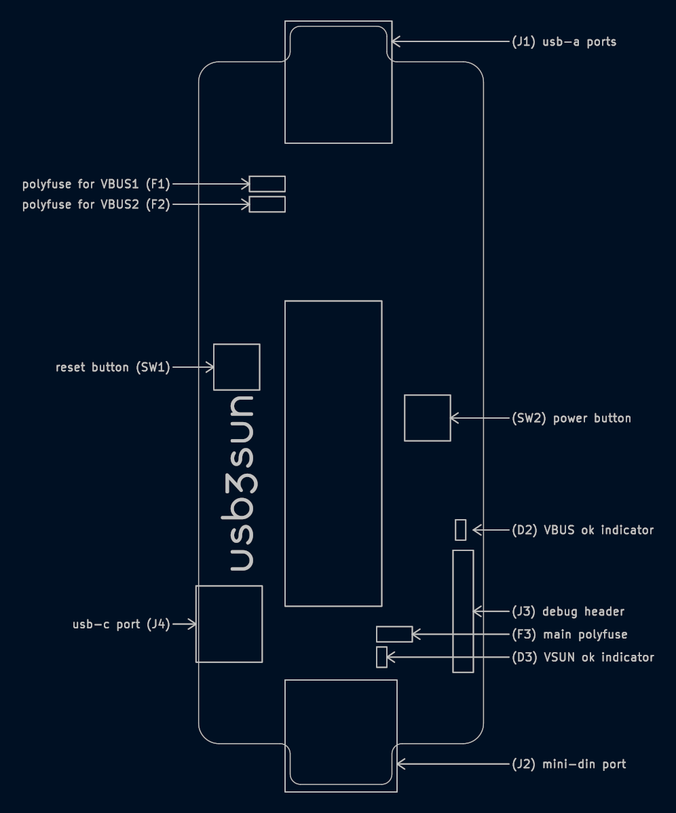
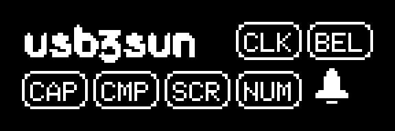

[README](../README.md) >

usb3sun user guide
==================

usb3sun is an adapter that allows you to use usb keyboards and mice with SPARCstations and other sun workstations.



<!-- export User.1 to svg, open in gimp at 300dpi, background #001023, expand 60x60 center -->

## toc

- [getting started](#getting-started)
- [the power key](#the-power-key)
- [the display](#the-display)
- [the settings menu](#the-settings-menu)
- [bindings](#bindings)
- [updating the firmware](#updating-the-firmware)
    - [usb method](#usb-method)
    - [picoprobe method](#picoprobe-method)
- [debugging and automation](#debugging-and-automation)
    - [debug logging over usb cdc](#debug-logging-over-usb-cdc)
    - [debug logging with the debug uart](#debug-logging-with-the-debug-uart)
    - [automation with the debug cli](#automation-with-the-debug-cli)
- [compatibility](#compatibility)
- [specifications](#specifications)
    - [electrical characteristics](#electrical-characteristics)
    - [design files](#design-files)
- [troubleshooting](#troubleshooting)
- [errata](#errata)

## getting started

to use the adapter, you will need a sun workstation, as well as a usb keyboard and/or mouse.

you will also need an 8-pin mini-din cable, male to male, **with each pin connected to the same pin on the other end**. we recommend the original sun cable (530-1442 or 530-1442-02) or the [lindy 31532](https://www.lindy.com.au/serial-cable-8-pin-mini-din-m-m-2m), but they are sometimes sold as a “mini-din serial cable”, LocalTalk cable, or AppleTalk cable.

|  |  |
|-|-|
| ⚠️<br>**watch out!** | do not use mini-din cables with any pins swapped, like the apple 590-0552-A. if you are unsure, check with a multimeter in continuity mode. |
| | be sure to hold the mini-din port on the adapter while connecting or disconnecting a cable. the port can be tight, so holding it will minimise strain on the board. |

connect the adapter to your sun workstation with the mini-din cable, and connect any keyboards and mice to the usb-a ports on the adapter. the usb-c port on the adapter (rev A2+) is for debugging and firmware updates only.

## the power key

some sun keyboards have a power key, which switches on the workstation by toggling pin 7 of the mini-din port, in addition to sending scancodes like other keys.

to switch on your workstation, press the onboard power button (rev A1+), or press **Right Ctrl+P** on your usb keyboard. note that the latter will only work if the adapter is powered externally via the usb-c port (rev A2+) or the VBUS pin of the debug header (J3).

to send the power key to software while the workstation is on, press **Right Ctrl+P** on your usb keyboard. the onboard power button (rev A1+) does not send any scancodes.

## the display



| off | on | meaning |
|-|-|-|
|  |  | **click mode** — as set by the workstation, ignoring the “force click” setting |
|  |  | **bell active** |
|  |  | **caps lock active** |
|  |  | **compose active** |
|  |  | **scroll lock active** |
|  |  | **num lock active** |
|  |  | **buzzer active** — making any sound, including click, bell, or plug or unplug notifications |

## the settings menu

usb3sun remembers its settings while powered off (firmware 1.2+).

to open the settings menu, press **Right Ctrl+Space**. use the **Up** and **Down** arrow keys to select a setting, then use **Left** and **Right** to change settings listed as “in place”, or **Return** or **Enter** to choose other actions.

to close the settings menu, press **Esc** (firmware 2.0+) or choose **Go back**.

if there are no unsaved changes, or if you have an older firmware that saves changes immediately (firmware &lt;2.0), that’s all you need to do! if there are unsaved changes (firmware 2.0+), you will be asked if you want to save your changes:

- press **Enter** to save your settings
- press **N** to close without saving
- press **Esc** to go back to the settings menu

some usb devices may start to malfunction after saving settings, because we need to pause the whole adapter (including the usb host) while we write to flash. if you have an affected device, pressing **Shift+Enter** instead of **Enter** will reboot usb3sun (the adapter, not your workstation) after saving your settings. please report any affected devices in the github issue ([#14](https://github.com/delan/usb3sun/issues/14)).

| setting | firmware | in place? | values |
|-|-|-|-|
| Go back | 1.0+ | no | closes the settings menu |
| Force click | 1.2+ | yes | **no** (default) = allow the workstation to control the click mode |
|  |  |  | **off** = never click when pressing keys |
|  |  |  | **on** = always click when pressing keys |
| Click duration | 1.0+ | yes | 0 ms, 5 ms (default), 10 ms, …, 100 ms |
| Mouse baud | 2.0+ | yes | 1200, 2400, 4800, 9600 (default) |
|  |  |  | lower baud rates may be required on **NeXTSTEP** and **Plan 9** |
| Hostid | 1.5+ | no | sets the hostid used when reprogramming your idprom |
| Reprogram idprom | 1.5+ | no | plays a macro that reprograms your idprom |
| Wipe idprom (AAh) | 1.5+ | no | plays a macro that makes your idprom contents invalid |

## bindings

for more details, see [/src/bindings.h](../src/bindings.h), but here are the important ones:

| USB               | Sun                     |
|-------------------|-------------------------|
| context menu      | Compose                 |
| Left Alt          | Alt                     |
| Right Alt         | Graph/Alt               |
| Left GUI*         | left Meta (diamond)     |
| Right GUI*        | right Meta (diamond)    |
| Left Ctrl         | Control                 |
| Right Ctrl+Space  | (usb3sun settings menu) |
| Right Ctrl+.      | Stop                    |
| Right Ctrl+Esc    | Front                   |
| Right Ctrl+Return | Line Feed               |
| Right Ctrl+C      | Copy                    |
| Right Ctrl+F      | Find                    |
| Right Ctrl+O      | Open                    |
| Right Ctrl+P      | Power                   |
| Right Ctrl+V      | Paste                   |
| Right Ctrl+X      | Cut                     |
| Right Ctrl+Y      | Again                   |
| Right Ctrl+Z      | Undo                    |
| Right Ctrl+F1     | Help                    |
| Right Ctrl+F4     | Props                   |
| Right Ctrl+=      | keypad =                |

\* aka Super, Mod4, Windows, etc

## updating the firmware

you can update or reflash the firmware over usb (rev A2+), or with a picoprobe.

### usb method

1. press and hold the BOOTSEL button underneath the adapter
2. connect the adapter’s usb-c port (J4) to your computer
3. release the BOOTSEL button
4. copy firmware.uf2 to the usb mass storage device — you can copy it as a file to the FAT file system, or write to the block device directly with dd(1)

### picoprobe method

you will need a [raspberry pi pico](https://www.altronics.com.au/p/z6421a-raspberry-pi-pico-rp2040-development-board-with-headers/), other than the one used by usb3sun, which we’ll call the debugger. you will also need a way to connect pins on the adapter’s debug header (J3) to pins on the debugger, such as [header pins](https://www.altronics.com.au/p/p5430-oupiin-40-way-header-pin/) and [jumper cables](https://www.altronics.com.au/p/p1023-socket-to-socket-30-way-prototyping-ribbon-strips/).

flash the debugger with [the picoprobe firmware](https://github.com/raspberrypi/picoprobe), then connect the adapter to the debugger as follows, being sure to connect GND first and disconnect GND last.

| rev A0 | rev A1+ | picoprobe |
|-|-|-|
| GND | GND | GND (pin 8) |
|  | UART_TX | GP5 (pin 7) |
|  | UART_RX | GP4 (pin 6) |
| SWDIO | SWDIO | GP3 (pin 5) |
| SWCLK | SWCLK | GP2 (pin 4) |
| VBUS | VBUS | VBUS (pin 40) |

to flash the adapter with firmware.elf, run the command below.

```
$ openocd -f interface/cmsis-dap.cfg -f target/rp2040.cfg -c 'adapter speed 1000' -c 'program firmware.elf verify reset exit'
```

## debugging and automation

usb3sun has a wide range of debugging options, which you can use to investigate bugs, find hardware defects, or diagnose usb compatibility issues. with new enough hardware and firmware, you can even automate input (firmware 2.0+)!

### debug logging over usb cdc

by default, usb3sun has built-in debug logging over usb cdc, via the usb-c port marked “debug only” (J4) (rev A2+). building the firmware with PICOPROBE_ENABLE (firmware &lt;2.0) or without DEBUG_OVER_CDC (firmware 2.0+) will disable this.

logging over usb cdc has some serious limitations:

- the **debug cli** (see below) is not currently supported over usb cdc — this may change in the future
- you can only get the logs for usb3sun this way, not the logs for tinyusb or the underlying arduino-pico framework — this will never change, because it would create a chicken-and-egg problem
- it can be very unreliable, because the output tx may stop working if idle for even a few seconds — the reasons for this are still unclear, but may be related to flow control or a usb suspend bug

to connect, plug your adapter into your computer via the usb-c port marked “debug only” (J4), then use picocom:

```sh
$ picocom -fn -b115200 --imap lfcrlf /dev/ttyACM0
```

### debug logging with the debug uart

the best debug logging method is to use the UART_TX and UART_RX pins in the debug header (J3) (rev A1+), which avoids all of the limitations of logging over usb cdc.

the debug uart is enabled by default in newer adapters (rev B0+), but older adapters have a hardware limitation that means you can only use the debug uart with a [custom firmware build](firmware.md#building-the-firmware-for-pico) that disables the sun keyboard interface. the exact procedure also depends on your firmware version:

- if you have **rev A0**, **rev A1**, **rev A2**, or **rev A3**, with **firmware &lt;2.0**, the debug uart is **disabled by default**, unless you build the firmware with PICOPROBE_ENABLE, and doing so disables the sun keyboard interface (even with SUNK_ENABLE)
- if you have **rev A0**, **rev A1**, **rev A2**, or **rev A3**, with **firmware 2.0+**, the debug uart is **disabled by default**, unless you build the firmware with DEBUG_OVER_UART (which is the default) but without SUNK_ENABLE (disabling the sun keyboard interface)
- if you have **rev B0** or **rev B1**, with **firmware 2.0+**, the debug uart is **enabled by default**, unless you build the firmware without DEBUG_OVER_UART

to connect, wire up your adapter to a picoprobe (see [§ *picoprobe method*](#picoprobe-method)) or 3V3-capable usb-to-serial adapter, then use picocom:

```sh
$ picocom -fn -b115200 --imap lfcrlf /dev/ttyACM0
```

### automation with the debug cli

when connected to [the debug uart](#debug-logging-with-the-debug-uart), you can type commands or press keys over that connection to send input over the sun keyboard and mouse interfaces, even without any usb devices! press **Enter** to get a prompt (`> `), then use the debug cli as follows:

- press **Alt+WASD** to **move up**, **down**, **left**, or **right** on the sun mouse
- press **Alt+QEZC** to **move diagonally** on the sun mouse
- press **Alt+123** to **toggle the left**, **middle**, or **right** buttons on the sun mouse
- press **Ctrl+H** to make the sun keyboard press **Backspace**
- press **Ctrl+J** to make the sun keyboard press **Return**
- type `stop a` to make the sun keyboard press **Stop+A**
- type `enter` to make the sun keyboard press **Enter**
- type `go` to make the sun keyboard type **“go” followed by Return**
- type `help` to get help, much like the help above

## compatibility

usb3sun is compatible with any machine that would normally use a

- Sun Compact 1
- Sun Type 4
- Sun Type 5
- Sun Type 5c
- Sun Type 6 (non-usb)

usb3sun has been tested successfully with

- SPARCstation IPC (sun4c)
- SPARCstation IPX (sun4c)
- SPARCstation 2 (sun4c)
- SPARCstation 5 (sun4m)
- SPARCstation 20 (sun4m)
- Ultra 5 (sun4u)
- 1209:A1E5 Atreus (Technomancy version) **keyboard** with QMK
- 04A5:8001 BenQ Zowie EC2 **mouse**
- 046D:C063 Dell M-UAV-DEL8 **mouse**
- FEED:1307 gBoards Gergo **keyboard** with QMK
- 03F0:6941 HP 150 Wired **Keyboard** (HSA-A013K, 664R5AA)
- 0461:4E24 HP KB71211 **keyboard** — no scroll lock or right meta
- 0461:4E23 HP MOGIUO **mouse**
- 04D9:1503 Inland 208397 **keyboard**
- 30FA:2031 Keji KECK801UKB **keyboard**
- 17EF:608D Lenovo EMS-537A **mouse**
- 17EF:6019 Lenovo MSU1175 **mouse**
- 045E:0040 Microsoft Wheel **Mouse** Optical 1.1A — enumeration is unreliable
- 045E:0752 Microsoft Wired **Keyboard** 400
- 045E:0750 Microsoft Wired **Keyboard** 600
- 045E:0773 Microsoft Explorer Touch **Mouse** (model 1490)
- FEED:6061 Preonic OLKB-60 **keyboard** with QMK

usb3sun is not yet compatible with

- [#4](https://github.com/delan/usb3sun/issues/4) — 05AC:024F Apple Magic **Keyboard** with Numeric Keypad (model A1243)
- [#5](https://github.com/delan/usb3sun/issues/5) — 1209:2303 Atreus (Keyboardio version) **keyboard** with Kaleidoscope
- [#6](https://github.com/delan/usb3sun/issues/6) — 3367:1903 Endgame Gear XM1r **mouse** — buttons only (16-bit dx/dy, no boot protocol)
- [#7](https://github.com/delan/usb3sun/issues/7) — 045E:0039 Microsoft Intelli**Mouse** Optical 1.1A — broken (“Control FAILED”)

## specifications

|  | rev A0 | rev A1 | rev A2 | rev A3+ |
|-|-|-|-|-|
| width | 36 mm | 36 mm | 36 mm | 36 mm |
| length | 95 mm | **98 mm** | 98 mm | 98 mm |
| height | 23 mm | 23 mm | 23 mm | 23 mm |
| ports | 1x sun mini-din | 1x sun mini-din | 1x sun mini-din | 1x sun mini-din |
|  | 2x usb-a | 2x usb-a | 2x usb-a | 2x usb-a |
|  |  |  | **1x usb-c (debug only)** | 1x usb-c (debug only) |
| buttons |  | **power (for workstation)** | power (for workstation) | power (for workstation) |
|  |  | **reset (for adapter)** | reset (for adapter) | reset (for adapter) |
| led indicators |  | **VBUS ok** | VBUS ok | VBUS ok |
|  |  | **VSUN ok** | VSUN ok | VSUN ok |

### electrical characteristics

|  | rev A0+ |
|-|-|
| operating temperature | -40°C to 85°C |
| storage temperature | -40°C to 85°C |
| VBUS | -0V3 to 6V0 |
| VSUN | -0V3 to 6V0 |
| I<sub>VBUS1</sub> | up to 500mA |
| I<sub>VBUS2</sub> | up to 500mA |

### design files

|  | rev A0 | rev A1 | rev A2 | rev A3 | rev B0 | rev B1 |
|-|-|-|-|-|-|-|
| schematic | [rendered](https://kicanvas.org/?github=https%3A%2F%2Fgithub.com%2Fdelan%2Fusb3sun%2Fblob%2FA0%2Fhardware%2Fpcb%2Fusb3sun.kicad_sch) ([source](https://github.com/delan/usb3sun/blob/A0/hardware/pcb/usb3sun.kicad_sch)) | [rendered](https://kicanvas.org/?github=https%3A%2F%2Fgithub.com%2Fdelan%2Fusb3sun%2Fblob%2FA1%2Fhardware%2Fpcb%2Fusb3sun.kicad_sch) ([source](https://github.com/delan/usb3sun/blob/A1/hardware/pcb/usb3sun.kicad_sch)) | [rendered](https://kicanvas.org/?github=https%3A%2F%2Fgithub.com%2Fdelan%2Fusb3sun%2Fblob%2FA2%2Fhardware%2Fpcb%2Fusb3sun.kicad_sch) ([source](https://github.com/delan/usb3sun/blob/A2/hardware/pcb/usb3sun.kicad_sch)) | [rendered](https://kicanvas.org/?github=https%3A%2F%2Fgithub.com%2Fdelan%2Fusb3sun%2Fblob%2FA3%2Fhardware%2Fpcb%2Fusb3sun.kicad_sch) ([source](https://github.com/delan/usb3sun/blob/A3/hardware/pcb/usb3sun.kicad_sch)) | [rendered](https://kicanvas.org/?github=https%3A%2F%2Fgithub.com%2Fdelan%2Fusb3sun%2Fblob%2FB0%2Fhardware%2Fpcb%2Fusb3sun.kicad_sch) ([source](https://github.com/delan/usb3sun/blob/B0/hardware/pcb/usb3sun.kicad_sch)) | [rendered](https://kicanvas.org/?github=https%3A%2F%2Fgithub.com%2Fdelan%2Fusb3sun%2Fblob%2FB1%2Fhardware%2Fpcb%2Fusb3sun.kicad_sch) ([source](https://github.com/delan/usb3sun/blob/B1/hardware/pcb/usb3sun.kicad_sch)) |
| pcb layout | [rendered](https://kicanvas.org/?github=https%3A%2F%2Fgithub.com%2Fdelan%2Fusb3sun%2Fblob%2FA0%2Fhardware%2Fpcb%2Fusb3sun.kicad_pcb) ([source](https://github.com/delan/usb3sun/blob/A0/hardware/pcb/usb3sun.kicad_pcb)) | [rendered](https://kicanvas.org/?github=https%3A%2F%2Fgithub.com%2Fdelan%2Fusb3sun%2Fblob%2FA1%2Fhardware%2Fpcb%2Fusb3sun.kicad_pcb) ([source](https://github.com/delan/usb3sun/blob/A1/hardware/pcb/usb3sun.kicad_pcb)) | [rendered](https://kicanvas.org/?github=https%3A%2F%2Fgithub.com%2Fdelan%2Fusb3sun%2Fblob%2FA2%2Fhardware%2Fpcb%2Fusb3sun.kicad_pcb) ([source](https://github.com/delan/usb3sun/blob/A2/hardware/pcb/usb3sun.kicad_pcb)) | [rendered](https://kicanvas.org/?github=https%3A%2F%2Fgithub.com%2Fdelan%2Fusb3sun%2Fblob%2FA3%2Fhardware%2Fpcb%2Fusb3sun.kicad_pcb) ([source](https://github.com/delan/usb3sun/blob/A3/hardware/pcb/usb3sun.kicad_pcb)) | [rendered](https://kicanvas.org/?github=https%3A%2F%2Fgithub.com%2Fdelan%2Fusb3sun%2Fblob%2FB0%2Fhardware%2Fpcb%2Fusb3sun.kicad_pcb) ([source](https://github.com/delan/usb3sun/blob/B0/hardware/pcb/usb3sun.kicad_pcb)) | [rendered](https://kicanvas.org/?github=https%3A%2F%2Fgithub.com%2Fdelan%2Fusb3sun%2Fblob%2FB1%2Fhardware%2Fpcb%2Fusb3sun.kicad_pcb) ([source](https://github.com/delan/usb3sun/blob/B1/hardware/pcb/usb3sun.kicad_pcb)) |
| display module support |  | [source](https://github.com/delan/usb3sun/blob/74b367a12600d712eb7a05a9fc67c958bae3fe62/hardware/support/support.FCStd) | [source](https://github.com/delan/usb3sun/blob/A2/hardware/support/support.FCStd) | [source](https://github.com/delan/usb3sun/blob/A3/hardware/support/support.FCStd) | [source](https://github.com/delan/usb3sun/blob/B0/hardware/support/support.FCStd) | [source](https://github.com/delan/usb3sun/blob/B1/hardware/support/support.FCStd) |

## troubleshooting

observed on solaris 2.5.1 — if you boot solaris immediately after reprogramming a previously invalid idprom, you may see the loading spinner hang after the following errors. if affected, press **Stop+A**, then rerun your `boot` command to reboot your workstation.

```
Invalid format code in IDprom.
WARNING: TOD clock not initialized -- CHECK AND RESET THE DATE!
|
```

## errata

[#2](https://github.com/delan/usb3sun/issues/2) (fixed in rev B0+) — in **rev A0**, **rev A1**, **rev A2**, and **rev A3**, resetting the adapter will make the workstation drop you into an ok prompt, because the initial state of the adapter after reset is a serial “break” on the sun keyboard tx line. this may cause the software on your workstation to behave unpredictably after typing “go” to continue. for example, solaris 2.5.1 often panics here if booted over nfs.

[#11](https://github.com/delan/usb3sun/issues/11) (fixed in rev B0+) — in **rev A0**, **rev A1**, **rev A2**, and **rev A3**, resetting the adapter may cause the adapter to hang until power cycled, with the pico’s green indicator led stuck on, because the display module can’t be reset and may start to malfunction. this is relatively rare, but also fairly easy to reproduce if you mash the reset button several times in quick succession.

[#14](https://github.com/delan/usb3sun/issues/14) (workaround available in firmware 2.0+) — in **all firmware versions**, some usb devices may start to malfunction after saving settings, because we need to pause the whole adapter (including the usb host) while we write to flash. for example, with the Microsoft Wheel Mouse Optical 1.1A (045E:0040), saving settings may make the red led go dim and make the mouse start spewing updates until disconnected. to work around this issue (firmware 2.0+), hold **Shift** while pressing **Enter** to reboot the adapter after saving settings.
